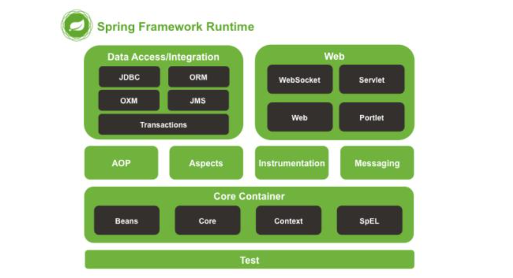
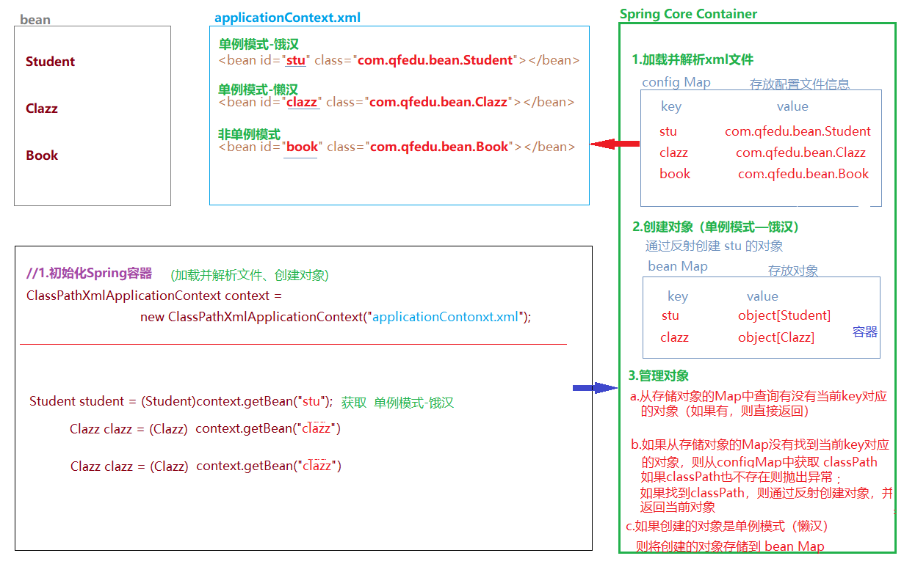
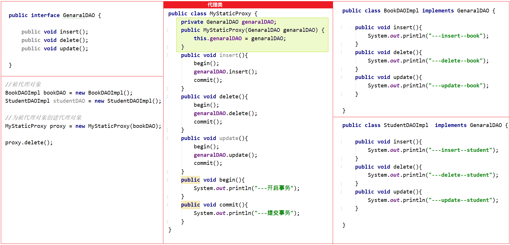

## 一、Spring概述 

#### 1.1 web项目开发中的耦合度问题

- 在Servlet中需要调用service中的方法，则需要在Servlet类中通过new关键字创建Service的实例

  ```java
  public interface ProductService{
      public List<Product> listProducts();
  }
  ```

  ```java
  public class ProductServiceImpl1 implements ProductService{
      public List<Product> listProducts(){
          //查询热销商品
      }
  }
  ```

  ```java
  public class ProductServiceImpl2 implements ProductService{
      public List<Product> listProducts(){
          //查询好评商品
      }
  }
  ```

  ```java
  public class ProductListServlet extends HttpServlet{
      
      //在servlet中使用new关键字创建ProductServiceImpl1对象，增加了servlet和service的耦合度
      private ProductService productService = new ProductServiceImpl1();
      
      protected void doGet(HttpServletRequest request,HttpServletResponse response){
          doPost(request,response);
      }
      protected void doPost(HttpServletRequest request,HttpServletResponse response){
          productService.listProducts();
      }
  }
  ```

- 在service实现类中需要调用DAO中的方法，也需要在servcie实现类通过new关键字创建DAO实现类对象
- 如果使用new关键字创建对象：
  - 失去了面向接口编程的灵活性
  - 代码的侵入性增强（增加了耦合度）、降低了代码的灵活性
  - 增强项目的扩展性

#### 1.2 面向接口编程

| 面向接口编程                             |
| ---------------------------------------- |
|  |

`解决方案`：在Servlet中定义Service接口的对象变量，不使用new关键字创建实现类对象，在servlet的实例化的时候，通过反射动态的给Service对象变量赋值。

`如何实现`：Spring可以做到！！！

#### 1.3 Spring介绍

> Spring是一个`轻量级的控制反转和面向切面的容器`框架，用来解决企业项目开发的复杂度问题—解耦

- 轻量级：体积小，对代码没有侵入性
- 控制反转：IoC（Inverse of Control）,把创建对象的工作交由Spring完成，Spring在创建对象的时候同时可以完成对象属性赋值（DI）
- 面向切面：AOP（Aspect Oriented Programming）面向切面编程，可以在不改变原有业务逻辑的情况下实现对业务的增强
- 容器：实例的容器，管理创建的对象

#### 1.4 Spring架构

- 官网 https://spring.io/

  

- Spring架构图

  

###### 1.4.1 Core Container

> Spring容器组件，用于完成实例的创建和管理
>
> - core
> - beans   实例管理
> - context 容器上下文

######  1.4.2 AOP、Aspects

> Spring AOP组件，实现面向切面编程
>
> - aop
> - aspects

###### 1.4.3 web

> Spring web组件实际指的是SpringMVC框架，实现web项目的MVC控制
>
> - web (Spring对web项目的支持)
> - webmvc (SpringMVC组件)

###### 1.4.4 Data Access

> Spring数据访问组件，也是一个基于JDBC封装的持久层框架（即使没有mybatis，Spring也可以完成持久化操作）
>
> - tx

###### 1.4.5 Test

> Spring的单元测试组件，提供了Spring环境下的单元测试支持
>
> - test

## 二、Spring IoC — 基于XML

> Spring IoC 容器组件，可以完成对象的创建、对象属性赋值、对象管理

#### 2.1 Spring框架部署（IoC）

###### 2.1.1 创建Maven工程

- Java
- Web

###### 2.1.2 添加SpringIoC依赖

- core
- beans
- aop
- expression
- `context`

```xml
<dependency>
    <groupId>org.springframework</groupId>
    <artifactId>spring-context</artifactId>
    <version>5.2.13.RELEASE</version>
</dependency>
```

###### 2.1.3 创建Spring配置文件

> 通过配置文件"告诉"Spring容器创建什么对象，给对象属性赋什么值

- 在resources目录下创建名为`appicationContext.xml`的文件（文件名是可以自定义的）

```xml
<?xml version="1.0" encoding="UTF-8"?>
<beans xmlns="http://www.springframework.org/schema/beans"
       xmlns:xsi="http://www.w3.org/2001/XMLSchema-instance"
       xsi:schemaLocation="http://www.springframework.org/schema/beans
       http://www.springframework.org/schema/beans/spring-beans.xsd">
        <!--  对于一个xml文件如果作为框架的配置文件，需要遵守框架的配置规则  -->
        <!--  通常一个框架为了让开发者能够正确的配置，都会提供xml的规范文件（dtd\xsd）  -->
</beans>
```


#### 2.2 SpringIoC使用

> 使用 SpringIoC组件创建并管理对象

###### 2.2.1 创建一个实体类

```java
public class Student {

    private String stuNum;
    private String stuName;
    private String stuGender;
    private int stuAge;
    private Date enterenceTime; //入学日期
}
```

###### 2.2.2 在Spring配置文件中配置实体类

```xml
<?xml version="1.0" encoding="UTF-8"?>
<beans xmlns="http://www.springframework.org/schema/beans"
       xmlns:xsi="http://www.w3.org/2001/XMLSchema-instance"
       xsi:schemaLocation="http://www.springframework.org/schema/beans
       http://www.springframework.org/schema/beans/spring-beans.xsd">

        <!--通过bean将实体类配置给Spring进行管理,id表示实体类的唯一表示-->
        <bean id="stu" class="com.qfedu.ioc.bean.Student">
                <property name="stuNum" value="10002"/>
                <property name="stuName" value="李斯"/>
                <property name="stuGender" value="女"/>
                <property name="stuAge" value="20"/>
        </bean>

</beans>
```

###### 2.2.3 初始化Spring对象工厂，获取对象

- ClassPathXMLApplicationContext

```java
//1.初始化Spring容器,加载Spring配置文件
ClassPathXmlApplicationContext context = new ClassPathXmlApplicationContext("applicationContext.xml");
//2.通过Spring容器获取Student对象
Student student2 = (Student) context.getBean("stu");
```

#### 2.3 IoC和DI

- IoC (Inverse of Control) 控制反转，通过Spring对象工厂完成对象的创建（new 对象）
- DI (Dependency Injection)依赖注入，在Spring完成对象创建的同时依赖Spring容器完成**对象属性的赋值**

###### 2.3.1 IoC

> 当我们需要通过Spring对象工厂创建某个类的对象时候，需要将这个交给Spring管理——通过bean标签配置

```xml
<!--通过bean将实体类配置给Spring进行管理,id表示实体类的唯一表示-->
<bean id="stu" class="com.qfedu.ioc.bean.Student"></bean>

<bean id="book" class="com.qfedu.ioc.bean.Book"></bean>
```

###### 2.3.2 DI

> 通过Spring容器给创建的对象属性赋值

```xml
<bean id="clazz" class="com.qfedu.ioc.bean.Clazz"></bean>

<!--通过bean将实体类配置给Spring进行管理,id表示实体类的唯一表示-->
<bean id="stu" class="com.qfedu.ioc.bean.Student" autowire="byName">
    <property name="stuNum" value="10001"/>
</bean>
```

#### 2.4 DI依赖注入

###### 2.4.1 依赖注入三种方式

> Spring容器加载配置文件之后，通过`反射`创建类的对象，并给属性赋值；
>
> Spring容器通过反射实现属性注入有三种方式：
>
> - set方法注入
> - 构造器注入
> - 接口注入（不常用）

###### 2.4.2 set方法注入（实体类必须有setter）

> 在bean标签中通过**配置property标签给属性属性赋值**，实际上就是通过反射调用set方法完成属性的注入

**简单类型及字符串**

- 直接通过property标签的value属性赋值

```xml
<!--通过bean将实体类配置给Spring进行管理,id表示实体类的唯一表示-->
<bean id="stu" class="com.qfedu.ioc.bean.Student" autowire="byName">
    <!--    简单类型    -->
    <property name="stuNum" value="10001"/>
    <property name="stuAge" value="12"/>
    <!--    字符串类型-->
    <property name="weight" value="62.3"/>
</bean>
```

**日期类型**（不能常规赋值）

- 方式1：在property标签中通过**ref**引用Spring容器中的一个对象

```xml
<bean id="date" class="java.util.Date"></bean>

<bean id="stu" class="com.qfedu.ioc.bean.Student" >
    <!--    日期类型-->
    <property name="enterenceTime" ref="date"/>
</bean>
```

- 方式2：在property标签中添加**子标签bean**来指定对象

```xml
<bean id="stu" class="com.qfedu.ioc.bean.Student" >
    <!--    日期类型-->
    <property name="enterenceTime">
        <bean class="java.util.Date"/>
    </property>
</bean>
```

**自定义类对象属性**

- 方式1：

```xml
<bean id="cla" class="com.qfedu.ioc.bean.Clazz">
    <property name="classId" value="2010"/>
    <property name="className" value="Java2010"/>
</bean>

<bean id="stu" class="com.qfedu.ioc.bean.Student">
    <!--  自定义对象类型-->
    <property name="clazz" ref="cla"/>
</bean>
```

- 方式2

```xml
<bean id="stu" class="com.qfedu.ioc.bean.Student">
    <!--  自定义对象类型-->
    <property name="clazz">
        <bean class="com.qfedu.ioc.bean.Clazz">
            <property name="classId" value="2010"/>
            <property name="className" value="Java2010"/>
        </bean>
    </property>
</bean>
```

**集合类型**

- List

  - List<String>  List中的元素是**字符串或者简单类型**的封装类

  ```xml
  <property name="hobbies" value="旅游,电影"/>
  ```

  ```xml
  <property name="hobbies" >
      <list>
          <value>旅游</value>
          <value>电影</value>
          <value>Java</value>
      </list>
  </property>
  ```

  - List<Object> List中的元素是**对象类型**

  ```xml
  <property name="hobbies" >
      <list>
          <bean class="com.qfedu.ioc.bean.Book"/>
          <bean class="com.qfedu.ioc.bean.Book"/>
          <bean class="com.qfedu.ioc.bean.Book"/>
          <bean class="com.qfedu.ioc.bean.Book"/>
      </list>
  </property>
  ```

  ```xml
  <property name="hobbies" >
      <list>
          <ref bean="book"></ref>  <!--引用容器中的备案-->
          <ref bean="book"></ref>
      </list>
  </property>
  ```

- Set

  ```xml
  <property name="sets">
      <set>
          <!--和list元素注入方式相同-->
      </set>
  </property>
  ```

- Map

  ```xml
  <property name="maps">
      <map>
          <entry>
              <key>
                  <value>k1</value>
              </key>
              <value>123</value>
          </entry>
          <entry>
              <key>
                  <value>k2</value>
              </key>
              <value>456</value>
          </entry>
      </map>
  </property>
  ```

- Properties

  ```xml
  <property name="properties">
      <props>
          <prop key="k1">aaa</prop>
          <prop key="k2">bbb</prop>
      </props>
  </property>
  ```

###### 2.4.3 构造器注入(实体类有构造器)

**简单类型、字符串、对象**

```java
public class Student {

    private String stuNum;
    private String stuName;
    private String stuGender;
    private int stuAge;
    private double weight;
    private Date enterenceTime; //入学日期
    private Clazz clazz;

    public Student(String stuNum, String stuName, String stuGender, int stuAge, double weight, Date enterenceTime, Clazz clazz) {
        this.stuNum = stuNum;
        this.stuName = stuName;
        this.stuGender = stuGender;
        this.stuAge = stuAge;
        this.weight = weight;
        this.enterenceTime = enterenceTime;
        this.clazz = clazz;
    }
}
```

```xml
<bean id="date" class="java.util.Date"></bean>

<bean id="stu" class="com.qfedu.ioc.bean.Student">
    <constructor-arg index="0" value="10001"/>       <!--字符串类型-->
    <constructor-arg index="2" value="女"/>
    <constructor-arg index="1" value="张三"/>
    <constructor-arg index="3" value="21"/>       <!--简单类型-->
    <constructor-arg index="4" value="62.5"/>
    <constructor-arg index="5" ref="date"/>       <!--对象类型-->
    <constructor-arg index="6">                  <!--对象类型-->
        <bean class="com.qfedu.ioc.bean.Clazz"></bean>
    </constructor-arg>
</bean>
```

**集合类型属性**

```java
public class Student{
    private List<String> hobbies;
    private Set<String> sets;
    private Map<String,Object> maps;
    private Properties properties;

    public Student(List<String> hobbies, Set<String> sets, Map<String, Object> maps, Properties properties) {
        this.hobbies = hobbies;
        this.sets = sets;
        this.maps = maps;
        this.properties = properties;
    }
}
```

```xml
<bean id="stu1" class="com.qfedu.ioc.bean.Student">
    <constructor-arg index="0">
        <list>
            <value>11</value>
            <value>22</value>
            <value>33</value>
        </list>
    </constructor-arg>
    <constructor-arg index="1">
        <set>
            <value>aa</value>
            <value>bb</value>
            <value>cc</value>
        </set>
    </constructor-arg>
    <constructor-arg index="2">
        <map>
            <entry>
                <key><value>key1</value></key>
                <value>value1</value>
            </entry>
            <entry>
                <key><value>key2</value></key>
                <value>value2</value>
            </entry>
        </map>
    </constructor-arg>
    <constructor-arg index="3">
        <props>
            <prop key="k1">v1</prop>
            <prop key="k2">v2</prop>
        </props>
    </constructor-arg>
</bean>
```

#### 2.5 Bean的作用域

> 在bean标签可以通过scope属性指定对象的的作用域
>
> - scope="singleton"  表示当前bean是单例模式（默认饿汉模式，Spring容器**初始化阶段就会完成此对象的创建**；当在bean标签中设置 lazy-init="true"变为懒汉模式）
> - scope="prototype" 表示当前bean为非单例模式，每次通过Spring容器**获取此bean的对象时**都会创建一个新的对象

##### 单例模式（生成同一个实例）

>`scope="singleton"`
>
>不管获取对象几次，每次getBean都是**同一个实例**
>
>单例模式含有饿汉模式和懒汉模式

- 饿汉模式(默认)：

  > **在加载对象时候，对象就会创建实例**，为所有spring配置文件中定义的bean都是生成的一个实例，天生线程安全的，多线程的情况下也不会出现问题。

- 懒汉模式`lazy-init="true"`：

  > 在**获取对象第一次请求**的时候，才会创建实例。本身是线程不安全的，但有几种实现线程安全的写法。

```xml
<bean id="book" class="com.qfedu.ioc.bean.Book" scope="singleton" lazy-init="true"></bean>
```

##### 多例模式

> `scope="prototype"`

```xml
<bean id="book" class="com.qfedu.ioc.bean.Book" scope="prototype"></bean>
```


#### 2.6 Bean的声明周期方法

> - **init-method**属性指定当前bean的初始化方法，初始化方法在构造器执行之后执行
>
> - **destroy-method**属性指定当前bean的销毁方法，销毁方法在对象销毁之前执行

- Bean类

  ```java
  public class Book {
  
      private int bookId;
      private String bookName;
  
       //初始化方法：在创建当前类对象时调用的方法，进行一些资源准备工作
      public void init(){
          System.out.println("-------init");
      }
  
      //销毁方法：在Spring容器销毁对象时调用此方法，进行一些资源回收性的操作
      public void destory(){
          System.out.println("-------destory");
      }
  }
  ```

- Spring配置文件

  ```xml
  <bean id="book" class="com.qfedu.ioc.bean.Book" scope="prototype" init-method="init" destroy-method="destory" ></bean>
  ```

#### 2.7 自动装配`autowire`

> 自动装配：Spring在实例化当前bean的时候从**Spring容器(其他bean/实体类)**中找到匹配的实例赋值给当前bean的属性
>
> 自动装配策略有两种：
>
> - byName  根据当前Bean的**属性名**在Spring容器中寻找匹配的对象 ，如果根据name找打了bean但是类型不匹配则抛出异常（private Clazz clazz 是找clazz 这个属性）.
> - byType  根据当前Bean的**属性类型**在Spring容器中寻找匹配的对象，如果根据类型找到了多个bean也会抛出异常（private Clazz clazz 是找Clazz这个类型）

- byName

```xml
<bean id="clazz" class="com.qfedu.ioc.bean.Clazz"></bean>

<!-- Student类中有clazz这个属性，会自动匹配到clazz这个bean的实例类-->
<bean id="stu2" class="com.qfedu.ioc.bean.Student" autowire="byName"></bean>
```

- byType

```xml
<bean id="clazz2" class="com.qfedu.ioc.bean.Clazz"></bean>

<!-- Student类中有private Clazz clazz这个属性， 找到Clazz这个类型-->
<bean id="stu2" class="com.qfedu.ioc.bean.Student" autowire="byType"></bean>
```

#### 2.8 SpringIoC 工作原理




## 三、Spring IoC — 基于注解

> SpringIoc的使用，需要我们通过XML将类声明给Spring容器进行管理，从而通过Spring工厂完成对象的创建及属性值的注入；
>
> Spring除了提供基于XML的配置方式，同时提供了基于注解的配置：直接**在实体类中添加注解声明**给Spring容器管理，以简化开发步骤。

#### 3.1 Spring框架部署

###### 3.1.1 创建Maven项目

略

###### 3.2.2 添加SpringIoC依赖

```xml
<dependency>
    <groupId>org.springframework</groupId>
    <artifactId>spring-context</artifactId>
    <version>5.2.13.RELEASE</version>
</dependency>
```

###### 3.2.3 创建Spring配置文件

- 创建`applicationContext.xml`文件
- 声明使用注解配置
- 声明Spring工厂注解的扫描范围

```xml
<?xml version="1.0" encoding="UTF-8"?>
<beans xmlns="http://www.springframework.org/schema/beans"
       xmlns:xsi="http://www.w3.org/2001/XMLSchema-instance"
       xmlns:context="http://www.springframework.org/schema/context"
       xsi:schemaLocation="http://www.springframework.org/schema/beans
       http://www.springframework.org/schema/beans/spring-beans.xsd
        http://www.springframework.org/schema/context
        http://www.springframework.org/schema/context/spring-context.xsd">

    <!-- 声明使用注解配置 -->
    <context:annotation-config/>

    <!-- 声明Spring工厂注解的扫描范围 -->
    <context:component-scan base-package="com.qfedu.beans"/>

</beans>
```

#### 3.2 IoC常用注解

###### 3.2.1 `@Component`

> 类注解，声明此类被Spring容器进行管理，**相当于bean标签的作用**

- `@Component(value="stu")` 

  > value属性用于指定当前bean的id，相当于**bean标签的id属性**；
  >
  > value属性也可以省略，如果省略当前类的id默认为**类名首字母改小写**

- 除了@Component之外 @Service、@Controller、@Repository这三个注解也可以将类声明给Spring管理，他们主要是**语义上的区别**
  - @Controller 注解主要声明将控制器类配置给Spring管理，例如Servlet
  - @Service 注解主要声明业务处理类配置Spring管理，Service接口的实现类
  - @Repository 直接主要声明持久化类配置给Spring管理，DAO接口
  - @Component 除了控制器、servcie和DAO之外的类一律使用此注解声明

###### 3.2.2 `@Scope`

- 类注解，用于声明当前类单例模式还是 非单例模式，相当于bean标签的scope属性
- @Scope("prototype") 表示声明当前类为非单例模式（**默认单例模式**,类生成同一个实例）

###### 3.2.3 `@Lazy`

- 类注解，用于声明一个**单例模式**的Bean是否为懒汉模式

- @Lazy(true) 表示声明为懒汉模式，在**获取对象第一次请求**的时候，才会创建实例

  (默认为饿汉模式,bean在加载对象时候，对象就会创建实例)

###### 3.2.4 `@PostConstruct`

- 方法注解，声明一个方法为当前类的**初始化方法**（在构造器之后执行），相当于bean标签的**init-method属性**

###### 3.2.5 `@PreDestroy`

- 方法注解，声明一个方法为当前类的**销毁方法**（在对象从容器中释放之前执行），相当于bean标签的**destory-method属性**

###### 3.2.6 `@Autowired`

- **1、属性注解、2、方法注解（set方法）**，声明当前**属性自动装配，默认byType**

-  **@Autowired(required = false)**  通过requried属性设置当前自动装配是否为必须（默认必须——如果没有找到类型与属性类型匹配的bean则抛出异常）

  - byType  →→  @Autowired

  - ref引用  →→  @Qualifier("bean的id")

  ```java
  //方法注解用在set方法
  @Autowired
  public void setClazz(@Qualifier("c2") Clazz clazz) {
      this.clazz = clazz;
  }
  ```

###### 3.2.7 `@Resource`

- 属性注解，也用于声明**属性自动装配，默认byName**
- 默认装配方式为byName，如果根据byName没有找到对应的bean，则**继续根据byType**寻找对应的bean，根据byType如果依然没有找到Bean或者找到不止一个类型匹配的bean,则抛出异常。

## 四、代理设计模式

#### 4.1 生活中的代理


代理设计模式的优点：

- 代理对象：通用性工作
- 被代理对象：专注核心业务

#### 4.2 静态代理

> 静态代理，代理类只能够为**特定的类**生产代理对象，不能代理任意类

##### 步骤：

代理类和被代理类必须和接口关联，所以代理类只能为特定类所用

1. 创建接口（规范必须实现的通用方法）

2. **代理类**，将接口作为属性并为其创建构造器（**传入被代理类的实例，实现通用业务，并增强业务能力**）

3. 被代理类，实现接口 （用来实现核心业务，也就是**实现接口规范的通用方法**）

   

   ​			



**使用代理的好处**

1.被代理类：实现**核心业务的代码**，将通用的**管理型逻辑**（事务管理、日志管理）和**业务逻辑**分离

2.代理类：实现**通用的代码**，提供了代码的复用性

3.通过在代理类添加业务逻辑，实现对原有业务逻辑的扩展（**增强**）

#### 4.3 动态代理

> 动态代理，几乎可以为**所有的类**产生代理对象
>
> 动态代理的实现方式有2种：
>
> - JDK动态代理
> - CGLib动态大力

###### 4.3.1 JDK动态代理

- JDK动态代理：是通过**被代理对象的类实现的接口**产生其代理对象的

  1.创建一个类，实现InvocationHandler接口，重写invoke方法

  2.在类种定义一个**Object类型的变量**，并提供这个变量的有参构造器，用于将**被代理对象**传递进来

  3.定义getProxy方法，用于**创建并返回代理对象**

```java

public class JDKDynamicProxy implements InvocationHandler {
    //被代理对象
    private Object obj;
    public JDKDynamicProxy(Object obj) {
        this.obj = obj;
    }
    //产生代理对象，返回代理对象
    public Object getProxy(){
        //1.获取被代理对象的类加载器
        ClassLoader classLoader = obj.getClass().getClassLoader();
        //2.获取被代理对象的类实现的接口
        Class<?>[] interfaces = obj.getClass().getInterfaces();
        //3.产生代理对象(通过被代理对象的类加载器及实现的接口)
        //第一个参数：被代理对象的类加载器
        //第二个参数：被代理对象实现的接口
        //第三个参数：使用产生代理对象调用方法时，用于拦截方法执行的处理器
        Object proxy = Proxy.newProxyInstance(classLoader, interfaces,this);
        return proxy;
    }
  //重写invoke方法 (InvocationHandler接口的方法)
    public Object invoke(Object proxy, Method method, Object[] args) throws Throwable {
        begin();
        Object returnValue = method.invoke(obj,args);  //执行method方法（insert）
        commit();
        return returnValue;
    }

    public void begin(){
        System.out.println("----------开启事务");
    }

    public void commit(){
        System.out.println("----------提交事务");
    }
}
```

- 测试

```java
 //创建被代理对象
BookDAOImpl bookDAO = new BookDAOImpl();
StudentDAOImpl studentDAO = new StudentDAOImpl();

//创建动态代理类对象，并将被代理对象传递到代理类中赋值给obj
JDKDynamicProxy jdkDynamicProxy = new JDKDynamicProxy(studentDAO);

//proxy就是产生的代理对象:产生的代理对象可以强转成被代理对象实现的接口类型
GenaralDAO proxy = (GenaralDAO)jdkDynamicProxy.getProxy();

//使用代理对象调用方法，并不会执行调用的方法，而是进入到创建代理对象时指定的InvocationHandler类中的invoke方法
//调用的方法作为一个Method参数，传递给了invoke方法
proxy.insert(student);
```

###### 4.3.2 CGLib动态代理

> 由于JDK动态代理是通过被代理类实现的接口来创建代理对象的，因此JDK动态代理只能代理实现了接口的类的对象。如果一个**类没有实现任何接口**，该如何产生代理对象呢？
>
> CGLib动态代理，是通过**创建被代理类的子类**来创建代理对象的，因此即使没有实现任何接口的类也可以通过CGLib产生代理对象
>
> CGLib动态代理不能为final类创建代理对象

- 添加CGLib的依赖

```XML
<!-- https://mvnrepository.com/artifact/cglib/cglib -->
<dependency>
    <groupId>cglib</groupId>
    <artifactId>cglib</artifactId>
    <version>3.3.0</version>
</dependency>
```

- CGLib动态代理实现：

  1.添加cglib依赖

  2.创建一个类，实现MethodInterceptor接口，同时实现接口中的intercept方法

  3.在类中定义一个Object类型的变量，并提供这个变量的有参构造器，用于传递被代理对象

  4.定义getProxy方法创建并返回代理对象（代理对象是通过创建被代理类的子类来创建的）

```java
/**
 * 1.添加cglib依赖
 * 2.创建一个类，实现MethodInterceptor接口，同时实现接口中的intercept方法
 * 3.在类中定义一个Object类型的变量，并提供这个变量的有参构造器，用于传递被代理对象
 * 4.定义getProxy方法创建并返回代理对象（代理对象是通过创建被代理类的子类来创建的）
 */
public class CGLibDynamicProxy implements MethodInterceptor {

    private Object obj;
    public CGLibDynamicProxy(Object obj) {
        this.obj = obj;
    }

    public Object getProxy(){
        Enhancer enhancer = new Enhancer();
        enhancer.setSuperclass(obj.getClass());
        enhancer.setCallback(this);
        Object proxy = enhancer.create();
        return proxy;
    }


    public Object intercept(Object o, Method method, Object[] objects, MethodProxy methodProxy) throws Throwable {
        begin();
        Object returnValue = method.invoke(obj,objects); //通过反射调用被代理类的方法
        commit();
        return returnValue;
    }

    public void begin(){
        System.out.println("----------开启事务");
    }

    public void commit(){
        System.out.println("----------提交事务");
    }
}
```

- 测试

```java
//创建被代理对象
BookDAOImpl bookDAO = new BookDAOImpl();
StudentDAOImpl studentDAO = new StudentDAOImpl();

//通过cglib动态代理类创建代理对象
CGLibDynamicProxy cgLibDynamicProxy = new CGLibDynamicProxy(bookDAO);
//代理对象实际上是被代理对象子类，因此代理对象可直接强转为被代理类类型
BookDAOImpl proxy = (BookDAOImpl) cgLibDynamicProxy.getProxy();

//使用对象调用方法，实际上并没有执行这个方法，而是执行了代理类中的intercept方法，将当前调用的方法以及方法中的参数传递到intercept方法
proxy.update();
```

## 五、Spring AOP

#### 5.1 AOP 概念

> Aspect Oriented Programming 面向切面编程，是一种利用“横切”的技术（底层实现就是动态代理），对原有的业务逻辑进行拦截，并且可以在这个拦截的横切面上添加特定的业务逻辑，对原有的业务进行增强。
>
> **基于动态代理实现在不改变原有业务的情况下对业务逻辑进行增强**


- 连接点：程序中的方法
- 切入点：被Spring横切的方法
- 通知/增强： 配置新增的业务的配置方法（定义新增的业务方法是放在切入点的前面\后面）


- 切点：**新增的业务方法**添加到切入点
- 切面：定义**包含切点新增方法的类**

AOP面向切面编程：就是在切面类上编程

#### 5.2 Spring AOP框架部署

###### 5.2.1 创建Maven项目

###### 5.2.2 添加依赖

- context
- aspects

```xml
<dependency>
    <groupId>org.springframework</groupId>
    <artifactId>spring-context</artifactId>
    <version>5.2.13.RELEASE</version>
</dependency>

<dependency>
    <groupId>org.springframework</groupId>
    <artifactId>spring-aspects</artifactId>
    <version>5.2.13.RELEASE</version>
</dependency>
```

###### 5.2.3 创建spring配置文件

- 需要引入aop的命名空间

```xml
<?xml version="1.0" encoding="UTF-8"?>
<beans xmlns="http://www.springframework.org/schema/beans"
       xmlns:xsi="http://www.w3.org/2001/XMLSchema-instance"
       xmlns:aop="http://www.springframework.org/schema/aop"
       xsi:schemaLocation="http://www.springframework.org/schema/beans
       http://www.springframework.org/schema/beans/spring-beans.xsd
        http://www.springframework.org/schema/aop
        http://www.springframework.org/schema/aop/spring-aop.xsd">


</beans>
```

#### 5.3 AOP配置—基于XML

> 在DAO的方法添加开启事务和提交事务的逻辑

###### 5.3.1 创建一个`切面类`，定义要添加的业务逻辑

```java
public class TxManager {

    public void begin(){
        System.out.println("-----------开启事务");
    }

    public void commit(){
        System.out.println("-----------提交事务");
    }

}
```

###### 5.3.2 配置aop

```xml
<?xml version="1.0" encoding="UTF-8"?>
<beans xmlns="http://www.springframework.org/schema/beans"
       xmlns:xsi="http://www.w3.org/2001/XMLSchema-instance"
       xmlns:aop="http://www.springframework.org/schema/aop"
       xsi:schemaLocation="http://www.springframework.org/schema/beans
       http://www.springframework.org/schema/beans/spring-beans.xsd
        http://www.springframework.org/schema/aop
        http://www.springframework.org/schema/aop/spring-aop.xsd">

    <bean id="bookDAO" class="com.qfedu.dao.BookDAOImpl"></bean>
    <bean id="studentDAO" class="com.qfedu.dao.StudentDAOImpl"></bean>

    <!---->
    <bean id="txManager" class="com.qfedu.utils.TxManager"></bean>
    <aop:config>
        <!--声明切入点-->
        <aop:pointcut id="book_all" expression="execution(* com.qfedu.dao.*.*(..))"/>

        <!--声明txManager为切面类-->
        <aop:aspect ref="txManager">
            <!--通知/增强-->
            <aop:before method="begin" pointcut-ref="book_all"/>
            <aop:after method="commit" pointcut-ref="book_all"/>
        </aop:aspect>
    </aop:config>

</beans>
```

###### `AOP开发步骤`：

1. **创建切面类**，在切面类定义切点方法

2. 将切面类配置给Spring容器 ` <aop:aspect ref="txManager">`

3. 声明切入点`<aop:pointcut id="book_all" expression="execution(* com.qfedu.dao.*.*(..))"/>`

4. 配置AOP的通知策略：
   - 切入点前：` <aop:before method="begin" pointcut-ref="book_all"/>`
   - 切入点后：`<aop:after method="commit" pointcut-ref="book_all"/>`

#### 5.4 切入点的声明

###### 5.4.1 各种切入点声明方式

语法：

```xml
<aop:pointcut id="切入点自定义ID" expression="execution(返回值 切入位置的方法(参数))"/>
```

- 切入点是方法

  ```xml
  <aop:pointcut id="book_insert" expression="execution(* com.qfedu.dao.BookDAOImpl.insert())"/>
  ```

- BookDAOImpl类中所有无参数无返回值的方法

  ```xaml
  <aop:pointcut id="book_pc1" expression="execution(void com.qfedu.dao.BookDAOImpl.*())"/>
  ```

- BookDAOImpl类中所有无返回值的方法

  ```xml
  <aop:pointcut id="book_pc2" expression="execution(void com.qfedu.dao.BookDAOImpl.*(..))"/>
  ```

- BookDAOImpl类中所有无参数的方法

  ``` xml
  <aop:pointcut id="book_pc3" expression="execution(* com.qfedu.dao.BookDAOImpl.*())"/>
  ```

- BookDAOImpl类中所有方法

  ```xml
  <aop:pointcut id="book_pc4" expression="execution(* com.qfedu.dao.BookDAOImpl.*(..))"/>
  ```

- dao包中所有类中的所有方法

  ```xml
  <aop:pointcut id="pc5" expression="execution(* com.qfedu.dao.*.*(..))"/>
  ```

- dao包中所有类中的insert方法

  ```xml
  <aop:pointcut id="pc6" expression="execution(* com.qfedu.dao.*.insert(..))"/>
  ```

- dao包中所有类中的insert方法

  ```xml
  <aop:pointcut id="pc7" expression="execution(* *(..))"/>
  ```

  

###### 5.4.2 AOP使用注意事项

```java
//如果要使用Spring aop面向切面编程，调用切入点方法的对象必须通过Spring容器获取
//如果一个类中的方法被声明为切入点并且织入了切点之后，通过Spring容器获取该类对象，实则获取到的是一个代理对象
//如果一个类中的方法没有被声明为切入点，通过Spring容器获取的就是这个类真实创建的对象
//BookServiceImpl bookService = new BookServiceImpl();
BookServiceImpl bookService = (BookServiceImpl) context.getBean("bookServiceImpl");
bookService.addBook();
```

#### 5.5 AOP通知策略

>  AOP通知策略：就是声明将切面类中的切点方法如何织入到切入点
>
> - before ，切入到指定切入点之前
> - after，切入到指定切入点之后
> - after-throwing
> - after-returning
> - around

###### 5.5.1 定义切面类

```java
public class MyAspect {

    public void method1(){
        System.out.println("~~~~~~~method1");
    }
    public void method2(){
        System.out.println("~~~~~~~method2");
    }
    public void method3(){
        System.out.println("~~~~~~~method3");
    }
    public void method4(){
        System.out.println("~~~~~~~method4");
    }

    //around环绕通知的切点方法，必须准守如下的定义规则：
    //1.必须带有一个ProceedingJoinPoint类型的参数
    //2.必须有Object类型的返回值
    //3.在前后增强的业务逻辑之间执行Object v = point.proceed();
    //4.方法最后返回v
    public Object method5(ProceedingJoinPoint point) throws Throwable {
        System.out.println("~~~~~~~method5---before");
        //此代码的执行，就表示切入点方法的执行
        Object v = point.proceed();
        System.out.println("~~~~~~~method5---after");
        return v;
    }

}
```

###### 5.5.2 配置切面类

```xml
<bean id="myAspect" class="com.qfedu.utils.MyAspect"></bean>
<aop:config>
    <!--使用aop:pointcut标签声明切入点：切入点可以是一个方法-->
    <aop:pointcut id="book_insert" expression="execution(* com.qfedu.dao.BookDAOImpl.insert())"/>

    <aop:aspect ref="myAspect">
        <!--aop:before 前置通知，切入到指定切入点之前-->
        <aop:before method="method1" pointcut-ref="book_insert"/>
        <!--aop:after 后置通知，切入到指定切入点之后-->
        <aop:after method="method2" pointcut-ref="book_insert"/>
        <!--aop:after-throwing 异常通知，切入点抛出异常之后-->
        <aop:after-throwing method="method3" pointcut-ref="book_insert"/>
        <!--aop:after-returning 方法返回值返回之后，对于一个Java方法而言return返回值也是方法的一部分
             因此“方法返回值返回之后”和“方法执行结束”是同一个时间点，随意after 和 after-returning根据配置
             的顺序决定执行顺序-->
        <aop:after-returning method="method4" pointcut-ref="book_insert"/>
        <aop:around method="method5" pointcut-ref="book_insert"/>
    </aop:aspect>

</aop:config>
```

## 六、Spring AOP 注解配置

### AOP注解：

> - 连接点(JionPoint)：程序中的方法
> - 切入点(Pointcut)：被Spring横切的方法
> - 通知/增强(Advice)： 配置新增的业务的配置方法（定义新增的业务方法是放在切入点的前面\后面）
>
> - 切点：**新增的业务方法**添加到切入点
> - 切面(Aspect)：定义**包含切点新增方法的类**   切点+通知

##### @Aspect  声明切面类

##### @Pointcut 定义切入点

##### @Before 前置通知，方法有 JoinPoint 参数

##### @AfterReturning 后置通知 - 注解带有 returning 属性

##### @Around 环绕通知-增强法有 ProceedingJoinPoint 参数

##### @AfterThrowing 异常通知 - 注解中有 throwing 属性（了解内容）

##### @After 最终通知

#### 6.1 Spring AOP 注解配置框架部署

###### 6.1.1 创建Maven工程

###### 6.1.2 添加Spring依赖

- context
- aspects

###### 6.1.3 Spring配置文件

```xml
<?xml version="1.0" encoding="UTF-8"?>
<beans xmlns="http://www.springframework.org/schema/beans"
       xmlns:xsi="http://www.w3.org/2001/XMLSchema-instance"
       xmlns:context="http://www.springframework.org/schema/context"
       xmlns:aop="http://www.springframework.org/schema/aop"
       xsi:schemaLocation="http://www.springframework.org/schema/beans
       http://www.springframework.org/schema/beans/spring-beans.xsd
       http://www.springframework.org/schema/context
        http://www.springframework.org/schema/context/spring-context.xsd
        http://www.springframework.org/schema/aop
        http://www.springframework.org/schema/aop/spring-aop.xsd">

    <context:annotation-config></context:annotation-config>
    <context:component-scan base-package="com.qfedu"></context:component-scan>

    <!--  基于注解配置的aop代理  -->
    <aop:aspectj-autoproxy></aop:aspectj-autoproxy>

</beans>
```

#### 6.2 AOP注解配置案例

##### 切面类

```java
@Component
@Aspect
public class TransactionManager {

    @Pointcut("execution(* com.qfedu.dao.*.*(..))")
    public void pc1(){}


    @Before("pc1()")
    public void begin(){
        System.out.println("~~~~开启事务");
    }

    @After("pc1()")
    public void commit(){
        System.out.println("~~~~提交事务");
    }

    @Around("pc1()")
    public Object printExecuteTime(ProceedingJoinPoint point) throws Throwable {
        long time1 = System.currentTimeMillis();
        Object v = point.proceed();
        long time2 = System.currentTimeMillis();
        System.out.println("----time:"+(time2-time1));
        return v;
    }

}
```

`注意`：注解使用虽然方便，但是只能在源码上添加注解，因此我们的自定义类提倡使用注解配置；但如果如果使用到第三方提供的类则需要通过xml配置形式完成配置。

## 七、Spring整合MyBatis

> Spring两大核心思想：IoC 和 AOP
>
> IoC : 控制反转，Spring容器可以完成对象的创建、属性注入、对象管理等工作
>
> AOP : 面向切面，在不修改原有业务逻辑的情况下，实现原有业务的增强

#### 7.1 Spring可以对MyBatis提供哪些支持？

- **IoC支持** SpringIoC 可以为MyBatis完成DataSource、SqlSessionFactory、SqlSession以及DAO对象的创建

- **AOP支持**使用Spring提供的**事务管理切面类**完成对MyBatis数据库操作中的事务管理

#### 7.2 Spring整合MyBatis准备工作

###### 7.2.1 创建Maven工程

###### 7.2.2 部署MyBatis框架 

- 添加依赖
  - Mysql驱动
  - mybatis

```xml
<!-- https://mvnrepository.com/artifact/mysql/mysql-connector-java -->
<dependency>
    <groupId>mysql</groupId>
    <artifactId>mysql-connector-java</artifactId>
    <version>5.1.47</version>
</dependency>

<!-- https://mvnrepository.com/artifact/org.mybatis/mybatis -->
<dependency>
    <groupId>org.mybatis</groupId>
    <artifactId>mybatis</artifactId>
    <version>3.4.6</version>
</dependency>
```

-  创建MyBatis配置文件(创建配置文件之后无需进行任何配置)

```xml
<?xml version="1.0" encoding="UTF-8" ?>
<!DOCTYPE configuration PUBLIC "-//mybatis.org//DTD Config 3.0//EN"
        "http://mybatis.org/dtd/mybatis-3-config.dtd">
<configuration>

</configuration>
```

###### 7.2.3 部署Spring框架

- 添加依赖

```xml
<dependency>
    <groupId>org.springframework</groupId>
    <artifactId>spring-context</artifactId>
    <version>5.2.13.RELEASE</version>
</dependency>

<dependency>
    <groupId>org.springframework</groupId>
    <artifactId>spring-aspects</artifactId>
    <version>5.2.13.RELEASE</version>
</dependency>

<dependency>
    <groupId>org.springframework</groupId>
    <artifactId>spring-jdbc</artifactId>
    <version>5.2.13.RELEASE</version>
</dependency>
```

- 创建Spring配置文件：applicationContext.xml

```xml
<?xml version="1.0" encoding="UTF-8"?>
<beans xmlns="http://www.springframework.org/schema/beans"
       xmlns:xsi="http://www.w3.org/2001/XMLSchema-instance"
       xmlns:context="http://www.springframework.org/schema/context"
       xmlns:aop="http://www.springframework.org/schema/aop"
       xsi:schemaLocation="http://www.springframework.org/schema/beans
       http://www.springframework.org/schema/beans/spring-beans.xsd
       http://www.springframework.org/schema/context
        http://www.springframework.org/schema/context/spring-context.xsd
        http://www.springframework.org/schema/aop
        http://www.springframework.org/schema/aop/spring-aop.xsd">
    

</beans>
```

###### 7.2.4 添加Spring整合MyBatis的依赖

- mybatis-spring  就是mybatis提供的兼容Spring的补丁

```xml
<!-- https://mvnrepository.com/artifact/org.mybatis/mybatis-spring -->
<dependency>
    <groupId>org.mybatis</groupId>
    <artifactId>mybatis-spring</artifactId>
    <version>1.3.2</version>
</dependency>
```

#### 7.3 Spring整合MyBatis整合IoC配置

###### 7.3.1 整合Druid连接池

- 添加druid的依赖

```xml
<dependency>
    <groupId>com.alibaba</groupId>
    <artifactId>druid</artifactId>
    <version>1.1.10</version>
</dependency>
```

- 创建druid.properties属性文件

```properties
druid.driver=com.mysql.jdbc.Driver
druid.url=jdbc:mysql://localhost:3306/db_2010_mybatis?characterEncoding=utf-8
druid.username=root
druid.password=admin123

## 连接池参数
druid.pool.init=1
druid.pool.minIdle=3
druid.pool.maxActive=20
druid.pool.timeout=30000
```

- 在applicationContext.xml中配置DruidDataSource

```xml
<!--加载druid.properties属性文件-->
<context:property-placeholder location="classpath:druid.properties"/>

<!--依赖Spring容器完成数据源DataSource的创建-->
<bean id="druidDataSource" class="com.alibaba.druid.pool.DruidDataSource">
    <property name="driverClassName" value="${druid.driver}"/>
    <property name="url" value="${druid.url}"/>
    <property name="username" value="${druid.username}"/>
    <property name="password" value="${druid.password}"/>

    <property name="initialSize" value="${druid.pool.init}"/>
    <property name="minIdle" value="${druid.pool.minIdle}"/>
    <property name="maxActive" value="${druid.pool.maxActive}"/>
    <property name="maxWait" value="${druid.pool.timeout}"/>
</bean>
```

###### 7.3.2 整合MyBatis—创建SqlSessionFactory

> 依赖Spring容器创建MyBatis的SqlSessionFactory对象

```xml
<!--依赖Spring容器完成MyBatis的SqlSessionFactory对象的创建-->
<bean id="sqlSessionFactory" class="org.mybatis.spring.SqlSessionFactoryBean" >
    <!--配置数据源-->
    <property name="dataSource" ref="druidDataSource"/>
    <!--配置mapper文件的路径-->
    <property name="mapperLocations" value="classpath:mappers/*Mapper.xml"/>
    <!--配置需要定义别名的实体类的包-->
    <property name="typeAliasesPackage" value="com.qfedu.pojo"/>
    <!--可选：配置MyBatis的主配置文件-->
    <property name="configLocation" value="classpath:mybatis-config.xml"/>
</bean>
```

###### 7.3.3 整合MyBatis-创建Mapper

```xml
<!--加载dao包中的所有DAO接口，通过sqlSessionFactory获取SqlSession，然后创建所有的DAO接口对象，存储在Spring容器-->
<bean class="org.mybatis.spring.mapper.MapperScannerConfigurer">
    <property name="sqlSessionFactoryBeanName" value="sqlSessionFactory"/>
    <property name="basePackage" value="com.qfedu.dao"/>
</bean>
```

#### 7.4 Spring整合MyBatis整合AOP配置

> 使用Spring提供的事务管理切面类 完成DAO中增删改操作的事务管理

###### 7.4.1 事务的隔离级别

>  isolation 设置事务隔离级别：READ_UNCOMMITTED  ,READ_COMMITTED , REPEATABLE_READ , SERIALIZABLE


###### 7.4.2 事务的传播机制

 propagation 设置事务的传播机制    

- REQUIRED 如果上层方法没有事务，则创建一个新的事务；如果已经存在事务，则加入到事务中。    

- SUPPORTS 如果上层方法没有事务，则以非事务方式执行；如果已经存在事务，则加入到事务中。

- REQUIRES_NEW 如果上层方法没有事务，则创建一个新的事务；如果已经存在事务，则将当前事务挂起。 

- NOT_SUPPORTED 如果上层方法没有事务，则以非事务方式执行；如果已经存在事务，则将当前事务挂起。    

- NEVER 如果上层方法没有事务，则以非事务方式执行；如果已经存在事务，则抛出异常。    

- MANDATORY 如果上层方法已经存在事务，则加入到事务中执行；如果不存在事务则抛出异常。    

- NESTED 如果上层方法没有事务，则创建一个新的事务；如果已经存在事务，则嵌套到当前事务中。

###### 7.4.3 Spring AOP事务管理配置—XML配置

```xml
<!--1.将Spring提供的事务管理配置配置给Spring容器-->
<bean id="transactionManager" class="org.springframework.jdbc.datasource.DataSourceTransactionManager">
    <property name="dataSource" ref="druidDataSource"/>
</bean>

<!--2.通过Spring jdbc提供的 tx标签，声明事务管理策略-->
<tx:advice id="txAdvice" transaction-manager="transactionManager">
    <tx:attributes>
        <tx:method name="insert*" isolation="REPEATABLE_READ" propagation="REQUIRED"/>
        <tx:method name="delete*" isolation="REPEATABLE_READ" propagation="REQUIRED"/>
        <tx:method name="update*" isolation="REPEATABLE_READ" propagation="REQUIRED"/>
        <tx:method name="query*" isolation="REPEATABLE_READ" propagation="SUPPORTS"/>
    </tx:attributes>
</tx:advice>

<!--3.将事务管理策略以AOP配置 应用于DAO操作方法-->
<aop:config>
    <aop:pointcut id="crud" expression="execution(* com.qfedu.service.*.*(..))"/>
    <aop:advisor advice-ref="txAdvice" pointcut-ref="crud"/>
</aop:config>
```

###### 7.4.4 Spring AOP事务管理配置—注解配置

- 在applicationContext.xml中配置事务管理，声明使用注解方式进行事务配置

```xml
<!--使用注解进行事务管理前提是 IoC需要进行注解配置-->
<context:annotation-config/>
<context:component-scan base-package="com.qfedu"/>

<!--1.将Spring提供的事务管理配置配置给Spring容器-->
<bean id="transactionManager" class="org.springframework.jdbc.datasource.DataSourceTransactionManager">
    <property name="dataSource" ref="druidDataSource"/>
</bean>

<!--2.声明使用注解完成事务配置-->
<tx:annotation-driven transaction-manager="transactionManager"/>
```

- 在需要Spring进行事务管理的方法上添加`@Transactional`注解

```java
@Transactional(isolation = Isolation.REPEATABLE_READ ,propagation = Propagation.SUPPORTS )
public List<User> listUsers() {
    return userDAO.queryUsers();
}
```

## 八、基于Spring的单元测试

> 如果想要使用Spring容器实现属性注入、实现AOP面向切面编程，对象必须通过Spring容器获取；为了便于Spring环境下的测试，Spring提供了test组件，专门针对Spring环境进行单元测试。

#### 8.1 添加依赖

```xml
<dependency>
     <groupId>junit</groupId>
     <artifactId>junit</artifactId>
     <version>4.12</version>
     <scope>test</scope>
</dependency>
<dependency>
    <groupId>org.springframework</groupId>
    <artifactId>spring-test</artifactId>
    <version>5.2.13.RELEASE</version>
</dependency>
```

#### 8.2 编写单元测试类

###### 8.2.1 创建一个单元测试类

略

###### 8.2.2 添加注解

```java
//1.通过@RunWith 声明当前测试类位于Spring容器环境（被Spring容器管理）
@RunWith(SpringJUnit4ClassRunner.class)
//2.通过@ContextConfiguration 声明当前测试环境的Spring容器运行时加载的配置文件
@ContextConfiguration("classpath:applicationContext.xml")
public class UserServiceImplTest {

    //因为当前测试类是基于Spring容器运行的，当前测试类的对象是通过Spring容器创建的
    //因此可以通过Spring容器实现属性的注入
    @Resource
    private UserService userServiceImpl2;
    @Resource
    private UserService userServiceImpl;

    @Test
    public void test(){
        List<User> users = userServiceImpl.listUsers();
        System.out.println(users);
    }

}
```

