## 一、Maven简介

#### 1.1 在项目中如何导入jar包？

- 下载jar包 （mvn）
- 将下载的jar包拷贝到项目中（WEB-INF/lib）
- 选择jar文件--右键--Add as Library

#### 1.2 传统导入jar包的方式存在什么问题？

- 步骤多（相对）——`繁琐`
- 在不同的项目中如果需要相同的jar包，需要分别存储这个jar文件——`冗余`、`项目体积大`
- 在不同的环境下可能因为jar文件版本不一致导致项目无法运行（重新配置）——`移植性差`

#### 1.3 项目生命周期

> 项目从编译到运行的整个过程
>
> 完整的生命周期：清理缓存—校验—编译—测试—打包—安装—部署

- IDEA提供了一键构建项目的功能，但是如果我们需要自定义的生命周期管理，却没有现成的工具（清理缓存）

#### 1.4 Maven简介

> Maven是一个`基于项目对象模型（POM）用于进行项目的依赖管理、生命周期管理的`工具软件

**核心功能**

- 依赖管理

- 生命周期管理

- 聚合工程

## 二、Maven安装及配置

#### 2.1 Maven下载

- http://maven.apache.org/download.cgi

#### 2.2 Maven安装

> Maven是基于Java语言进行开发的，因此依赖JDK（建议JDK1.7+）
>
> 开箱即用：直接解压即可

- 解压（d:/mvn）
- 目录结构：
  - bin  存放指令文件（Maven提供了一个mvn指令）
  - boot 包含了一个类加载框架的jar文件
  - conf  包含了Maven的核心配置文件settings.xml
  - lib  存放了maven运行所需的jar文件

#### 2.3 配置环境变量

- `MAVEN_HOME`       D:\mvn\apache-maven-3.6.3

- `Path`   增加   %MAVEN_HOME%\bin

| 测试                                     |
| ---------------------------------------- |
| 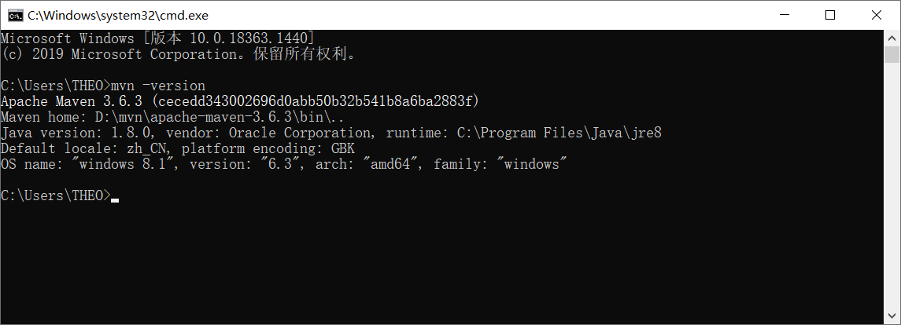 |

## 三、Maven的项目结构

>  使用Maven进行项目还有一个好处：无论使用什么样 的开发工具（eclipse/idea）项目的结构是统一的。

#### 3.1 Maven的项目结构

```
fmwy(项目名称)
--src
  --main (存放项目的源文件)
    --java (存放java代码，相当于传统项目中的src目录)
    --resources (存放配置文件和静态资源的目录，相当于传统项目的web目录)
  --test (存放项目的单元测试代码)
    --java（测试代码）
--pom.xml
```

#### 3.2 pom.xml

> POM Project Object Model，Maven可以根据pom文件的配置对此项目进行依赖管理；也就是说项目中需要依赖，直接在pom.xml进行配置即可

```xml
<?xml version="1.0" encoding="utf-8"?>
<project xmlns="http://maven.apache.org/POM/4.0.0"
         xmlns:xsi="http://www.w3.org/2001/XMLSchema-instance"
         xsi:schemaLocation="http://maven.apache.org/POM/4.0.0 http://maven.apache.org/xsd/maven-4.0.0.xsd">
    <!--指定项目模型版本-->
	<modelVersion>4.0.0</modelVersion>
    <!--指定项目的标识：G 企业标识 A 项目标识 V 版本-->
    <groupId>com.qfedu</groupId>
    <artifactId>fmwy</artifactId>
    <version>1.0.0</version>
    
    <!--配置当前项目的依赖-->
    <dependencies>
    	
    </dependencies>
</project>
```

> 如果需要在当前项目中添加依赖，只需在pom.xml文件中进行依赖配置即可

**配置依赖** 找到依赖的坐标，添加dependencies标签即可

```xml
<!-- https://mvnrepository.com/artifact/mysql/mysql-connector-java -->
<dependency>
    <groupId>mysql</groupId>
    <artifactId>mysql-connector-java</artifactId>
    <version>5.1.47</version>
</dependency>
```

## 四、依赖管理

#### 4.1 Maven依赖管理的流程

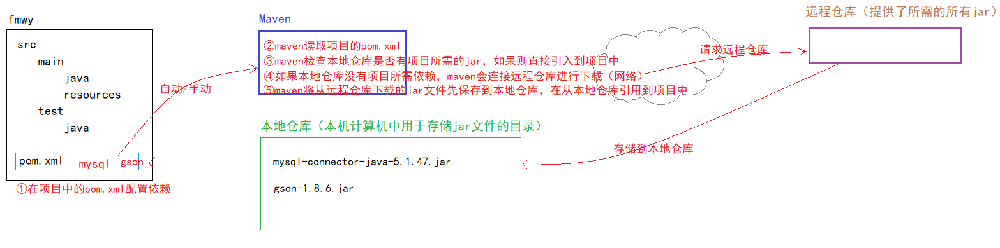

#### 4.2 Maven仓库介绍

- `本地仓库`  就是本地计算机上的某个文件夹（可以是自定义的任何文件夹）
- `远程仓库`  就是远程主机上的jar文件仓库
  - `中央仓库`  maven官方提供的仓库，包含了所需的一切依赖（免配置）
  - `公共仓库` 除了中央仓库以外的第三方仓库都是公共仓库，例如aliyun（需要配置）
  - `私服` 企业搭建的供内部使用的maven仓库

| maven仓库                                |
| ---------------------------------------- |
| 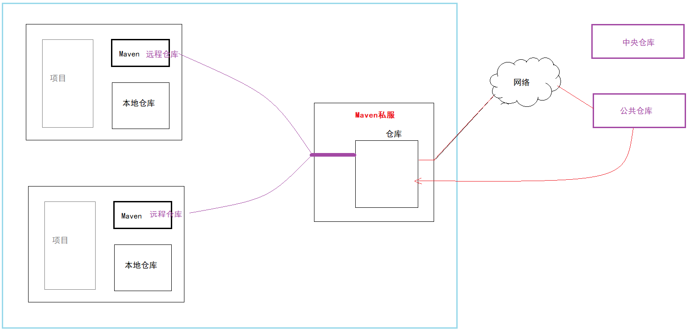 |

#### 4.3 Maven仓库配置

> 在maven_home/conf/settings.xml中进行配置

**配置本地仓库**

```xml
<localRepository>d:\repo</localRepository>
```

**配置公共仓库**

```xml
<mirrors>
	<mirror>
		<id>nexus-aliyun</id>
		<mirrorOf>central</mirrorOf>
		<name>Nexus aliyun</name>
		<url>http://maven.aliyun.com/nexus/content/groups/public</url>
	 </mirror>
</mirrors>
```

## 五、项目生命周期管理

#### 5.1 生命周期介绍

> 项目构建的声明周期：项目开发结束之后部署到运行环境运行的过程
>
> - 清除缓存
> - 检查
> - 编译
> - 测试（就会执行maven项目中test目录下的单元测试）
> - 打包（war 、 jar）
> - 安装 （jar会被安装到本地仓库）
> - 部署 （将项目生成的包放到外部服务器中—私服仓库）

#### 5.2 生命周期管理指令

> 在项目的根目录下执行mvn指令（此目录下必须包含pom.xml）

- 清除缓存

```
mvn clean
```

- 检查

```mvn
mvn check
```

- 编译

```
mvn compile
```

- 测试

```
mvn test
```

- 打包

```
mvn package
```

- 安装 

```
mvn install
```

- 部署 

```
mvn deploye
```

## 六、基于IDEA的Maven使用

#### 6.1 在IDEA中关联Maven

| maven配置                                |
| ---------------------------------------- |
| 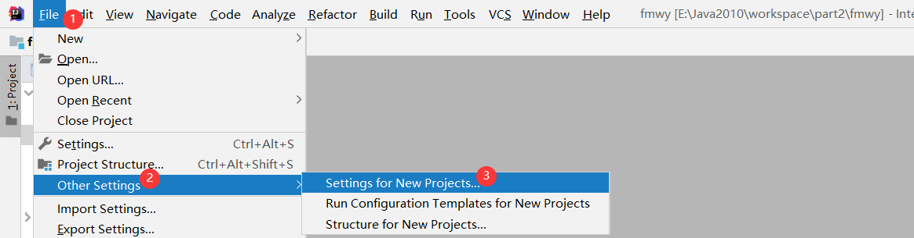 |
| 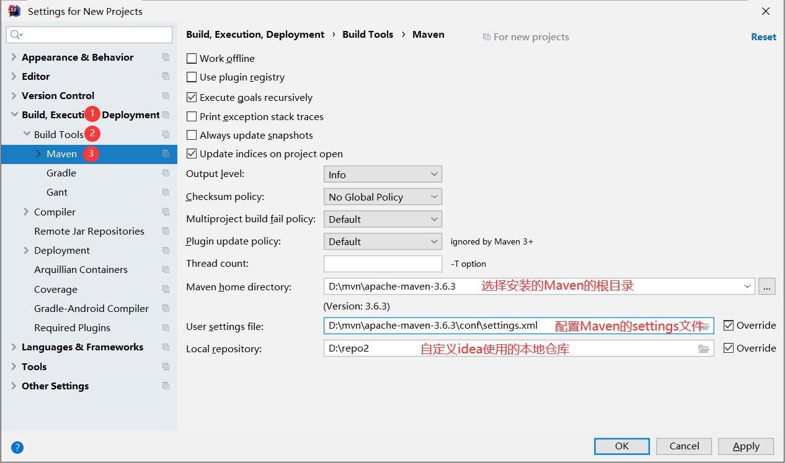 |

`说明：` IDEA本身集成了Maven，考虑到IDEA和Maven版本的兼容性，Idea不建议配置比默认版本更新的版本，建议使用idea自带的maven。

#### 6.2 使用IDEA创建Maven项目

###### 6.2.1 Java项目

| 创建Java项目                             |
| ---------------------------------------- |
| 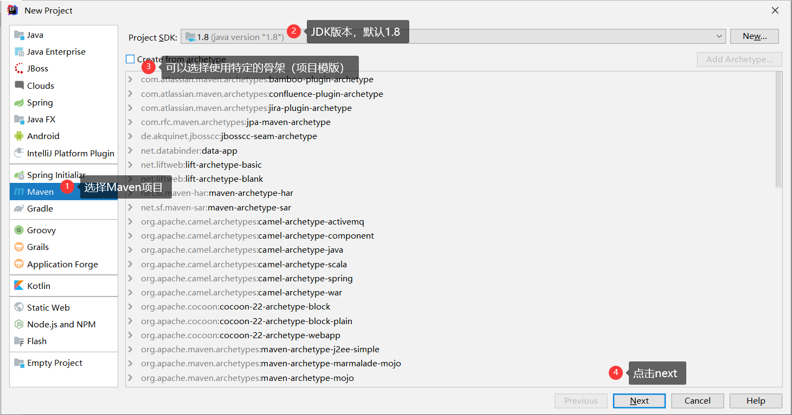 |
| 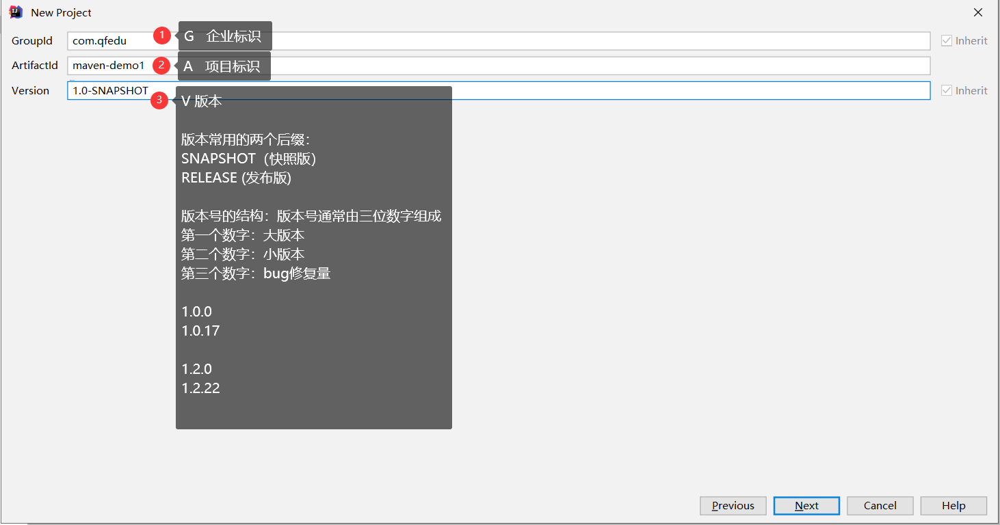 |
| 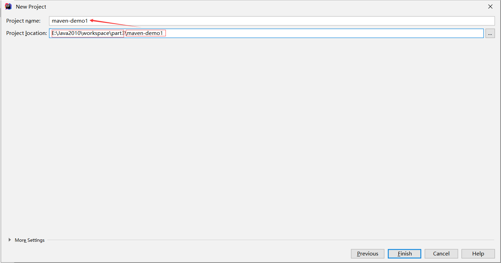 |

###### 6.2.2 web项目

- **创建maven项目**：maven-demo2

- **在pom.xml文件设置打包方式为war**

  ```xml
  <?xml version="1.0" encoding="UTF-8"?>
  <project xmlns="http://maven.apache.org/POM/4.0.0"
           xmlns:xsi="http://www.w3.org/2001/XMLSchema-instance"
           xsi:schemaLocation="http://maven.apache.org/POM/4.0.0 http://maven.apache.org/xsd/maven-4.0.0.xsd">
      <modelVersion>4.0.0</modelVersion>
  
      <groupId>com.qfedu</groupId>
      <artifactId>maven-demo2</artifactId>
      <version>1.0.0</version>
  
      <!--设置项目打包方式为war-->
      <packaging>war</packaging>
  
  </project>
  ```

- **完成web项目结构**

  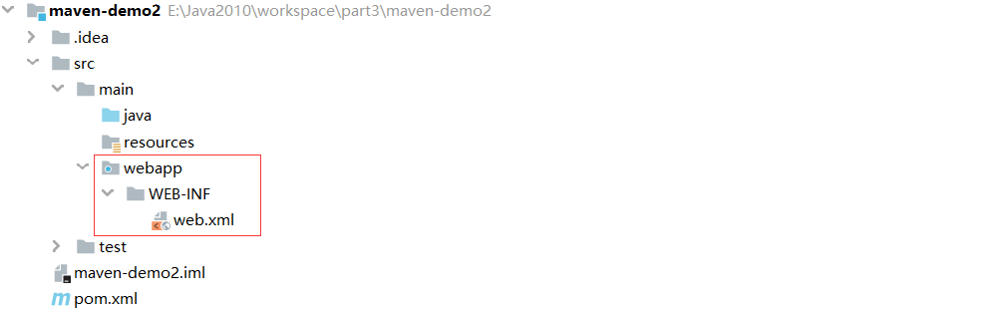

- **配置web组件—Tomcat**

  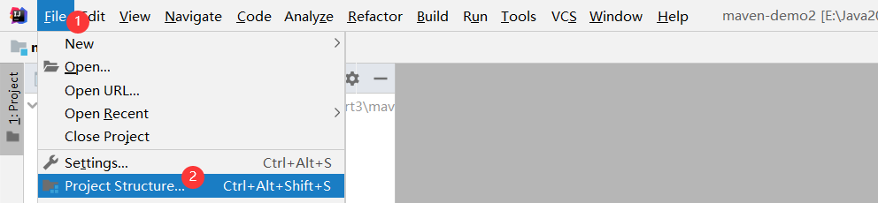

  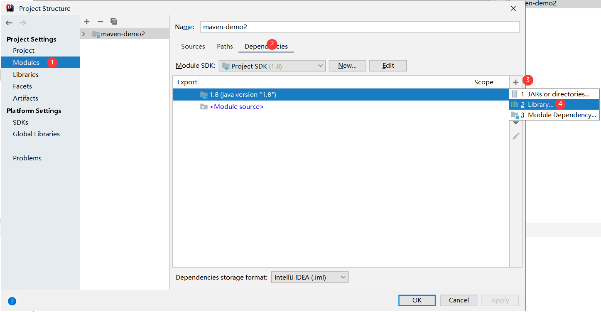

  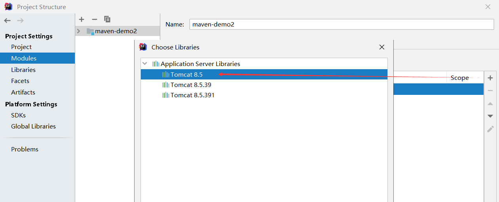

- **部署web项目**

  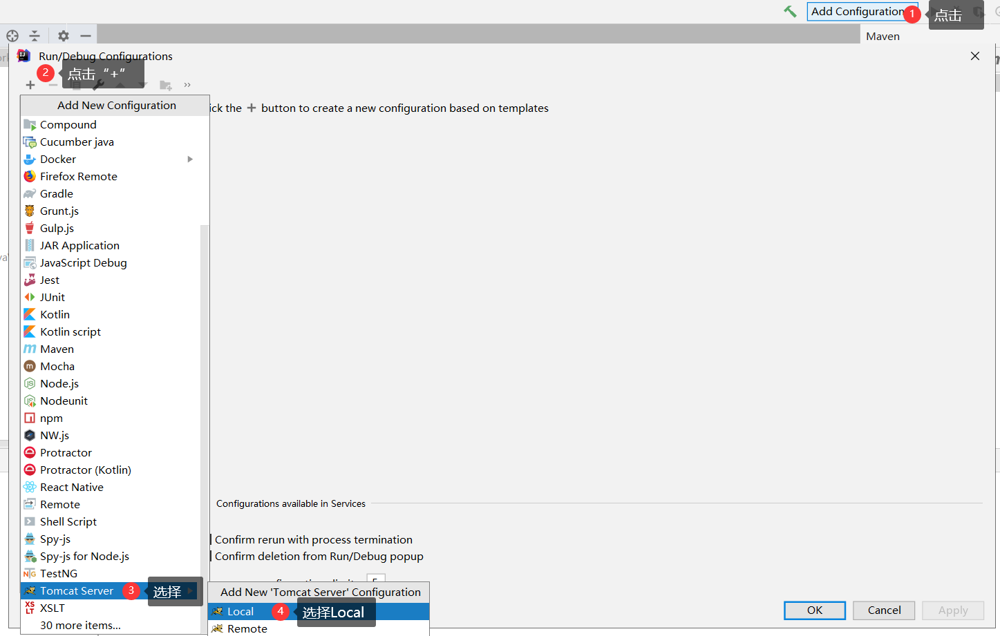

  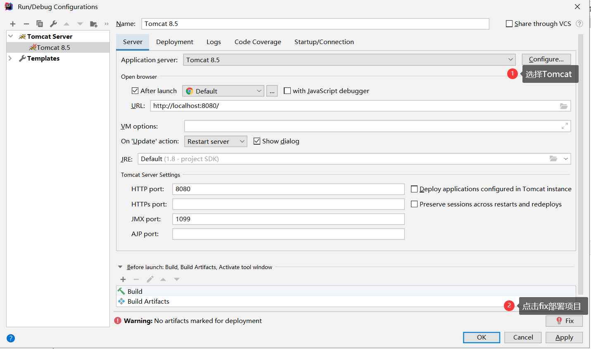


#### 6.3 在IDEA中使用Maven进行依赖管理

###### 6.3.1 查找依赖坐标

- https://mvnrepository.com/

###### 6.3.2 添加依赖

- 将依赖的坐标配置到项目的pom.xml文件dependencies标签中

```xml
<?xml version="1.0" encoding="UTF-8"?>
<project xmlns="http://maven.apache.org/POM/4.0.0"
         xmlns:xsi="http://www.w3.org/2001/XMLSchema-instance"
         xsi:schemaLocation="http://maven.apache.org/POM/4.0.0 http://maven.apache.org/xsd/maven-4.0.0.xsd">
    <modelVersion>4.0.0</modelVersion>
    <groupId>com.qfedu</groupId>
    <artifactId>maven-demo2</artifactId>
    <version>1.0.0</version>

    <!--设置项目打包方式为war-->
    <packaging>war</packaging>

    <dependencies>
        <!--在此位置配置项目中所需依赖的坐标 GAV-->
        <dependency>
            <groupId>com.google.code.gson</groupId>
            <artifactId>gson</artifactId>
            <version>2.8.5</version>
        </dependency>

        <dependency>
            <groupId>org.projectlombok</groupId>
            <artifactId>lombok</artifactId>
            <version>1.18.18</version>
            <scope>provided</scope>
        </dependency>
    </dependencies>
</project>
```

###### 6.3.3 依赖范围

> 在通过dependency添加依赖时，可以通过`scope`标签配置当前依赖的适用范围

- test  只在项目测试阶段引入当前依赖(编译、测试)

  ```xml
  <dependency>
      <groupId>junit</groupId>
      <artifactId>junit</artifactId>
      <version>4.13.2</version>
      <scope>test</scope>
  </dependency>
  ```

- runtime 只在运行时使用（运行、测试运行）
- provided 在（编译、测试、运行）
- compile 在（编译、测试、运行、打包）都引入

#### 6.4 在IDEA中使用Maven进行项目构建

###### 6.4.1 Maven项目构建生命周期说明

- clean 清理缓存  清理项目生成的缓存
- validate 校验  验证项目需要是正确的（项目信息、依赖）
- compile 编译  编译项目专供的源代码
- test 测试  运行项目中的单元测试
- package 打包  将项目编译后的代码打包成发布格式
- verify 检查  对集成测试的结果进行检查、确保项目的质量是达标的
- install 安装 将包安装到maven的本地仓库，以便在本地的其他项目中可以引用此项目（聚合工程）
- deploy  部署  将包安装到私服的仓库，以供其他开发人员共享

###### 6.4.2 IDEA进行生命周期管理

- 可视化

  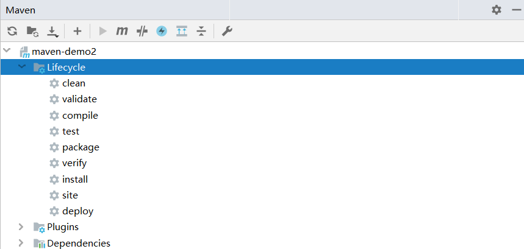

- 终端指令

  选择项目名称---右键---Open in Terminal

  mvn clean


## 七、私服

> 企业搭建供内部使用的一个Maven仓库
>
> - 开发者需要依赖直接从私服下载
> - 私服可以实现企业内部依赖的共享：当企业开发了一个通用插件（jar），可以发布到私服，可以连接到当前私服的其他开发者就可以共享这个插件了

#### 7.1 私服搭建

我们可以通过专门的Maven仓库管理软件来搭建私服。例如：Apache Archiva、Nexus

###### 7.1.1 下载Nexus

- 官网 https://www.sonatype.com/
- 下载 https://help.sonatype.com/repomanager2/download

###### 7.1.2 解压nexus

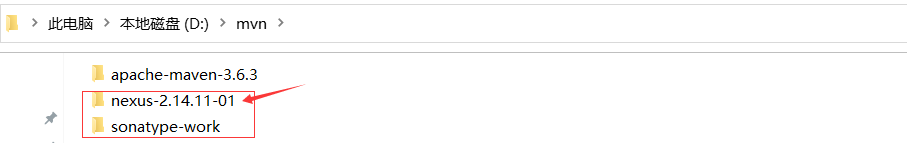

###### 7.1.3 安装并运行nexus

- 进入到`nexus-2.14.11-01/bin`目录

- 管理员身份打开cmd命令行，执行指令

  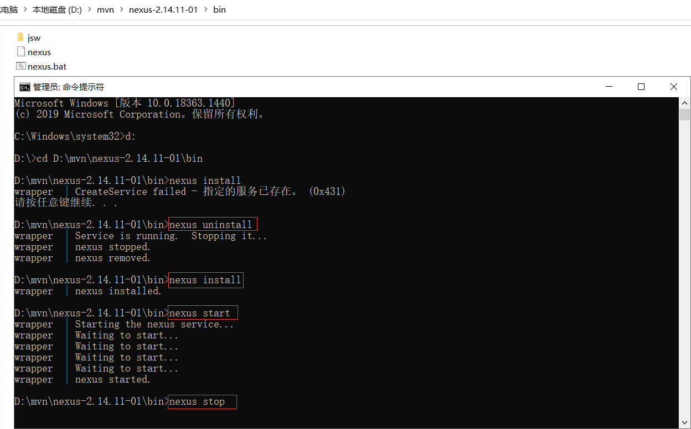

###### 7.1.4 登录Nexus

> 私服管理器登录地址： http://localhost:8081/nexus

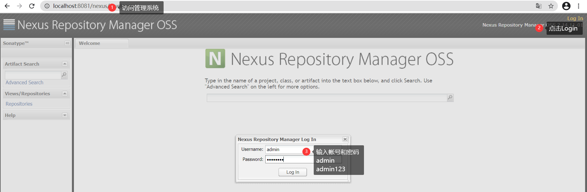

- 私服中仓库类型

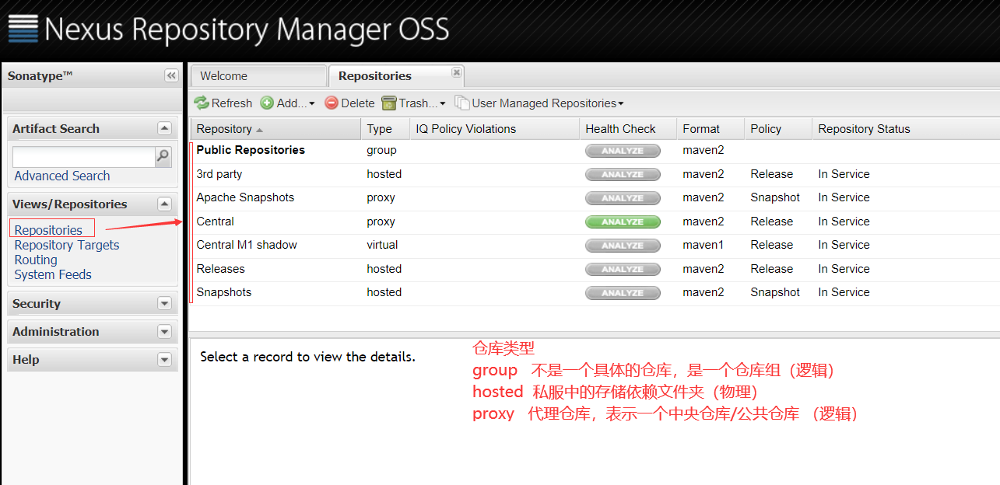

- 私服仓库组的配置

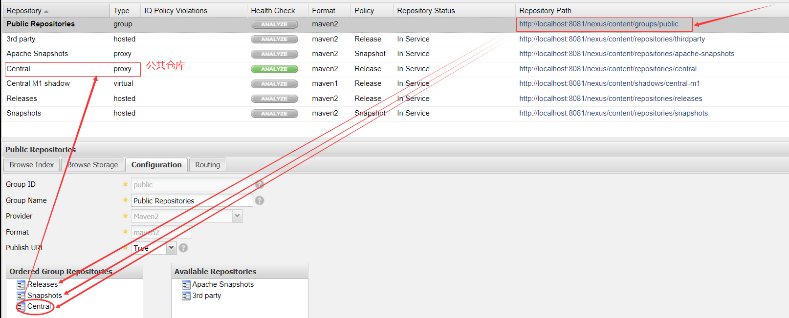


#### 7.2 配置私服

###### 7.2.1 在maven的settings.xml文件的`servers`标签中

```xml
<!--配置连接私服所需的帐号和密码-->
<server> 
    <id>nexus-public</id> <!-- nexus的认证id -->
    <username>admin</username> <!--nexus中的用户名密码-->
    <password>admin123</password> 
</server>
```

###### 7.2.2 在maven的settings.xml文件的`profiles`标签中

> repository 和 pluginRepository的  id子标签的值，要和上面配置的server 的id子标签的值一致

```xml
<profile> 
    <id>nexus</id> 
    <repositories> 
        <repository> 
            <id>nexus-public</id>      
            <name>Nexus Release Snapshot Repository</name>   
            <url>http://localhost:8081/nexus/content/groups/public/</url>
            <releases><enabled>true</enabled></releases> 
            <snapshots><enabled>true</enabled></snapshots> 
        </repository>
    </repositories> 
    <pluginRepositories>
        <pluginRepository> 
            <id>nexus-public</id> 
            <url>http://localhost:8081/nexus/content/groups/public/</url>
            <releases><enabled>true</enabled></releases> 
            <snapshots><enabled>true</enabled></snapshots> 
        </pluginRepository> 
    </pluginRepositories> 
</profile>
```

###### 7.2.3  在maven的settings.xml文件的`activeProfiles`配置激活profile

```xml
 <activeProfiles>
	<activeProfile>nexus</activeProfile>
 </activeProfiles>
```


## Maven聚合工程