## 一、Git简介

#### 1.1 项目的版本管理

> 在项目开发过程中，项目没开发到一个节点就会对当前项目进行备份，这个备份就是项目的一个版本；当我们继续开发一个阶段后，再次进行备份，就生成新的版本——多个版本的集合就是项目的版本库

在项目版本管理中，我们可以使用手动进行管理，但是存在一些问题：

- 需要手动维护版本的更新日志，记录每个版本的变化
- 需要手动查找历史版本，当历史版本比较多的时候，查找工作很繁琐
- 当我们需要回退到某个版本时，只能够手动的通过IDE工具手动打开

#### 1.2 团队协同开发

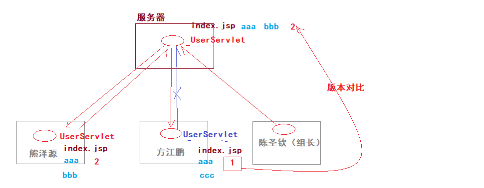

#### 1.3 版本管理工具—Git

> Git是一个开源的分布式版本控制系统，用于敏捷高效的处理任何大小项目的版本管理。

核心功能：

- 项目的版本管理
- 团队协同开发

## 二、Git下载及安装

#### 2.1 下载Git

| https://git-scm.com/                     |
| ---------------------------------------- |
| 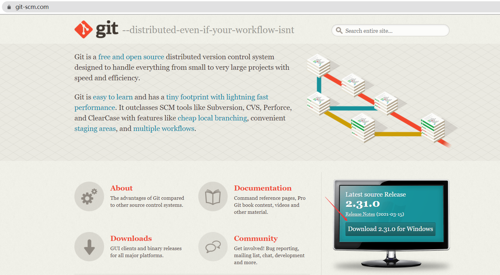 |

#### 2.2 安装Git

> 除了选择安装位置以外，其他都傻瓜式安装

#### 2.3 检查

- win + r
- 输入cmd
- 输入 `git --version`

## 三、Git架构

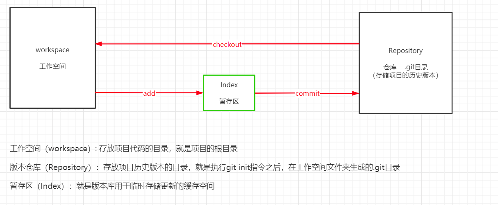

## 四、Git基本使用

#### 4.1 创建版本库

- 在工作空间的目录中，右键“Git Bash Here”打开git终端

- 在Git终端中输入`git init`指令，创建版本库（就是一个.git目录）

  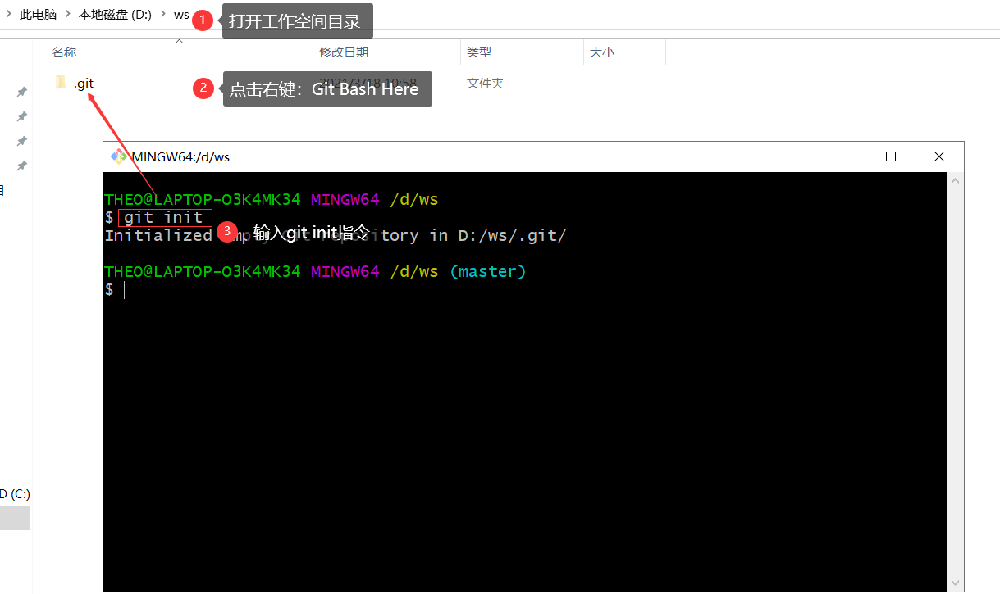

#### 4.2 查看版本库状态

```shell
git status
```

#### 4.3 将工作空间的修改添加到暂存区

```shell
git add a.txt   ## 只将工作空间中的某个文件add到暂存区
git add . ## 将工作空间中所有文件都add暂存区
```

#### 4.4 将暂存区内容提交到版本库（仓库）

```shell
git commit -m '版本说明'
```

#### 4.5 查看版本库中的历史版本

```shell
git log --oneline  ## 每个版本信息只显示一行
get log  ## 显示每个版本的详细信息
```

#### 4.6 设置用户信息

> 因为我们将暂存区的内容提交到版本时，会记录当前版本的提交的用户信息，因此在版本提交之前需要先绑定用户信息

```shell
git config --global user.name 'ergou'
git config --global user.email 'haha@hehe.com'
```

#### 4.7 同步历史版本到工作空间

```shell
git checkout 版本号
```

## 五、远程仓库

#### 5.1 远程仓库

> 远程仓库，远程版本库；实现版本库的远程存储，以实现团队的协同开发

| 远程仓库                                 |
| ---------------------------------------- |
| 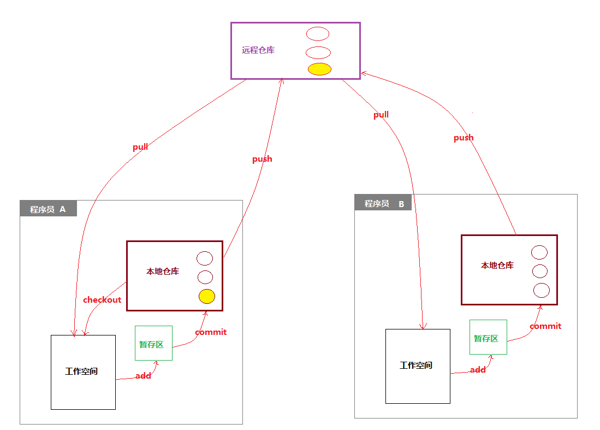 |

#### 5.2 如何获得远程仓库

- 使用GitLab搭建私服
- 远程仓库提供商
  - GitHub  https://gitbub.com
  - Gitee（码云） https://gitee.com
  - Coding

#### 5.3 创建远程仓库（码云）

- 注册账号

  - 366274379  / admin123

  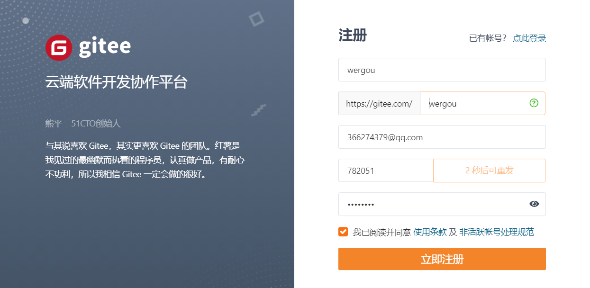

- 创建远程仓库：https://gitee.com/qfytao/j2010.git

- 远程仓库管理（添加开发人员）

  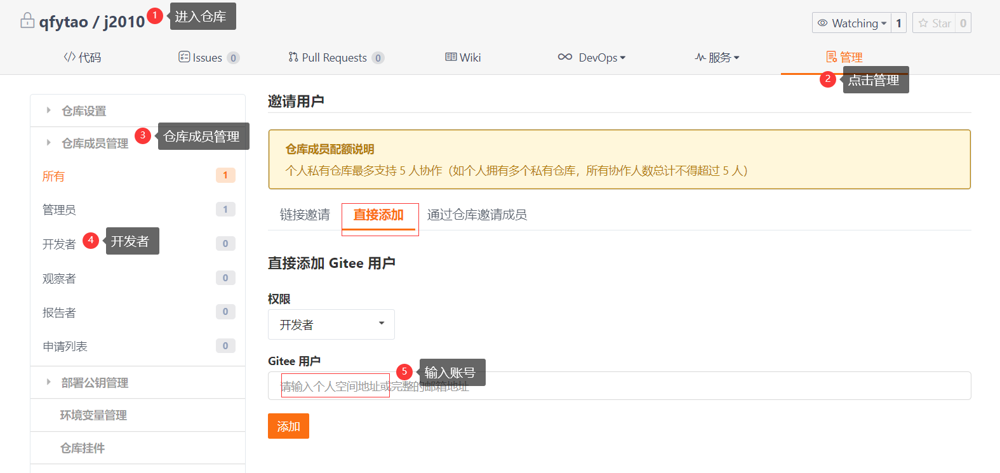

## 六、远程仓库操作

#### 6.1 push本地仓库到远程仓库

###### 6.1.1 准备工作

1. 创建本地工作空间

   ```
   D:\fmwy
   	src
   		main
   			java
   			resources
   		test
   			java
   	pom.xml
   ```

2. 初始化本地仓库

   ```shell
   git init
   ```

3. 将工作空间搭建的项目结构add到暂存区

   ```shell
   git add .
   ```

4. 将暂存区文件提交到版本库，生成第一个版本

   ```shell
   git commit -m '创建项目'
   ```

5. 为当前项目创建一个远程仓库

   https://gitee.com/qfytao/fmwy.git

###### 6.1.2 本地仓库关联远程仓库

> 建立D:\fmwy中的本地仓库 和 远程仓库https://gitee.com/qfytao/fmwy.git的关联

```shell
 git remote add origin https://gitee.com/qfytao/fmwy.git
```

###### 6.1.3 查看远程仓库状态

```shell
git remote -v
```

###### 6.1.4 将本地仓库push到远程仓库

> push到远程仓库需要gitee的帐号和密码

```shell
git push origin master
```

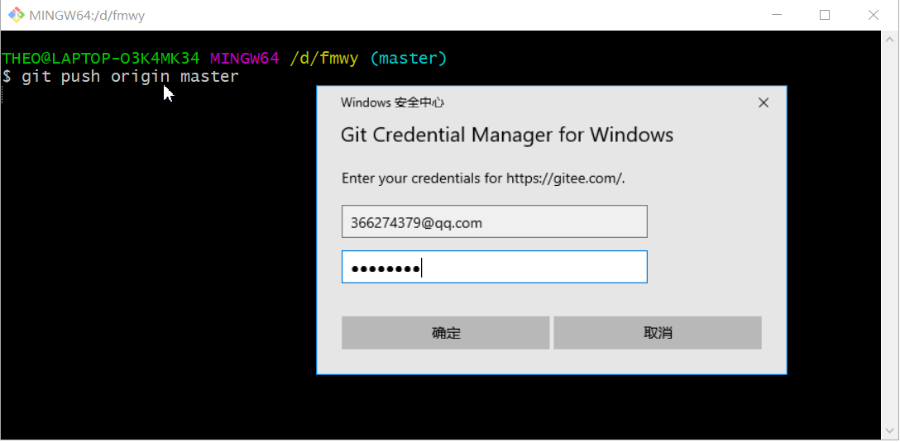

#### 6.2 其他开发者pull远程仓库到本地

> 其他开发者：www.1114325587@qq.com    *****

###### 6.2.1 先创建本地仓库

- 在E盘创建ws目录(空目录)，进入ws目录，打开Git客户端

- 创建本地版本库

  ```shell
  git init
  ```

###### 6.2.2 拉取远程仓库到本地

- 拉取远程仓库

  ```shell
  git pull 远程仓库地址 master
  git pull https://gitee.com/qfytao/fmwy2.git master
  ```


#### 6.3 解决协同开发冲突问题

```
场景:    Helloworld.java  [bbb]

开发者1：涛哥                              开发者2：小乔
-------------------------------------------------------------------------------------------
git pull fmwy2 master                    git pull fmwy2 master							
									     在Hellworld.java中新增内容 “bbb”
在Hellworld.java中新增内容 “aaa”
									     git add .
									     git commit -m ''
									     git push fmwy2 master
git add .
git commit -m ''
git push fmwy2 master【会失败！！！----在我pull之后，push之前被其他开发人员push过】


```

```
问题：我该如何操作？
git pull fmwy2 master 【将小乔修改的内容拉取到我本地】

对文件进行冲突合并

git add .
git commit -m ''
git push fmwy2 maste
```

HelloWorld.java

```
>>>>>>>>>>>>>>>>>>>>>HEAD
aaa
=================
bbb
<<<<<<<<<<<<<<<<<<<<< sikdfhjkasdfhjasdfhjk
```

## 七、分支管理

#### 7.1 什么是分支

> 分支就是版本库中记录版本位置（支线），分支之间项目会影响，使用分支可以对项目起到保护作用
>
> 分支就是一条时间线，每次提交就在这条时间线上形成一个版本

#### 7.2 分支特性

- 创建一个新的版本库，默认创建一个主分支—master分支
- 每个分支可以进行单独管理（常规分支、保护分支、只读分支）
- 分支是可以合并的

#### 7.3 分支操作

###### 7.3.1 创建分支

```shell
git branch branch_name
```

###### 7.3.2 查看分支

```shell
git branch
```

###### 7.3.3 切换分支

```shell
git branch branch_name  # 切换到指定分支上的最新版本
```

###### 7.3.4 检出分支

```shell
git checkout 历史版本 -b branch_name  # 签出指定的历史版本创建新分支
```

###### 7.3.5 分支合并

- 三方合并
- 快速合并

```shell
# 在master分支执行 git merge dev   表示将dev分支合并merge
git merge breanch_name
```

## 八、Idea整合Git使用

> 作为Java开发工程，我们代码的编写工作都是在IDE工具（idea）中完成，因此我们需要了解和掌握直接使用IDE工具完成Git的操作

#### 8.1 IDEA关联Git

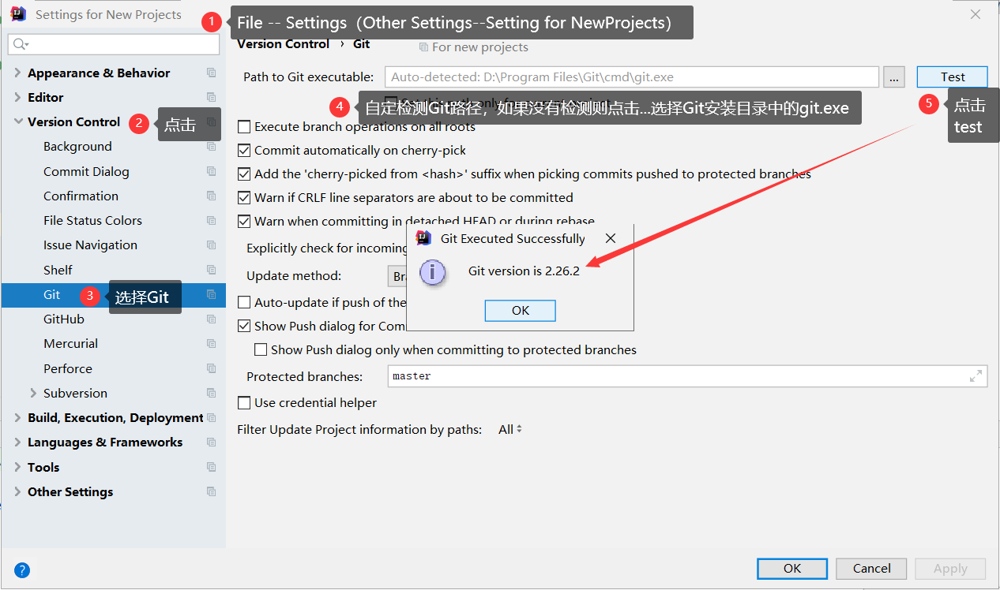

#### 8.2 IDEA中Git版本管理

> 准备工作：打开IDEA新建一个web工程

###### 8.2.1 创建本地版本库

|                                          |
| ---------------------------------------- |
| 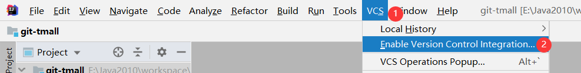 |
| 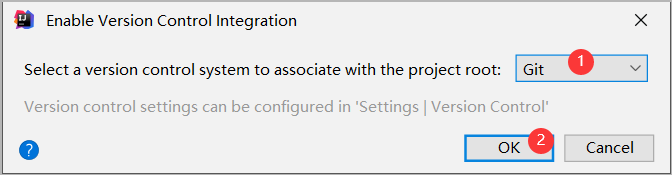 |

###### 8.2.2 设置忽略文件

> 在工作空间中有些文件是不需要记录到版本库中的（例如.idea、target、.iml文件），可以通过设置忽略提交来实现

- 在工作空间的根目录（项目的根目录）中创建一个名为`.gitignore`文件

- 在`.gitignore`文件配置忽略过滤条件

  ```
  .idea
  target
  *.iml
  ```

###### 8.2.3 将工作空间add到暂存区

- 选择项目/文件---右键---Git---Add（添加到暂存区的文件--绿色）

- 如果一个文件创建好之后还没有添加到暂存区--棕红色

- 添加到暂存区的操作可以设置默认添加

  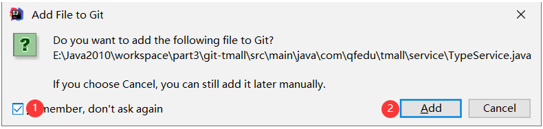

###### 8.2.4 将暂存区提交到版本库

- 选择项目/文件---右键---Git--Commit（记录到版本库的文件--黑色）

- 如果对记录到 版本库的文件进行了修改，也就是说工作空间和版本库不一致--蓝色

#### 8.3 IDEA中Git分支管理

###### 8.3.1 创建分支

- 点击IDEA右下角`Git`
- 在弹窗中点击`New Branch`
- 输入新分支的名称

###### 8.3.2 切换分支

- 点击IDEA右下角`Git`
- 点击非当前分支右边的箭头
- 在选项卡点击`checkout`

###### 8.3.3 删除分支

| 点击右小角git                            |
| ---------------------------------------- |
| 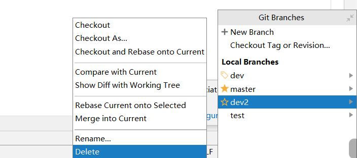 |

###### 8.3.4 合并分支

> 例如：将dev合并到master

- 切换到master分支
- 点击dev分支右面的箭头，在展开的菜单中选择`Merge into current`

#### 8.4 IDEA中使用Git进行团队协同开发

###### 8.4.1 项目管理者

1. 完成项目搭建

   - 略

2. 为当前项目创建本地版本库

3. 将搭建好的项目提交到本地版本库

   - add到暂存区
   - commit到版本库

4. 创建远程版本库（远程仓库）

   - https://gitee.com/qfytao/git-jd.git
   - 管理—添加开发者

5.  将本地仓库push到远程仓库（master分支——master分支）

   | 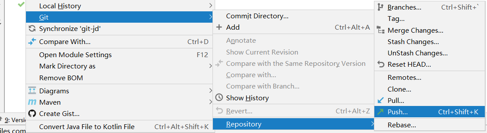 |
   | ---------------------------------------- |
   | 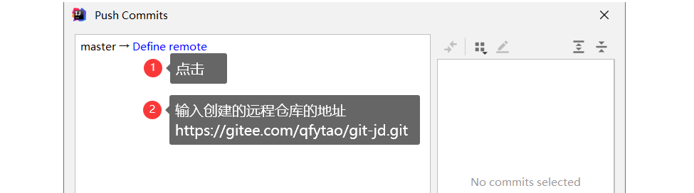 |
   | 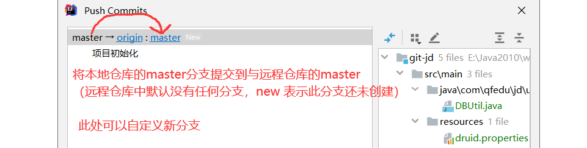 |

6. 在本地创建dev分支

   > 在远程仓库`checkout as` 新建本地`dev`分支（master需要进行保护）

   | 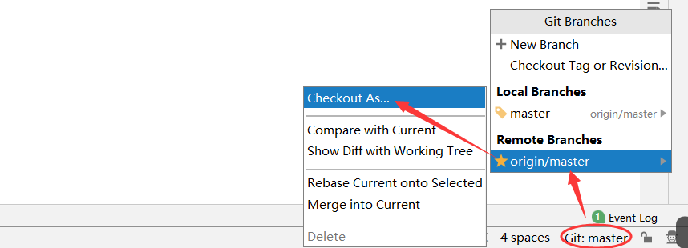 |
   | ---------------------------------------- |
   |  |

7. 将本地dev分支push到远程仓库，新建远程仓库的dev分支

   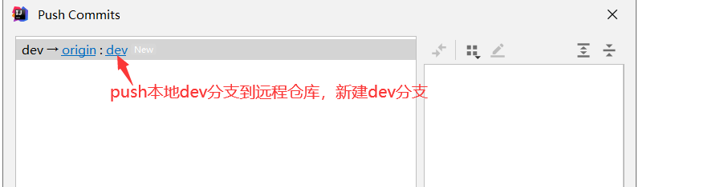

8. 设置远程仓库中master分支为保护分支

   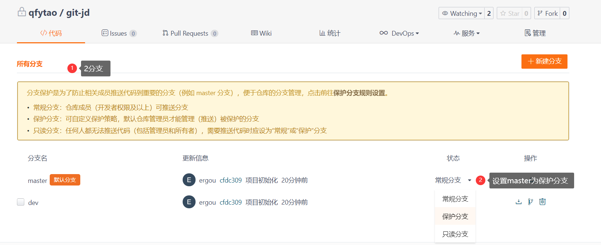


###### 8.4.2 项目开发者

1. 从管理员提供的远程仓库pull项目到本地

   - 远程仓库 https://gitee.com/qfytao/git-jd.git

   | 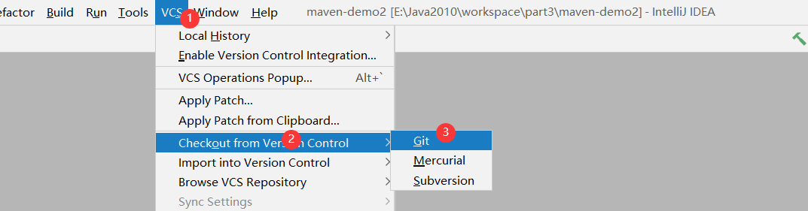 |
   | ---------------------------------------- |
   | 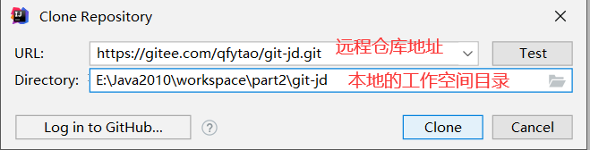 |

2. 打开项目（此时本地工作空间的项目和远程仓库是同步的）

3. 开发步骤：

   - 选择要修改的文件--pull
   - 进行修改操作
   - 测试本地修改
   - add到暂存区
   - commit到本地版本库
   - push到远程仓库（dev）

#### 8.5 解决团队协同开发的冲突问题

> 冲突：在pull之后，push之前被其他开发者这push成功

- 选择产生冲突的文件---pull
- 弹出弹窗提示：accpet yours | accept theirs | Merge
  - accpet yours  保留自己的版本（提交时会覆盖其他开发者代码）
  - accpet theirs 保留远程仓库上的版本（会导致自己修改的代码丢失）
  - `Merge` 手动合并（和其他开发者沟通合并方案）

