## 一、MyBatis简介

#### 1.1 框架概念

> 框架，就是软件的半成品，完成了软件开发过程中的通用操作，程序员只需很少或者不用进行加工就能够实现特定的功能，从而简化开发人员在软件开发中的步骤，提高开发效率。

#### 1.2  常用框架

- MVC框架：简化了Servlet的开发步骤
  - Struts
  - Struts2
  - `SpringMVC`
- 持久层框架：完成数据库操作的框架
  - apache DBUtils
  - Hibernate
  - Spring JPA
  - `MyBatis`
  - EJB3.0
- 胶水框架：`Spring`

SSM   Spring SpringMVC MyBatis

SSH   Spring Struts2 Hibernate

#### 1.3 MyBatis介绍

> MyBatis是一个`半自动`的`ORM`框架
>
> ORM（Object Relational Mapping）对象关系映射，将Java中的一个对象与数据表中一行记录一一对应。
>
> ORM框架提供了实体类与数据表的映射关系，通过映射文件的配置，实现对象的持久化。

- MyBatis的前身是iBatis，iBatis是Apache软件基金会提供的一个开源项目
- 2010年iBatis迁移到Google code，正式更名为MyBatis
- 2013年迁移到Github托管
- MyBatis特点：
  - 支持自定义SQL、存储过程
  - 对原有的JDBC进行了封装，几乎消除了所有JDBC代码，让开发者只需关注SQL本身
  - 支持XML和注解配置方式自定完成ORM操作，实现结果映射

## 二、MyBatis框架部署

> 框架部署，就是将框架引入到我们的项目中

#### 2.1 创建Maven项目

- Java工程
- Web工程

#### 2.2 在项目中添加MyBatis依赖

- 在pom.xml中添加依赖

  - mybatis    
  - mysql driver 

  ```xml
  <!-- https://mvnrepository.com/artifact/mysql/mysql-connector-java -->
  <dependency>
      <groupId>mysql</groupId>
      <artifactId>mysql-connector-java</artifactId>
      <version>5.1.47</version>
  </dependency>
  
  <!-- https://mvnrepository.com/artifact/org.mybatis/mybatis -->
  <dependency>
      <groupId>org.mybatis</groupId>
      <artifactId>mybatis</artifactId>
      <version>3.4.6</version>
  </dependency>
  ```

#### 2.3 创建MyBatis配置文件

- 创建自定义模板：选择resources----右键New----Edit File Templates

  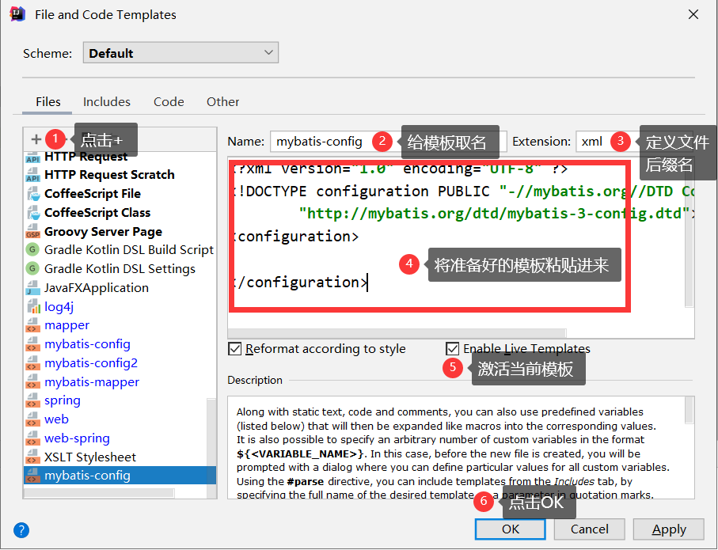

- 在resources中创建名为`mybatis-config.xml`的文件

- 在`mybatis-config.xml`文件配置数据库连接信息

  ```xml
  <?xml version="1.0" encoding="UTF-8" ?>
  <!DOCTYPE configuration PUBLIC "-//mybatis.org//DTD Config 3.0//EN"
          "http://mybatis.org/dtd/mybatis-3-config.dtd">
  <configuration>
      
      <!-- 在environments配置数据库连接信息 -->
      <!-- 在environments标签中可以定义多个environment标签，每个environment标签可以定义一套连接配置 -->
      <!-- default属性，用来指定使用哪个environment标签 -->
      <environments default="mysql">
          
          <environment id="mysql">
              <!--transactionManager标签用于配置数据库管理方式-->
              <transactionManager type="JDBC"></transactionManager>
              <!--dataSource标签就是用来配置数据库连接信息 -->
              <dataSource type="POOLED">
                  <property name="driver" value="com.mysql.jdbc.Driver"/>
                  <property name="url" value="jdbc:mysql://localhost:3306/db_2010_fmwy?characterEncoding=utf-8"/>
                  <property name="username" value="root"/>
                  <property name="password" value="admin123"/>
              </dataSource>
          </environment>
          
      </environments>
  
  </configuration>
  ```

  

## 三、MyBatis框架使用

> 案例：学生信息的数据库操作

#### 3.1 创建数据表

| tb_students                              |
| ---------------------------------------- |
|  |

#### 3.2 创建实体类

| Student.java                             |
| ---------------------------------------- |
| 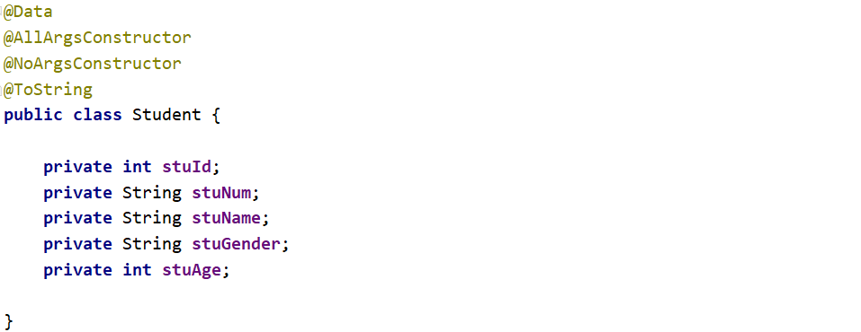 |

#### 3.3 创建DAO接口，定义操作方法

| StudentDAO.java                          |
| ---------------------------------------- |
|  |

#### 3.4 创建DAO接口的映射文件

- 在`resources`目录下，新建名为`mappers`文件夹
- 在`mappers`中新建名为`StudentMapper.xml`的映射文件（根据模板创建）
- 在映射文件中对DAO中定义的方法进行实现：

```xml
<?xml version="1.0" encoding="UTF-8" ?>
<!DOCTYPE mapper
        PUBLIC "-//mybatis.org//DTD Mapper 3.0//EN"
        "http://mybatis.org/dtd/mybatis-3-mapper.dtd">
<!--mapper文件相当于DAO接口的‘实现类’，namespace属性要指定`实现`DAO接口的全限定名-->
<mapper namespace="com.qfedu.dao.StudentDAO">

    <insert id="insertStudent">
        insert into tb_students(stu_num,stu_name,stu_gender,stu_age)
        values(#{stuNum},#{stuName},#{stuGender},#{stuAge})
    </insert>

    <delete id="deleteStudent">
        delete from tb_students where stu_num=#{stuNum}
    </delete>

</mapper>
```

#### 3.5 将映射文件添加到主配置文件

| mybatis-config.xml                       |
| ---------------------------------------- |
| 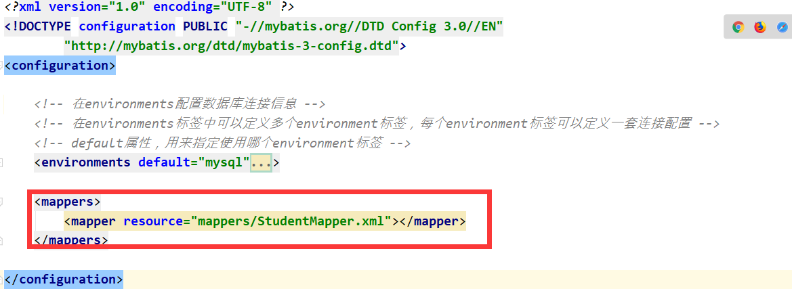 |

## 四、单元测试

#### 4.1 添加单元测依赖 

```xml
<dependency>
    <groupId>junit</groupId>
    <artifactId>junit</artifactId>
    <version>4.12</version>
</dependency>
```

#### 4.2 创建单元测试类

| 在被测试类名后alt+insert ---  选择Test   |
| ---------------------------------------- |
| 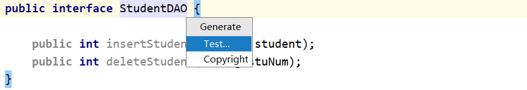 |
| 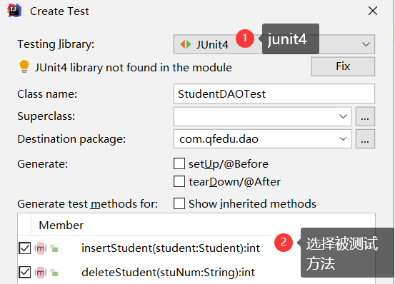 |

#### 4.3 测试代码

```java
package com.qfedu.dao;

import com.qfedu.pojo.Student;
import org.apache.ibatis.io.Resources;
import org.apache.ibatis.session.SqlSession;
import org.apache.ibatis.session.SqlSessionFactory;
import org.apache.ibatis.session.SqlSessionFactoryBuilder;

import java.io.IOException;
import java.io.InputStream;

import static org.junit.Assert.*;

public class StudentDAOTest {

    @org.junit.Test
    public void insertStudent() {

        try {
            //加载mybatis配置文件
            InputStream is = Resources.getResourceAsStream("mybatis-config.xml");
            SqlSessionFactoryBuilder builder = new SqlSessionFactoryBuilder();
            //会话工厂
            SqlSessionFactory factory = builder.build(is);
            //会话（连接）
            SqlSession sqlSession = factory.openSession();
            //通过会话获取DAO对象
            StudentDAO studentDAO = sqlSession.getMapper(StudentDAO.class);
            //测试StudentDAO中的方法
            int i = studentDAO.insertStudent(new Student(0, "10001", "张三", "男", 21));
            //需要手动提交
            sqlSession.commit();
            System.out.println(i);
        } catch (IOException e) {
            e.printStackTrace();
        }
    }

    @org.junit.Test
    public void deleteStudent() {
    }
}
```

## 五、MyBatis的CRUD操作

> 案例:学生信息的增删查改

#### 5.1 添加操作

略

#### 5.2 删除操作

> 根据学号删除一条学生信息

- 在StudentDAO中定义删除方法

| StudentDAO                               |
| ---------------------------------------- |
|  |

- 在StudentMapper.xml中对接口方法进行“实现”

| StudentMapper.xml                        |
| ---------------------------------------- |
|  |

- 测试：在StudentDAO的测试类中添加测试方法

| StudentDAOTest                           |
| ---------------------------------------- |
|  |

#### 5.3 修改操作

> 根据学生学号，修改其他字段信息

- 在StudentDAO接口中定义修改方法

| StudentDAO                               |
| ---------------------------------------- |
| 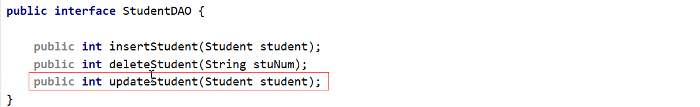 |

- 在StudentMapper.xml中“实现”接口中定义的修改方法

| StudentMapper.xml                        |
| ---------------------------------------- |
| 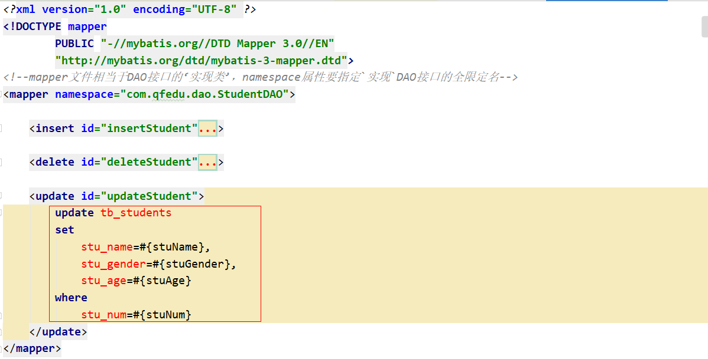 |

- 单元测试

| StudentDAOTest                           |
| ---------------------------------------- |
|  |

#### 5.4 查询操作-查询所有

- 在StudentDAO接口定义操作方法

| StudentDAO                               |
| ---------------------------------------- |
|  |

- 在StudentMapper.xml中“实现”DAO中定义的方法

| StudentMapper.xml                        |
| ---------------------------------------- |
| 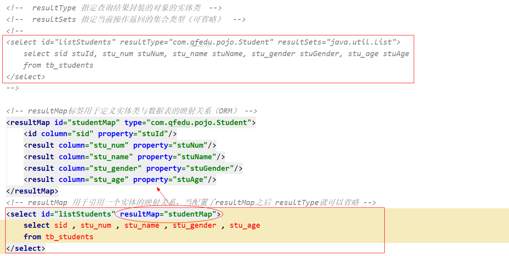 |

- 单元测试

| StudentDAOTest                           |
| ---------------------------------------- |
|  |

#### 5.5 查询操作-查询一条记录

>  根据学号查询一个学生信息

- 在StudentDAO接口中定义方法

| StudentDAO                               |
| ---------------------------------------- |
| 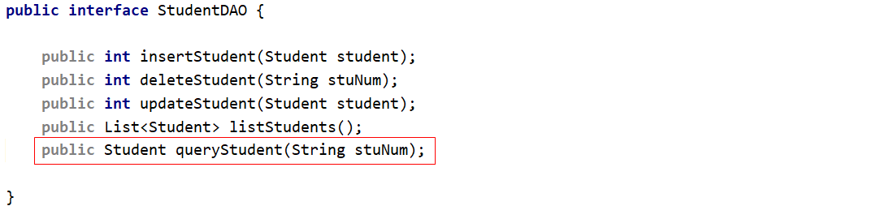 |

- 在StudentDAOMapper.xml中配置StudentDAO接口的方法实现——SQL

| StudentDAOMapper.xml                     |
| ---------------------------------------- |
| 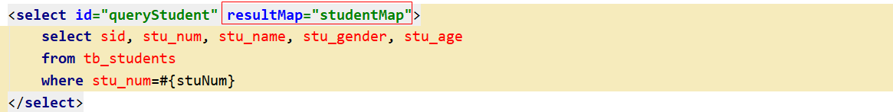 |

- 单元测试

| StudentDAOTest                           |
| ---------------------------------------- |
|  |

#### 5.6 查询操作-多参数查询

> 分页查询（参数  start ， pageSize）

- 在StudentDAO中定义操作方法，如果方法有多个参数，使用`@Param`注解声明参数的别名

| StudentDAO                               |
| ---------------------------------------- |
| 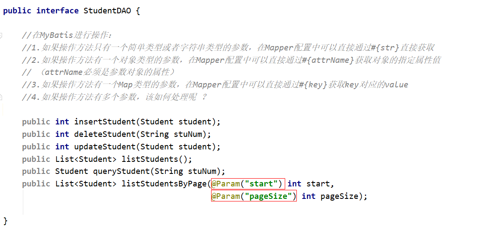 |

- 在StudentMapper.xml配置sql时，使用`#{别名}`获取到指定的参数

| StudentMapper.xml                        |
| ---------------------------------------- |
|  |

**`注意`** 如果DAO操作方法没有通过@Param指定参数别名，在SQL中也可以通过`arg0,arg1...`或者`param1,param2,...`获取参数

#### 5.7 查询操作-查询总记录数

- 在StudentDAO接口中定义操作方法

| StudentDAO                               |
| ---------------------------------------- |
| 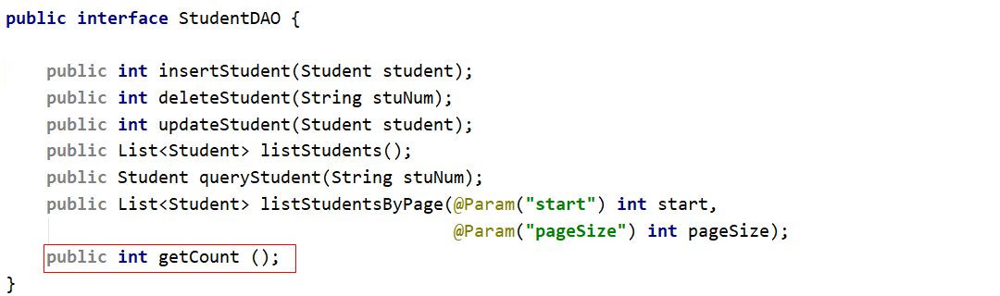 |

- 在StudentMapper.xml配置sql，通过resultType指定当前操作的返回类型为int

|                                          |
| ---------------------------------------- |
| 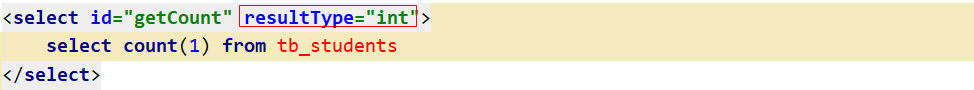 |

#### 5.8 添加操作回填生成的主键

- StduentMapper.xml的添加操作标签——`insert`

```xml
<!-- useGeneratedKeys 设置添加操作是否需要回填生成的主键 -->
<!-- keyProperty 设置回填的主键值赋值到参数对象的哪个属性 -->
<insert id="insertStudent" useGeneratedKeys="true" keyProperty="stuId">
    insert into tb_students(stu_num, stu_name, stu_gender, stu_age)
    values (#{stuNum}, #{stuName}, #{stuGender}, #{stuAge})
</insert>
```

## 六、MyBatis工具类封装

- MyBatisUtil

```java
public class MyBatisUtil {

    private static SqlSessionFactory factory;
    private static final ThreadLocal<SqlSession> local = new ThreadLocal<SqlSession>();

    static{
        try {
            InputStream is = Resources.getResourceAsStream("mybatis-config.xml");
            SqlSessionFactoryBuilder builder = new SqlSessionFactoryBuilder();
            factory = builder.build(is);
        } catch (IOException e) {
            e.printStackTrace();
        }
    }

    public static SqlSessionFactory getFactory(){
        return factory;
    }

    public static SqlSession getSqlSession(){
        SqlSession sqlSession = local.get();
        if(sqlSession == null ){
            sqlSession = factory.openSession();
            local.set(sqlSession);
        }
        return sqlSession;
    }

    public static <T extends Object> T getMapper(Class<T> c){
        SqlSession sqlSession = getSqlSession();
        return sqlSession.getMapper(c);
    }

}
```


## 七、事务管理

> SqlSession 对象
>
> - getMapper(DAO.class) :  获取Mapper（DAO接口的实例）
> - 事务管理

#### 7.1 手动提交事务

- `sqlSession.commit();`提交事务
- `sqlSession.rollback();`事务回滚

**测试类中进行事务管理**

```java
@Test
public void insertStudent() {
    SqlSession sqlSession = MyBatisUtil.getSqlSession();
    //1.当我们获取sqlSession对象时，就默认开启了事务
    try{
        //通过会话获取DAO对象
        StudentDAO studentDAO = sqlSession.getMapper(StudentDAO.class);
        //测试StudentDAO中的方法
        Student student = new Student(0, "10005", "Lily", "女", 21);
        int i = studentDAO.insertStudent(student);
        //2.操作完成并成功之后，需要手动提交
        sqlSession.commit();
    }catch (Exception e){
        //3.当操作出现异常，调用rollback进行回滚
        sqlSession.rollback();
    }
}
```

**业务逻辑层手动事务管理**

```java
public class StudentServiceImpl implements StudentService {

    public boolean addStudent(Student student) {
        boolean b = false;
        SqlSession sqlSession = MyBatisUtil.getSqlSession();
        try{
            StudentDAO studentDAO = sqlSession.getMapper(StudentDAO.class);
            int i = studentDAO.insertStudent(student);
            b = i>0;
            sqlSession.commit();
        }catch (Exception e){
            sqlSession.rollback();
        }
        return b;
    }
}
```

#### 7.2 自动提交事务

>  通过SqlSessionFactory调用openSession方法获取SqlSession对象时，可以通过参数设置事务是否自动提交：
>
> - 如果参数设置为true，表示自定提交事务： factory.openSession(true);
>
> - 如果参数设置为false，或者不设置参数，表示手动提交：factory.openSession();/factory.openSession(false);

**MyBatisUtil**优化

```java
public class MyBatisUtil {

    private static SqlSessionFactory factory;
    private static final ThreadLocal<SqlSession> local = new ThreadLocal<SqlSession>();

    static{
        try {
            InputStream is = Resources.getResourceAsStream("mybatis-config.xml");
            SqlSessionFactoryBuilder builder = new SqlSessionFactoryBuilder();
            factory = builder.build(is);
        } catch (IOException e) {
            e.printStackTrace();
        }
    }

    public static SqlSessionFactory getFactory(){
        return factory;
    }

    private static SqlSession getSqlSession(boolean isAutoCommit){
        SqlSession sqlSession = local.get();
        if(sqlSession == null ){
            sqlSession = factory.openSession(isAutoCommit);
            local.set(sqlSession);
        }
        return sqlSession;
    }

    //手动事务管理
    public static SqlSession getSqlSession(){
        return getSqlSession(false);
    }

    //自动事务提交
    public static <T extends Object>T getMapper(Class<T> c){
        SqlSession sqlSession = getSqlSession(true);
        return sqlSession.getMapper(c);
    }

}
```

**测试操作**

```java
@Test
public void testDeleteStudent() {
    StudentDAO studentDAO = MyBatisUtil.getMapper(StudentDAO.class);
    int i = studentDAO.deleteStudent("10001");
}
```

**业务逻辑层自动事务管理**

```java
public class StudentServiceImpl implements StudentService {

    private StudentDAO studentDAO = MyBatisUtil.getMapper(StudentDAO.class);

    public boolean addStudent(Student student) {
        int i = studentDAO.insertStudent(student);
        boolean b = i>0;
        return b;
    }
}
```

##  八、MyBatis主配置文件

>  mybatis-config.xml 是MyBatis框架的主配置文件，只要用于配置MyBatis数据源及属性信息

#### 8.1 properties标签

> 用于设置键值对，或者加载属性文件

- 在resources目录下创建`jdbc.properties`文件，配置键值对如下：

```properties
mysql_driver=com.mysql.jdbc.Driver
mysql_url=jdbc:mysql://localhost:3306/db_2010_fmwy?characterEncoding=utf-8
mysql_username=root
mysql_password=admin123
```

- 在mybatis-config.xml中通过`properties`标签引用`jdbc.properties`文件;引入之后，在配置environment时可以直接使用jdbc.properties的key获取对应的value

| mybatis-config.xml                       |
| ---------------------------------------- |
| 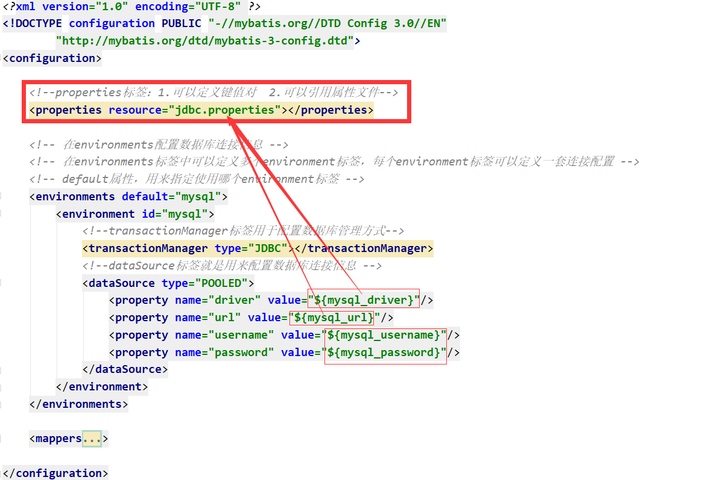 |

#### 8.2 settings标签

```xml
<!--设置mybatis的属性-->
<settings>
    <!-- 启动二级缓存-->
    <setting name="cacheEnabled" value="true"/>
    <!-- 启动延迟加载 -->
    <setting name="lazyLoadingEnabled" value="true"/>
</settings>
```

#### 8.3 typeAliases标签

```xml
<!--typeAliases标签用于给实体类取别名，在映射文件中可以直接使用别名来替代实体类的全限定名-->
<typeAliases>
    <typeAlias type="com.qfedu.pojo.Student" alias="Student"></typeAlias>
    <typeAlias type="com.qfedu.pojo.Book" alias="Book"></typeAlias>
</typeAliases>
```

#### 8.4 plugins标签

```xml
<!--plugins标签，用于配置MyBatis插件（分页插件）-->
<plugins>
    <plugin interceptor=""></plugin>
</plugins>
```

#### 8.5 environments标签

```xml
<!-- 在environments配置数据库连接信息 -->
<!-- 在environments标签中可以定义多个environment标签，每个environment标签可以定义一套连接配置 -->
<!-- default属性，用来指定使用哪个environment标签 -->
<environments default="mysql">

    <!--  environment 标签用于配置数据库连接信息  -->
    <environment id="mysql">

        <!--transactionManager标签用于配置数据库管理方式
            type="JDBC"  可以进行事务的提交和回滚操作
            type="MANAGED" 依赖容器完成事务管理，本身不进行事务的提交和回滚操作 -->
        <transactionManager type="JDBC"></transactionManager>

        <!--dataSource标签就是用来配置数据库连接信息 POOLED|UNPOOLED -->
        <dataSource type="POOLED">
            <property name="driver" value="${mysql_driver}"/>
            <property name="url" value="${mysql_url}"/>
            <property name="username" value="${mysql_username}"/>
            <property name="password" value="${mysql_password}"/>
        </dataSource>
    </environment>

</environments>
```

#### 8.6 mappers标签

> 加载映射配置（映射文件、DAO注解）

```xml
<!--mappers标签用于载入映射文件-->
<mappers>
    <mapper resource="mappers/StudentMapper.xml"></mapper>
</mappers>
```

## 九、映射文件

#### 9.1 MyBatis Mapper初始化

> XML文件解析：读取xml文件中的标签配置封装到Java对象中

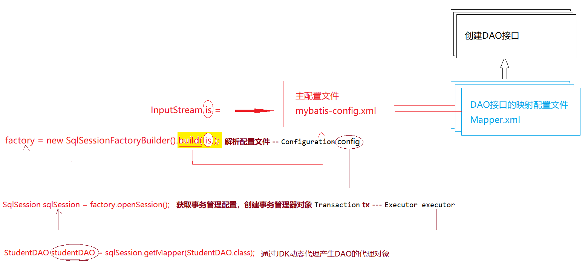

#### 9.2 mapper根标签

> mapper文件相当于DAO接口的‘实现类’，namespace属性要指定`实现`DAO接口的全限定名

#### 9.3 insert标签

> 声明添加操作（sql: insert ...）
>
> **常用属性**
>
> id属性，绑定对应DAO接口中的方法
>
> parameterType属性，用以指定接口中对应方法的参数类型（可省略）
>
> useGeneratedKeys属性， 设置添加操作是否需要回填生成的主键
>
> keyProperty属性，指定回填的id设置到参数对象中的哪个属性
>
> timeout属性，设置此操作的超时时间，如果不设置则一直等待

**主键回填**

```xml
<insert id="insertStudent" useGeneratedKeys="true" keyProperty="stuId">
    insert into tb_students(stu_num, stu_name, stu_gender, stu_age)
    values (#{stuNum}, #{stuName}, #{stuGender}, #{stuAge})
</insert>
```

```xml
<insert id="insertStudent" >
    <selectKey keyProperty="stuId" resultType="java.lang.Integer">
        select last_insert_id()
    </selectKey>
    insert into tb_students(stu_num, stu_name, stu_gender, stu_age)
    values (#{stuNum}, #{stuName}, #{stuGender}, #{stuAge})
</insert>
```

#### 9.4 delete标签

> 声明删除操作

#### 9.5 update标签

> 声明修改操作

#### 9.6 select标签

> 声明查询操作
>
> - id属性， 指定绑定方法的方法名
> - parameterType属性，设置参数类型
>
> - resultType属性，指定当前sql返回数据封装的对象类型（实体类）
> - resultMap属性，指定从数据表到实体类的字段和属性的对应关系
> - useCache属性，指定此查询操作是否需要缓存
> - timeout属性，设置超时时间

#### 9.7 resultMap标签

```xml
<!-- resultMap标签用于定义实体类与数据表的映射关系（ORM） -->
<resultMap id="studentMap" type="Student">
    <id column="sid" property="stuId"/>
    <result column="stu_num" property="stuNum"/>
    <result column="stu_name" property="stuName"/>
    <result column="stu_gender" property="stuGender"/>
    <result column="stu_age" property="stuAge"/>
</resultMap>
```

#### 9.8 cache标签

> 设置当前DAO进行数据库操作时的缓存属性设置

```xml
<cache type="" size="" readOnly="false"/>
```

#### 9.9 sql和include

> SQL片段

```xml
<sql id="wanglaoji">sid , stu_num , stu_name , stu_gender , stu_age</sql>

<select id="listStudents" resultMap="studentMap">
    select <include refid="wanglaoji"/> from tb_students
</select>
```

## 十、分页插件

> 分页插件是一个独立于MyBatis框架之外的第三方插件;

#### 10.1 添加分页插件的依赖

> PageHelper

```xml
 <!-- pagehelper分页插件 -->
<dependency>
    <groupId>com.github.pagehelper</groupId>
    <artifactId>pagehelper</artifactId>
    <version>5.1.10</version>
</dependency>
```

#### 10.2 配置插件

> 在mybatis的主配置文件`mybatis-config.xml`中通过`plugins`标签进行配置

```xml
<!--plugins标签，用于配置MyBatis插件（分页插件）-->
<plugins>
    <plugin interceptor="com.github.pagehelper.PageInterceptor"></plugin>
</plugins>
```

#### 10.3 分页实例

> 对学生信息进行分页查询

```java
@Test
public void testListStudentsByPage() {
    StudentDAO studentDAO = MyBatisUtil.getMapper(StudentDAO.class); //sqlSession
    PageHelper.startPage(2,4);
    List<Student> students = studentDAO.listStudents();
    PageInfo<Student> pageInfo = new PageInfo<Student>(students);
    //pageInfo中就包含了数据及分页信息
}
```

**带条件分页**

```java
@Test
public void testListStudentsByPage() {
    StudentDAO studentDAO = MyBatisUtil.getMapper(StudentDAO.class); //sqlSession
    PageHelper.startPage(2,4);
    //List<Student> students = studentDAO.listStudents();
    List<Student> list = studentDAO.listStudentsByGender("女");
    PageInfo<Student> pageInfo = new PageInfo<Student>(list);
    //pageInfo中就包含了数据及分页信息
}
```

## 十一、关联映射

#### 11.1 实体关系

> 实体——数据实体，实体关系指的就是数据与数据之间的关系
>
> 例如：用户和角色、房屋和楼栋、订单和商品

实体关系分为以下四种：

**一对一关联**

实例：人和身份证、学生和学生证、用户基本信息和详情

数据表关系：

- 主键关联（用户表主键 和详情主键相同时，表示是匹配的数据）

  

- 唯一外键关联

  

**一对多关联**、**多对一关联**

实例：

- 一对多： 班级和学生 、 类别和商品、楼栋和房屋
- 多对一：学生和班级 、  商品和类别

数据表关系：

- 在多的一端添加外键和一的一段进行关联

**多对多关联**

实例：用户和角色、角色和权限、房屋和业主、学生和社团、订单和商品

数据表关系：建立第三张关系表添加两个外键分别与两张表主键进行关联

用户(user_id)           用户角色表(uid,rid)      角色(role_id)


#### 11.2 创建项目，部署MyBatis框架

- 创建web项目（maven）

  ```xml
  <!-- 添加web依赖 -->
  <dependency>
      <groupId>javax.servlet</groupId>
      <artifactId>jsp-api</artifactId>
      <version>2.0</version>
      <scope>provided</scope>
  </dependency>
  <dependency>
      <groupId>javax.servlet</groupId>
      <artifactId>javax.servlet-api</artifactId>
      <version>4.0.1</version>
      <scope>provided</scope>
  </dependency>
  ```

- 部署MyBatis框架

  - 添加依赖

  ```xml
  <!-- https://mvnrepository.com/artifact/org.mybatis/mybatis -->
  <dependency>
      <groupId>org.mybatis</groupId>
      <artifactId>mybatis</artifactId>
      <version>3.4.6</version>
  </dependency>
  <!-- https://mvnrepository.com/artifact/mysql/mysql-connector-java -->
  <dependency>
      <groupId>mysql</groupId>
      <artifactId>mysql-connector-java</artifactId>
      <version>5.1.47</version>
  </dependency>
  ```

  - 配置文件
  - 帮助类

  ```java
  public class MyBatisUtil {
  
      private static SqlSessionFactory factory;
      private static final ThreadLocal<SqlSession> local = new ThreadLocal<SqlSession>();
  
      static{
          try {
              InputStream is = Resources.getResourceAsStream("mybatis-config.xml");
              factory = new SqlSessionFactoryBuilder().build(is);
          } catch (IOException e) {
              e.printStackTrace();
          }
      }
  
      public static SqlSessionFactory getSqlSessionFactory(){
          return factory;
      }
  
      public static SqlSession getSqlSession(boolean isAutoCommit){
          SqlSession sqlSession = local.get();
          if(sqlSession == null){
              sqlSession = factory.openSession(isAutoCommit);
              local.set(sqlSession);
          }
          return sqlSession;
      }
  
      public static SqlSession getSqlSession(){
          return getSqlSession(false);
      }
  
      public static <T extends  Object>T getMapper(Class<T> c){
          SqlSession sqlSession = getSqlSession(true);
          return sqlSession.getMapper(c);
      }
  
  }
  ```

#### 11.3 一对一关联

> 实例：用户---详情

###### 11.3.1 创建数据表

```sql
-- 用户信息表
create table users(
    user_id int primary key auto_increment,
    user_name varchar(20) not null unique,
    user_pwd varchar(20) not null,
    user_realname varchar(20) not null,
    user_img varchar(100) not null
);

-- 用户详情表
create table details(
	detail_id int primary key auto_increment,
    user_addr varchar(50) not null,
    user_tel char(11) not null,
    user_desc varchar(200),
	uid int not null unique
    -- constraint FK_USER foreign key(uid) references users(user_id)
);
```

###### 11.3.2 创建实体类

- User

  ```java
  @Data
  @NoArgsConstructor
  @AllArgsConstructor
  @ToString
  public class User {
      private int userId;
      private String userName;
      private String userPwd;
      private String userRealname;
      private String userImg;
  }
  ```

- Detail

  ```java
  @Data
  @NoArgsConstructor
  @AllArgsConstructor
  @ToString
  public class Detail {
      private int detailId;
      private String userAddr;
      private String userTel;
      private String userDesc;
      private int userId;
  }
  ```

###### 11.3.3 添加操作（事务）

| 测试代码                                 |
| ---------------------------------------- |
|  |

###### 11.3.4 一对一关联查询

> 在查询用户的同时关联查询出与之对应的详情

**实体**

| User                                     | Detail                                   |
| ---------------------------------------- | ---------------------------------------- |
| 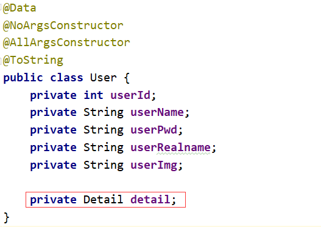 | 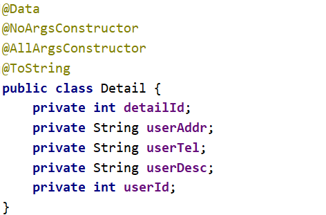 |

**映射文件**

| 连接查询                                 |
| ---------------------------------------- |
| 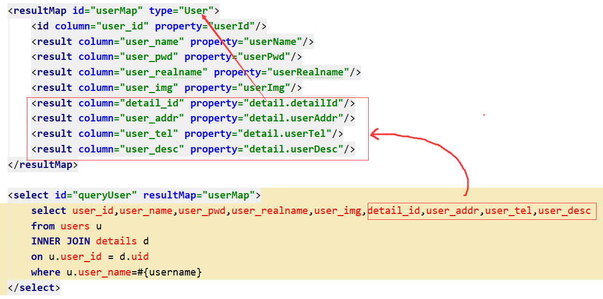 |

| 子查询                                   |
| ---------------------------------------- |
|  |
|  |

#### 11.4 一对多关联

> 案例：班级(1)—学生(n)

###### 11.4.1 创建数据表

```sql
-- 创建班级信息表
create table classes(
    cid int primary key auto_increment,
    cname varchar(30) not null unique,
    cdesc varchar(100)
);

-- 创建学生信息表
create table students(
    sid char(5) primary key,
    sname varchar(20) not null,
    sage int not null,
    scid int not null
);
```

###### 11.4.2 创建实体类

| Clazz                                    | Student                                  |
| ---------------------------------------- | ---------------------------------------- |
| 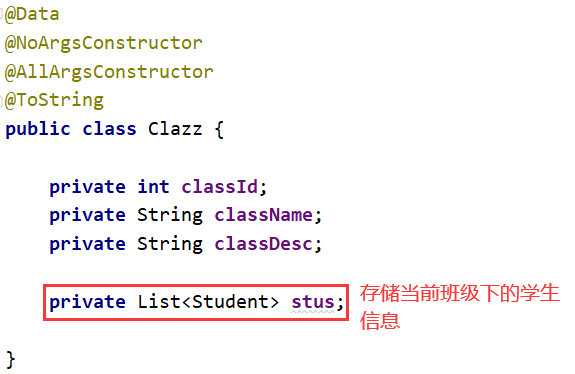 | 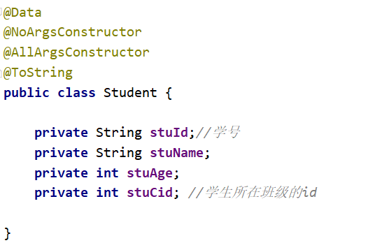 |

###### 11.4.3 关联查询

> 当查询一个班级的时候， 要关联查询出这个班级下的所有学生

**连接查询**

| 连接查询映射配置                         |
| ---------------------------------------- |
| 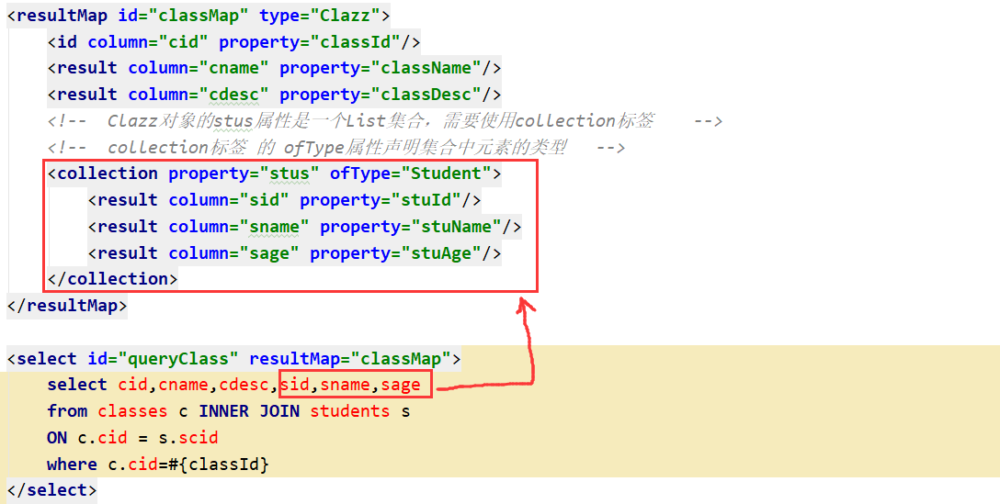 |

**子查询**

| 子查询映射配置                           |
| ---------------------------------------- |
|  |
|  |

#### 11.5 多对一关联

> 实例：学生(n)—班级(1)
>
> 当查询一个学生的时候，关联查询这个学生所在的班级信息

###### 11.5.1 创建实体类

| Student                                  | Clazz                                    |
| ---------------------------------------- | ---------------------------------------- |
| 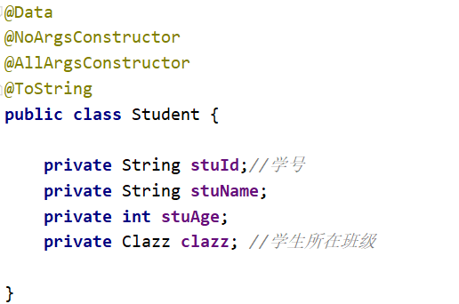 | 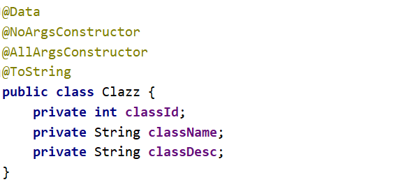 |

###### 11.5.2 关联查询

**连接查询**

| 连接查询映射配置                         |
| ---------------------------------------- |
| 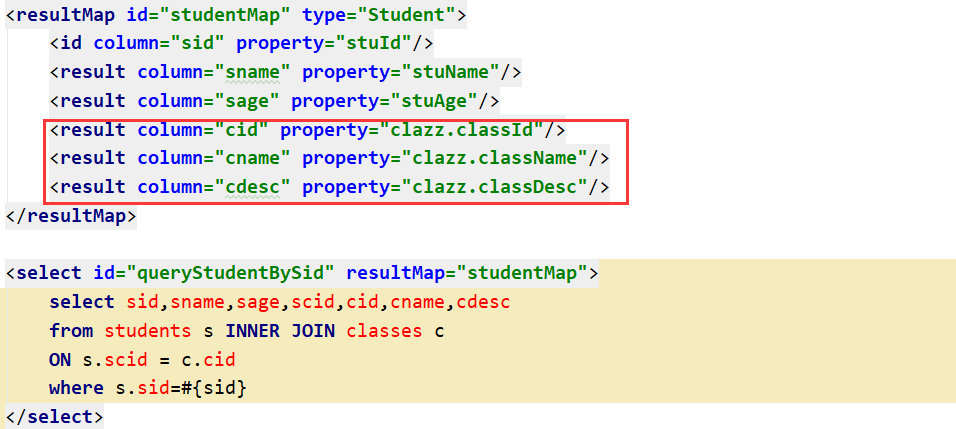 |

**子查询**

| 子查询映射配置                           |
| ---------------------------------------- |
| 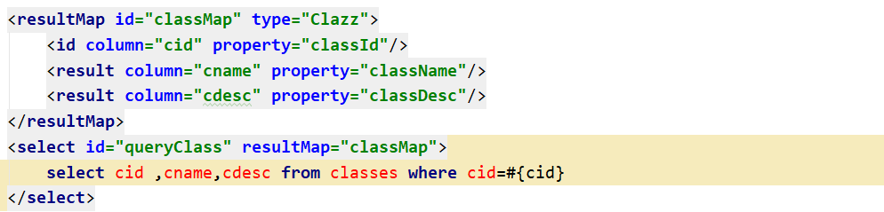 |
|  |

#### 11.6 多对多关联

> 案例：学生（m）—课程（n）

###### 11.6.1 创建数据表

```sql
-- 学生信息表（如上）
-- 课程信息表
create table courses(
    course_id int primary key auto_increment,
    course_name varchar(50) not null
);
-- 选课信息表/成绩表(学号、课程号、成绩)
create table grades(
    sid char(5) not null,
    cid int not null,
    score int not null
);
```

###### 11.6.2 关联查询

> 查询学生时，同时查询学生选择的课程

| Student                                  | Course                                   |
| ---------------------------------------- | ---------------------------------------- |
|  | 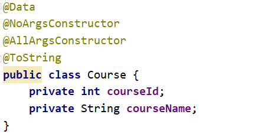 |

> 根据课程编号查询课程时，同时查询选择了这门课程的学生

| Student                                  | Course                                   |
| ---------------------------------------- | ---------------------------------------- |
| 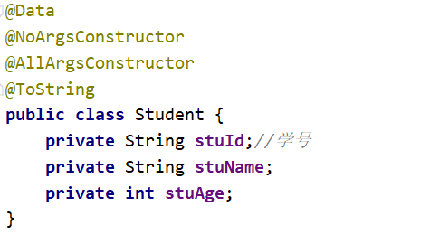 |  |

| 连接查询映射配置                         |
| ---------------------------------------- |
|  |

| 子查询映射配置                           |
| ---------------------------------------- |
|  |
| 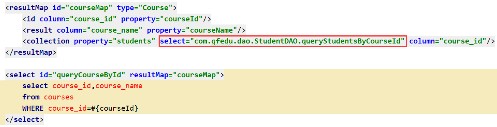 |

## 十二、动态SQL

> 交友网：珍爱网、百合网            筛选心仪对象       性别       年龄       城市    身高
>
> 电商：淘宝、京东             筛选商品                        羽毛球拍   品牌     价格

​               方江鹏      性别 女    select * from members where gender='女'

​               罗彪          性别  女   年龄  18-23       select * from members where gender='女' and age >=18 and age <=23

​               张三          年龄   城市  select * from members where  age >=18 and age <=23 and city=''

> 用户的筛选条件不同，我们完成筛选执行的SQL也不一样；我们可以通过穷举来一一的完成不同条件的筛选，但是这种实现思路过于繁琐和复杂，MyBatis就提供了动态SQL的配置方式来实现多条件查询。

#### 12.1 什么是动态SQL？

> 根据查询条件动态完成SQL的拼接

#### 12.2 动态SQL使用案例

> 案例：心仪对象搜索

###### 12.2.1 创建数据表

```sql
create table members(
    member_id int primary key auto_increment,
    member_nick varchar(20) not null unique,
    member_gender char(2) not null,
    member_age int not null,
    member_city varchar(30) not null
);
```

###### 12.2.2 创建实体类

```java
@Data
@NoArgsConstructor
@AllArgsConstructor
@ToString
public class Member {
    private int memberId;
    private String memberNick;
    private String memberGender;
    private int memberAge;
    private String memberCity;
}
```

###### 12.2.3 创建DAO接口

> 在DAO接口中定义一个多条件查询的方法

```java
public interface MemberDAO {

    //在多条件查询中，如果查询条件不确定，可以直接使用HashMap作为参数
    //优点：无需单独定义传递查询条件的类
    //缺点：当向Map中存放参数时，key必须与动态sql保持一致（）
    //public List<Member> searchMember(HashMap<String,Object> params);

    // 也可以定义专门用于存放查询条件的实体类存放参数
    //优点：设置参数时无需关注属性名
    //缺点：需要单独定义一个类来封装参数
    public List<Member> searchMember(MemberSearchCondition params);
}
```

#### 12.3 if

```xml
<resultMap id="memberMap" type="Member">
    <id column="member_id" property="memberId"/>
    <result column="member_nick" property="memberNick"/>
    <result column="member_gender" property="memberGender"/>
    <result column="member_age" property="memberAge"/>
    <result column="member_city" property="memberCity"/>
</resultMap>

<select id="searchMember" resultMap="memberMap">
    select member_id,member_nick,member_gender,member_age,member_city
    from members
    where 1=1
    <if test="gender != null">  <!--gender 就是参数对象的属性/参数Map的key-->
        and member_gender=#{gender}
    </if>
    <if test="minAge != null">
        and member_age &gt;= #{minAge}   <!-- &gt; -->
    </if>
    <if test="maxAge != null">
        and member_age &lt;= #{maxAge}  <!-- &lt; -->
    </if>
    <if test="city != null">
        and member_city = #{city}
    </if>
</select>
```

**测试**

```java
 @Test
public void testSearchMember() {

    HashMap<String,Object> params = new HashMap<String, Object>();
    params.put("gender","女");
    params.put("minAge",18);
    //params.put("maxAge",23);
    params.put("city","武汉");

    //-----------------------------------------------------------------------
    MemberSearchCondition params2 = new MemberSearchCondition();
    params2.setGender("女");
    //params2.setMinAge(21);
    //params2.setMaxAge(30);
    //params2.setCity("武汉");

    //==========================================================================

    MemberDAO memberDAO = MyBatisUtil.getMapper(MemberDAO.class);
    List<Member> members = memberDAO.searchMember(params2);

    for (Member m: members) {
        System.out.println(m);
    }
}
```


#### 12.4  where

```xml
<select id="searchMember" resultMap="memberMap">
    select member_id,member_nick,member_gender,member_age,member_city
    from members
    <where>
        <if test="gender != null">  <!--gender 就是参数对象的属性/参数Map的key-->
            and member_gender=#{gender}
        </if>
        <if test="minAge != null">
            and member_age &gt;= #{minAge}   <!-- &gt; -->
        </if>
        <if test="maxAge != null">
            and member_age &lt;= #{maxAge}  <!-- &lt; -->
        </if>
        <if test="city != null">
            and member_city = #{city}
        </if>
    </where>
    order by member_age
</select>
```

#### 12.5 **trim**

```xml
<select id="searchMember" resultMap="memberMap">
    select member_id,member_nick,member_gender,member_age,member_city
    from members
    <trim prefix="where" prefixOverrides="and | or" suffix="order by member_age">
        <if test="gender != null">  <!--gender 就是参数对象的属性/参数Map的key-->
            and member_gender=#{gender}
        </if>
        <if test="minAge != null">
            and member_age &gt;= #{minAge}   <!-- &gt; -->
        </if>
        <if test="maxAge != null">
            and member_age &lt;= #{maxAge}  <!-- &lt; -->
        </if>
        <if test="city != null">
            and member_city = #{city}
        </if>
    </trim>
</select>
```

#### 12.6 **foreach**

```java
public interface MemberDAO {
    //查询指定城市的会员
    public List<Member> searchMemberByCity(List<String> cities);
}
```

```xml
<select id="searchMemberByCity" resultMap="memberMap">
    select member_id,member_nick,member_gender,member_age,member_city
    from members where member_city in
    <foreach collection="list" item="cityName" separator="," open="(" close=")">
        #{cityName}
    </foreach>
</select>
```

**测试**

```java
 @Test
public void searchMemberByCity() {
    List<String> cities = new ArrayList<String>();
    cities.add("厦门");
    cities.add("宜昌");
    MemberDAO memberDAO = MyBatisUtil.getMapper(MemberDAO.class);
    List<Member> members = memberDAO.searchMemberByCity(cities);
    for (Member m: members) {
        System.out.println(m);
    }
}
```


## 十三、模糊查询

> 案例：根据昵称查询会员信息（模糊匹配  like）

#### 13.1 模糊查询实现

###### 13.1.1 DAO

```java
public interface MemberDAO {

    //根据昵称查询用户信息——模糊查询
    // 模糊查询需要使用${}取值，与sql进行拼接
    // 在使用${}时，即使只有一个参数也需要使用@Param注解声明参数的key（非String对象参数可以不用声明）
    public List<Member> searchMemberByNick(@Param("keyWord") String keyWord);

}
```

###### 13.1.2 映射文件

```xml
<!--如果参数时String类型，需要parameterType声明参数类型-->
<select id="searchMemberByNick" parameterType="java.lang.String" resultMap="memberMap">
    select member_id,member_nick,member_gender,member_age,member_city
    from members
    where member_nick like '%${keyWord}%'
</select>
```

###### 13.1.3 测试

```java
@Test
public void testSearchMemberByNick(){
    MemberDAO memberDAO = MyBatisUtil.getMapper(MemberDAO.class);
    List<Member> members = memberDAO.searchMemberByNick("花");
    for (Member m: members) {
        System.out.println(m);
    }
}
```

#### 13.2 #{}和${}的区别

-  ${key} 表示获取参数，先获取参数的值拼接到SQL语句中，再编译执行SQL语句;可能引起SQL注入问题  
-  #{key} 表示获取参数，先完成SQL编译(预编译)，预编译之后再将获取的参数设置到SQL与中 ，可以避免SQL注入问题


## 十四、MyBatis日志配置

> MyBatis做为一个封装好的ORM框架，其运行过程我们没办法跟踪，为了让开发者了解MyBatis执行流程及每个执行步骤所完成的工作，MyBatis框架本身支持log4j日志框架，对运行的过程进行跟踪记录。我们只需对MyBatis进行相关的日志配置，就可以看到MyBatis运行过程中的日志信息。

#### 14.1 添加日志框架依赖

```xml
<!-- https://mvnrepository.com/artifact/log4j/log4j -->
<dependency>
    <groupId>log4j</groupId>
    <artifactId>log4j</artifactId>
    <version>1.2.17</version>
</dependency>
```

#### 14.2 添加日志配置文件

- 在resources目录下创建名为 `log4j.properties`文件
- 在 `log4j.properties`文件配置日志输出的方式

```properties
# 声明日志的输出级别及输出方式
log4j.rootLogger=DEBUG,stdout
# MyBatis logging configuration...
log4j.logger.org.mybatis.example.BlogMapper=TRACE
# Console output...
log4j.appender.stdout=org.apache.log4j.ConsoleAppender
log4j.appender.stdout.layout=org.apache.log4j.PatternLayout
# 定义日志的打印格式  %t 表示线程名称  %5p 日志级别 %msg日志信息
log4j.appender.stdout.layout.ConversionPattern=[%t] %5p - %msg \:%m%n
```

#### 14.3 日志信息的级别

> 在使用日志框架输出日志信息的时候，会根据输出的日志信息的重要程度分为5个级别

| 级别  | 说明           |
| ----- | -------------- |
| DEBUG | 输出调试信息   |
| INFO  | 输出提示信息   |
| WARN  | 输出警告信息   |
| ERROR | 一般性错误信息 |
| FATAL | 致命性错误信息 |

## 十五、配置数据库连接池-整合Druid

> MyBatis做为一个ORM框架，在进行数据库操作时是需要和数据库连接连接的，MyBatis支持基于数据库连接池的连接创建方式。
>
> 当我们配置MyBatis数据源时，只要配置了dataSource标签的type属性值为POOLED时，就可以使用MyBatis内置的连接池管理连接。
>
> 如果我们想要使用第三方的数据库连接池，则需进行自定义配置。

#### 15.1 常见的连接池

- DBCP
- C3P0
- Druid 性能也比较好，提供了比较便捷的监控系统
- Hikari 性能最好

| 功能            | dbcp                | druid              | c3p0                               | HikariCP                           |
| --------------- | ------------------- | ------------------ | ---------------------------------- | ---------------------------------- |
| 是否支持PSCache | 是                  | 是                 | 是                                 | 否                                 |
| 监控            | jmx                 | jmx/log/http       | jmx,log                            | jmx                                |
| 扩展性          | 弱                  | 好                 | 弱                                 | 弱                                 |
| sql拦截及解析   | 无                  | 支持               | 无                                 | 无                                 |
| 代码            | 简单                | 中等               | 复杂                               | 简单                               |
| 更新时间        | 2015.8.6            | 2015.10.10         | 2015.12.09                         | 2015.12.3                          |
| 特点            | 依赖于common-pool   | 阿里开源，功能全面 | 历史久远，代码逻辑复杂，且不易维护 | 优化力度大，功能简单，起源于boneCP |
| 连接池管理      | LinkedBlockingDeque | 数组               |                                    | threadlocal+CopyOnWriteArrayList   |

#### 15.2 添加Druid依赖

```xml
<!-- https://mvnrepository.com/artifact/com.alibaba/druid -->
<dependency>
    <groupId>com.alibaba</groupId>
    <artifactId>druid</artifactId>
    <version>1.2.5</version>
</dependency>
```

#### 15.3 创建Druid连接池工厂

```java
public class DruidDataSourceFactory extends PooledDataSourceFactory {
    public DruidDataSourceFactory() {
        this.dataSource = new DruidDataSource();
    }
}
```

#### 15.4 将DruidDataSourceFactory配置给MyBatis数据源

```xml
<environments default="mysql">
    <environment id="mysql">
        <transactionManager type="JDBC"></transactionManager>

        <!--   POOLED 使用MyBatis内置的连接池实现   -->
        <!--  mybatis需要一个连接池工厂，这个工厂可以产生数据库连接池  PooledDataSourceFactory -->
        <dataSource type="com.qfedu.utils.DruidDataSourceFactory">
            <property name="driverClass" value="${driver}"/>
            <property name="jdbcUrl" value="${url}"/>
            <property name="username" value="${username}"/>
            <property name="password" value="${password}"/>
        </dataSource>
    </environment>
</environments>
```

## 十六、MyBatis缓存

> MyBatis是基于JDBC的封装，使数据库操作更加便捷；MyBatis除了对JDBC操作步骤进行封装之外也对其性能进行了优化：
>
> - 在MyBatis引入缓存机制，用于提升MyBatis的检索效率
> - 在MyBatis引入延迟加载机制，用于减少对数据库不必要的访问

#### 16.1 缓存的工作原理

> 缓存，就是存储数据的内存


#### 16.2 MyBatis缓存

> MyBatis缓存分为一级缓存和二级缓存

###### 16.2.1 一级缓存

> 一级缓存也叫做SqlSession级缓存，为每个SqlSession单独分配的缓存内存，无需手动开启可直接使用；多个SqlSession的缓存是不共享的。
>
> 特性：
>
> 1.如果多次查询使用的是同一个SqlSession对象，则第一次查询之后数据会存放到缓存，后续的查询则直接访问缓存中存储的数据；
>
> 2.如果第一次查询完成之后，对查询出的对象进行修改（此修改会影响到缓存），第二次查询会直接访问缓存，造成第二次查询的结果与数据库不一致；
>
> 3.当我们进行在查询时想要跳过缓存直接查询数据库，则可以通过sqlSession.clearCache();来清除当前SqlSession的缓存;
>
> 4.如果第一次查询之后第二查询之前，使用当前的sqlsession执行了修改操作，此修改操作会使第一次查询并缓存的数据失效，因此第二次查询会再次访问数据库。

测试代码：

```java
@Test
public void testQueryMemberById(){
    SqlSession sqlSession1 = MyBatisUtil.getSqlSessionFactory().openSession();
    SqlSession sqlSession2 = MyBatisUtil.getSqlSessionFactory().openSession();

    MemberDAO memberDAO1 = sqlSession1.getMapper(MemberDAO.class);
    Member member1 = memberDAO1.queryMemberById(1);
    System.out.println(member1);

    member1.setMemberAge(99);
    sqlSession1.clearCache();
    System.out.println("~~~~~~~~~~~~~~~~~~~~~~~~~~~~~~~~~~~~~~~~~~~~~~~~~~~~~~~~~~~");

    MemberDAO memberDAO2 = sqlSession1.getMapper(MemberDAO.class);
    Member member2 =memberDAO2.queryMemberById(1);
    System.out.println(member2);
}
```

###### 16.2.2 两次查询与数据库数据不一致问题


###### 16.2.3 二级缓存

> 二级缓存也称为SqlSessionFactory级缓存，通过同一个factory对象获取的Sqlsession可以共享二级缓存；在应用服务器中SqlSessionFactory是单例的，因此我们二级缓存可以实现全局共享。
>
> 特性：
>
> 1.二级缓存默认没有开启，需要在mybatis-config.xml中的settings标签开启
>
> 2.二级缓存只能缓存实现序列化接口的对象
>
> 3.

- 在mybatis-config.xml开启使用二级缓存

```xml
<settings>
    <setting name="cacheEnabled" value="true"/>
</settings>
```

- 在需要使用二级缓存的Mapper文件中配置cache标签使用功能二级缓存

```xml
<cache/>
```

- 被缓存的实体类实现序列化接口

```JAVA
@Data
@NoArgsConstructor
@AllArgsConstructor
@ToString
public class Member implements Serializable {
    private int memberId;
    private String memberNick;
    private String memberGender;
    private int memberAge;
    private String memberCity;
}
```

- 测试

```java
@Test
public void testQueryMemberById(){
    SqlSessionFactory factory =MyBatisUtil.getSqlSessionFactory();
    // 1.多个SqlSession对象必须来自于同一个SqlSessionFactory
    SqlSession sqlSession1 = factory.openSession(true);
    SqlSession sqlSession2 = factory.openSession(true);
    System.out.println(sqlSession1 == sqlSession2);

    MemberDAO memberDAO1 = sqlSession1.getMapper(MemberDAO.class);
    Member member1 = memberDAO1.queryMemberById(1);
    System.out.println(member1);
    sqlSession1.commit();  
    //2.第一次查询之后执行sqlSession1.commit()，会将当前sqlsession的查询结果缓存到二级缓存

    System.out.println("~~~~~~~~~~~~~~~~~~~~~~~~~~~~~~~~~~~~~~~~~~~~~~~~~~~~~~~~~~~");

    MemberDAO memberDAO2 = sqlSession2.getMapper(MemberDAO.class);
    Member member2 =memberDAO2.queryMemberById(1);
    System.out.println(member2);
}
```

#### 16.3 查询操作的缓存开关

```xml
<select id="queryMemberById" resultMap="memberMap" useCache="false">
    select member_id,member_nick,member_gender,member_age,member_city
    from members
    where member_id=#{mid}
</select>
```

## 十七、延迟加载

> 延迟加载——如果在MyBatis开启了延迟加载，在执行了子查询（至少查询两次及以上）时，默认只执行第一次查询，当用到子查询的查询结果时，才会触发子查询的执行；如果无需使用子查询结果，则子查询不会执行.

开启延迟加载：

```xml
<resultMap id="classMap" type="Clazz">
    <id column="cid" property="classId"/>
    <result column="cname" property="className"/>
    <result column="cdesc" property="classDesc"/>
    <collection property="stus" select="com.qfedu.dao.StudentDAO.queryStudentsByCid" column="cid" fetchType="lazy"/>
</resultMap>

<select id="queryClassByCid" resultMap="classMap">
    select cid,cname,cdesc
    from classes
    where cid=#{cid}
</select>
```

测试代码：

```java
@Test
public void queryClassByCid() {

    ClassDAO classDAO = MyBatisUtil.getMapper(ClassDAO.class);
    Clazz clazz = classDAO.queryClassByCid(1);
    System.out.println(clazz.getClassName());

    System.out.println("-----------------------------------");

    System.out.println(clazz.getStus());
}
```

运行日志：

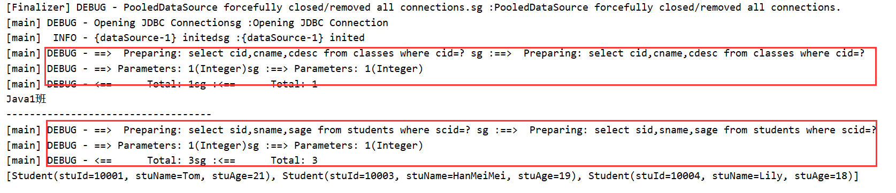


## 练习任务

> jsp+servlet+`mybatis`

商品信息的CRUD

- 添加商品
- 商品列表+分页
- 删除商品
- 修改商品
- 商品详情