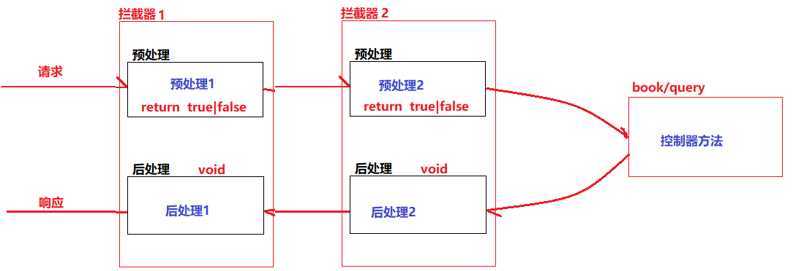

## 一、SpringMVC概述

> Spring MVC 是由Spring官方提供的基于MVC设计理念的web框架。
>
> SpringMVC是基于Servlet封装的用于实现MVC控制的框架，实现前端和服务端的交互。

#### 1.1 SpringMVC优势

- 严格遵守了MVC分层思想
- 采用了松耦合、插件式结构；相比较于我们封装的BaseServlet以及其他的一些MVC框架来说更灵活、更具扩展性

- SpringMVC是基于Spring的扩展、提供了一套完善的MVC注解
- SpringMVC在数据绑定、视图解析都提供了多种处理方式，可灵活配置
- SpringMVC对RESTful URL设计方法提供了良好的支持

#### 1.2 SpringMVC本质工作

- 接收并解析请求
- 处理请求
- 数据渲染、响应请求

## 二、SpringMVC框架部署

#### 2.1 基于Maven创建一个web工程

- SpringMVC是一个web框架，应用在web工程中

#### 2.2 添加SpringMVC依赖

- spring-context
- spring-aspects
- spring-jdbc
- spring-test
- spring-web
- spring-webmvc

```xml
<properties>
    <spring.version>5.2.13.RELEASE</spring.version>
</properties>

<dependencies>
    <dependency>
        <groupId>org.springframework</groupId>
        <artifactId>spring-context</artifactId>
        <version>${spring.version}</version>
    </dependency>
    <dependency>
        <groupId>org.springframework</groupId>
        <artifactId>spring-aspects</artifactId>
        <version>${spring.version}</version>
    </dependency>
    <dependency>
        <groupId>org.springframework</groupId>
        <artifactId>spring-jdbc</artifactId>
        <version>${spring.version}</version>
    </dependency>
    <dependency>
        <groupId>org.springframework</groupId>
        <artifactId>spring-test</artifactId>
        <version>${spring.version}</version>
    </dependency>
    <dependency>
        <groupId>org.springframework</groupId>
        <artifactId>spring-web</artifactId>
        <version>${spring.version}</version>
    </dependency>
    <dependency>
        <groupId>org.springframework</groupId>
        <artifactId>spring-webmvc</artifactId>
        <version>${spring.version}</version>
    </dependency>

</dependencies>
```

#### 2.3 创建SpringMVC配置文件

- 在resources目录下创建名为`spring-servlet.xml`的文件
- 添加MVC命名空间

```xml
<?xml version="1.0" encoding="UTF-8"?>
<beans xmlns="http://www.springframework.org/schema/beans"
       xmlns:xsi="http://www.w3.org/2001/XMLSchema-instance"
       xmlns:context="http://www.springframework.org/schema/context"
       xmlns:aop="http://www.springframework.org/schema/aop"
       xmlns:mvc="http://www.springframework.org/schema/mvc"
       xsi:schemaLocation="http://www.springframework.org/schema/beans
       http://www.springframework.org/schema/beans/spring-beans.xsd
       http://www.springframework.org/schema/context
        http://www.springframework.org/schema/context/spring-context.xsd
        http://www.springframework.org/schema/aop
        http://www.springframework.org/schema/aop/spring-aop.xsd
        http://www.springframework.org/schema/mvc
        http://www.springframework.org/schema/mvc/spring-mvc.xsd">
	<!--IoC采用注解配置-->
    <context:annotation-config/>
    <context:component-scan base-package="com.qfedu"/>

    <!--  声明MVC使用注解驱动  -->
    <mvc:annotation-driven/>

</beans>
```

#### 2.4 在web.xml中配置SpringMVC的前端控制器

> SpringMVC提供了一个名为DispatcherServlet的类（SpringMVC前端控制器），用于拦截用户请求交由SpringMVC处理

```xml
<?xml version="1.0" encoding="UTF-8"?>
<web-app xmlns="http://xmlns.jcp.org/xml/ns/javaee"
         xmlns:xsi="http://www.w3.org/2001/XMLSchema-instance"
         xsi:schemaLocation="http://xmlns.jcp.org/xml/ns/javaee
                      http://xmlns.jcp.org/xml/ns/javaee/web-app_3_1.xsd"
         version="3.1">

    <servlet>
        <servlet-name>SpringMVC</servlet-name>
        <servlet-class>org.springframework.web.servlet.DispatcherServlet</servlet-class>
        <init-param>
            <param-name>contextConfigLocation</param-name>
            <param-value>classpath:spring-servlet.xml</param-value>
        </init-param>
        <load-on-startup>1</load-on-startup>
    </servlet>
    <servlet-mapping>
        <servlet-name>SpringMVC</servlet-name>
        <url-pattern>/*</url-pattern>
    </servlet-mapping>

</web-app>
```

## 三、SpringMVC框架使用

> 在SpringMVC中，我们把接收用户请求、处理用户请求的类称之为Controlelr（控制器）

#### 3.1 创建控制器

###### 3.1.1 创建控制器类

- 创建一个名为`com.qfedu.controllers`的包（包需要在Spring注解扫描的范围内）
- 创建一个类（无需做任何的继承和实现）

- 在类上添加`@Controller`注解声明此类为SpringMVC的控制器
- 在类上添加`@RequestMapping("url")`声明此控制器类的请求url（可以省略）

```java
@Controller
@RequestMapping("/book")
public class BookController {

}
```

###### 3.1.2 在控制器类中定义处理请求的方法

- 在一个控制器类中可以定于多个方法处理不同的请求
- 在每个方法上添加`@RequestMapping("url")`用于声明当前方法请求的url

```java
@Controller
@RequestMapping("/book")
public class BookController {

    @RequestMapping("/add")
    public void addBook(){
        System.out.println("---book akdd");
    }

    @RequestMapping("/list")
    public void listBooks(){
        System.out.println("---book list");
    }

}
```

###### 3.1.3 访问

- http://localhost:8080/springmvc_demo2/book/add

- http://localhost:8080/springmvc_demo2/book/list

  

#### 3.2 静态资源配置 

> 静态资源：就是项目中的HTML、css、js、图片、字体等

###### 3.2.1 /* 和 / 的区别

- /* 拦截所有的HTTP请求，包括.jsp的请求，都做为控制器类的请求路径来处理
- / 拦截所有的HTTP请求，但不包括.jsp的请求，不会放行静态资源的请求（html/css/js/图片）

###### 3.2.2 静态资源放行配置

- 在springMVC的配置文件，添加如下静态资源放行的配置

```xml
<!--配置静态资源放行-->
<mvc:resources mapping="/css/**" location="/css/"/>
<mvc:resources mapping="/js/**" location="/js/"/>
<mvc:resources mapping="/imgs/**" location="/imgs/"/>
<mvc:resources mapping="/pages/**" location="/pages/"/>
```


#### 3.3 前端提交数据到控制器

###### 3.3.1 表单提交

- 表单提交：输入框需要提供name属性，SpringMVC控制器是通过name属性取值的

  ```html
  <body>
      <h3>添加图书</h3>
      <form action="book/add" method="post">
          <p>图书名称:<input type="text"/></p>
          <p>图书作者:<input type="text"/></p>
          <p>图书价格:<input type="text"/></p>
          <p><input type="submit" value="提交"/></p>
      </form>
  </body>
  ```

###### 3.3.2 URL提交

- URL提交：

  ```html
  <a href="book/add?bookName=Java">URL提交</a>
  ```

###### 3.3.3 AJAX提交

- AJAX提交：请求行、请求头、请求体都可以用来传值

  ```html
  <input type="button" value="ajax提交" id="btn1"/>
  <script type="text/javascript" src="js/jquery-3.4.1.min.js"></script>
  <script type="text/javascript">
      $("#btn1").click(function(){
          var obj = {};
          obj.bookName = "Java";
          obj.bookAuthor="张三";
          obj.bookPrice = 3.33;
  
          $.ajax({
              url:"book/add",
              type:"post",
              headers:{
  
              },
              contentType:"application/json",
              data:obj,
              success:function(res){
                  console.log(res);
              }
          });
      });
  </script>
  ```


#### 3.4 控制器接收前端提交的数据

###### 3.4.1 @RequestParam 接收请求行传值

- 表单提交
- URL提交
- $.ajax()请求的url传值
- $.post()/$.get()中的{}传值

**`@RequestParam`**注解用于接收请求行传递的数据

- 前端提交数据

  ```html
  <form action="book/add" method="post">
      <p>图书名称:<input type="text" name="name"/></p>
      <p>图书作者:<input type="text" name="author"/></p>
      <p>图书价格:<input type="text" name="price"/></p>
      <p><input type="submit" value="提交"/></p>
  </form>
  ```

- 控制器接收数据

  ```java
  /*接收请求行数据*/
  @RequestMapping("/add")
  public void addBook(@RequestParam("name") String a,
                      @RequestParam("author") String b,
                      @RequestParam("price") double c){
      System.out.println("---book add");
      System.out.println(a);
      System.out.println(b);
      System.out.println(c);
  }
  ```

`注意`**如果控制器方法中接收数据的参数名与请求行传值的key一致，则@RequestParam注解可省略**

```java
@RequestMapping("/add")
public void addBook(String name,String author, double price){
    System.out.println("---book add");
    System.out.println(name);
    System.out.println(author);
    System.out.println(price);
}
```

###### 3.4.2 @RequestHeader接收请求头传值

-   ajax封装请求头数据

  ```javascript
  $.ajax({
      ...,
      headers:{
         
  	},
      ...
  })
  ```

**`@RequestHeader`**注解用于接收请求行头传递的数据

- 前端

  ```javascript
  <input type="button" value="ajax提交" id="btn1"/>
      <script type="text/javascript" src="js/jquery-3.4.1.min.js"></script>
      <script type="text/javascript">
          $("#btn1").click(function(){
              $.ajax({
                  url:"book/list",
                  type:"post",
                  headers:{
                      token:"wahahaawahaha"
                  },
                  success:function(res){
                      console.log(res);
                  }
              });
          });
      </script>
  ```

- 控制器

  ```java
  @RequestMapping("/list")
  public void listBooks(@RequestHeader("token") String token){
      System.out.println("---book list");
  }
  ```

###### 3.4.3 @RequestBody接收请求体传值

- ajax封装请求体数据

  ```javascript
  $.ajax({
      ...,
      contentType:"application/json",
      data:obj,,
      ...
  })
  ```

**`@RequestBody`**注解用于接收请求行头传递的数据

- 前端

  ```html
  <input type="button" value="ajax提交" id="btn1"/>
      <script type="text/javascript" src="js/jquery-3.4.1.min.js"></script>
      <script type="text/javascript">
          $("#btn1").click(function(){
              var obj = {};
              obj.bookName = "Python";
              obj.bookAuthor="杰哥";
              obj.bookPrice = 2.22;
  
              var s = JSON.stringify(obj); //将对象转换成JSON格式
        
              $.ajax({
                  url:"book/update",
                  type:"post",
                  contentType:"application/json",
                  data:s,   //如果data的值为json格式字符串，contentType必须设置为"application/json"
                  success:function(res){
                      console.log(res);
                  }
              });
          });
      </script>
  ```

> @RquestBody 将前端请求体提交的JSON格式数据转换成Java对象，依赖jackson包

- 导入jackson的依赖

  ```XML
  <dependency>
      <groupId>com.fasterxml.jackson.core</groupId>
      <artifactId>jackson-databind</artifactId>
      <version>2.12.1</version>
  </dependency>
  ```

- 控制器

  ```java
  @RequestMapping("/update")
  public void update(@RequestBody Book book){
      System.out.println("---book update");
      System.out.println(book);
  }
  ```

  

#### 3.5 控制器响应前端请求

###### 3.5.1 控制器响应同步请求

> 同步请求：form、超链接
>
> 处理同步请求的方法的返回类型定义为String或者ModelAndView，以实现页面的跳转

- 返回类型为String

  **转发**

  ```java
  @RequestMapping("/add")
  public String addBook(String name, String author, double price){
      System.out.println("---book add");
      return "/tips.jsp";
  }
  ```

  **重定向**

  ```java
  @RequestMapping("/add")
  public String addBook(String name, String author, double price){
      System.out.println("---book add");
      return "redirect:/tips.jsp";
  }
  ```


- 返回类型为 ModelAndView

  **转发**

  ```java
  @RequestMapping("/add")
  public ModelAndView addBook(String name, String author, double price){
      System.out.println("---book add");
      ModelAndView modelAndView = new ModelAndView("/tips.jsp");
      return modelAndView;
  }
  ```

  **重定向**

  ```java
  @RequestMapping("/add")
  public ModelAndView addBook(String name, String author, double price){
      System.out.println("---book add");
      ModelAndView modelAndView = new ModelAndView("redirect:/tips.jsp");
      return modelAndView;
  }
  ```

###### 3.5.2 控制器响应异步请求

>  异步请求：ajax请求

**使用response中的输出流进行响应**

- 控制器方法的返回类型为`void`
- 控制器方法添加 `HttpServletResponse response`参数
- 在方法中通过response获取输出流，使用流响应ajax请求

```java
@RequestMapping("/update")
public void update(@RequestBody Book book, HttpServletResponse response) throws IOException {
    System.out.println("---book update");
    System.out.println(book);

    //使用ObjectMapper将对象转换成JSON格式字符串
    String s = new ObjectMapper().writeValueAsString(book);
    response.setCharacterEncoding("utf-8");
    response.setContentType("application/json");
    PrintWriter out = response.getWriter();
    out.println(s);
    out.flush();
    out.close();
}
```

**直接在控制器方法返回响应的对象**

- 控制器方法的返回类型设置为响应给ajax请求的对象类型
- 在控制器方法前添加`@ResponseBody`注解，将返回的对象转换成JSON响应给ajax请求
- 如果一个控制器类中的所有方法都是响应ajax请求，则可以直接在控制器类前添加`@ResponseBody`注解

```java
@RequestMapping("/update")
@ResponseBody
public List<Book> update() {
    System.out.println("---book update");
    List<Book> books = new ArrayList<Book>();
    books.add(new Book(1,"Java","老张",2.22));
    books.add(new Book(2,"C++","老李",3.22));
    return books;
}
```

###### 3.5.3 控制器响应同步请求的数据传递

> 对于同步请求的转发响应，我们可以传递参数到转发的页面

- 返回类型为String:

  ```java
  //1.在控制器方法中定义一个Model类型的参数
  //2.在return页面之前，向model中添加键值对，添加的键值对就会被传递到转发的页面
  @RequestMapping("/add")
  public String addBook(String name, String author, double price,Model model){
      model.addAttribute("key1","value1");
      model.addAttribute("book",new Book(1,"Java","老张",2.22));
      return "/tips.jsp";
  }
  
  //除了使用Model对象传值外，还可以直接使用HttpServletRequest对象
  @RequestMapping("/add")
  public String addBook(String name, String author, double price,HttpServletRequest request){
      request.setAttribute("key1","value1");
      request.setAttribute("book",new Book(1,"Java","老张",2.22));
      return "/tips.jsp";
  }
  ```

- 返回类型ModelAndView:

  ```java
  @RequestMapping("/add2")
  public ModelAndView addBook2(String name, String author, double price){
  
      ModelAndView modelAndView = new ModelAndView("/tips.jsp");
      modelAndView.addObject("key1","value1");
      modelAndView.addObject("book",new Book(1,"Java","老张",2.22));
      return modelAndView;
  }
  ```

#### 3.6 解决中文乱码问题

###### 3.6.1 前端编码

- JSP页面：

  ```jsp
  <%@ page contentType="text/html;charset=UTF-8" language="java" pageEncoding="UTF-8" %>
  ```

- HTML页面：

  ```html
  <meta charset="UTF-8">
  ```

###### 3.6.2 服务器编码

- tomcat/conf/server.xml

  ```xml
  <Connector port="8080" protocol="HTTP/1.1"
             connectionTimeout="20000"
             redirectPort="8443"  URIEncoding="UTF-8"/>
  ```

###### 3.6.3 设置SpringMVC的编码方式

- 在web.xml中配置SpringMVC编码过滤器的编码方式

  ```xml
  <filter>
      <filter-name>EncodingFilter</filter-name>
      <filter-class>org.springframework.web.filter.CharacterEncodingFilter</filter-class>
      <init-param>
          <param-name>encoding</param-name>
          <param-value>utf-8</param-value>
      </init-param>
      <init-param>
          <param-name>forceEncoding</param-name>
          <param-value>true</param-value>
      </init-param>
  </filter>
  <filter-mapping>
      <filter-name>EncodingFilter</filter-name>
      <url-pattern>/*</url-pattern>
  </filter-mapping>
  ```

## 四、SpringMVC的请求处理流程

#### 4.1 请求处理流程

> SpringMVC通过前端控制器（DispatcherServlet）拦截并处理用户请求的


```
① 前端发送请求被前端控制器DispatcherServlet拦截
② 前端控制器调用处理器映射器HandlerMapping对请求URL进行解析，解析之后返回调用给前端控制器
③ 前端控制器调用处理器适配器处理调用链
④ 处理器适配器基于反射通过适配器设计模式完成处理器(控制器)的调用处理用户请求
⑤ 处理器适配器将控制器返回的视图和数据信息封装成ModelAndView响应给前端控制器
⑥ 前端控制器调用视图解析器ViewResolver对ModelAndView进行解析，将解析结果（视图资源和数据）响应给前端控制器
⑦ 前端控制器调用视图view组件将数据进行渲染，将渲染结果（静态视图）响应给前端控制器
⑧ 前端控制器响应用户请求
```

#### 4.2 SpringMVC的核心组件

- `DispatcherServlet` 前端控制器、总控制器
  - 作用：接收请求，协同各组件工作、响应请求

- `HandlerMapping` 处理器映射
  - 作用：负责根据用户请求的URL找到对应的Handler
  - **可配置** SpringMVC提供多个处理器映射的实现，可以根据需要进行配置
- `HandlerAdapter` 处理器适配器
  - 作用：按照处理器映射器解析的用户请求的调用链，通过适配器模式完成Handler的调用
- `Handler` 处理器/控制器
  - 由工程师根据业务的需求进行开发
  - 作用：处理请求
- `ModelAndView` 视图模型
  - 作用：用于封装处理器返回的数据以及相应的视图
  - ModelAndView = Model + View
- `ViewResolver` 视图解析器
  - 作用：对ModelAndView进行解析
  - **可配置** SpringMVC提供多个视图解析器的实现，可以根据需要进行配置

- `View` 视图
  - 作用：完成数据渲染

#### 4.3  处理器映射器

> 不同的处理器映射器对URL处理的方式也不相同，使用对应的处理器映射器之后我们的前端请求规则也需要发生相应的变化
>
> SpringMVC提供的处理器映射器：
>
> - BeanNameUrlHandlerMapping  根据控制器的ID访问控制器
> - SimpleUrlHandlerMapping 根据控制器配置的URL访问（默认）

配置处理器映射器：

- 在SpringMVC的配置文件中通过bean标签声明处理器映射器

- 配置BeanNameUrlHandlerMapping  

  ```xml
  <bean class="org.springframework.web.servlet.handler.BeanNameUrlHandlerMapping"></bean>
  ```

- 配置SimpleUrlHandlerMapping

  ```xml
  <bean class="org.springframework.web.servlet.handler.SimpleUrlHandlerMapping">
      <property name="mappings">
          <props>
              <prop key="/aaa">bookController</prop>
              <prop key="/bbb">studentController</prop>
          </props>
      </property>
  </bean>
  ```

#### 4.4  视图解析器

> Spring提供了多个视图解析器：
>
> -  UrlBasedViewResolver
> -  InternalResourceViewResolver

- UrlBasedViewResolver 需要依赖jstl

  - 添加JSTL的依赖

  ```xml
  <dependency>
      <groupId>javax.servlet</groupId>
      <artifactId>jstl</artifactId>
      <version>1.2</version>
  </dependency>
  ```

  - 配置视图解析器

  ```xml
  <bean id="viewResolver" class="org.springframework.web.servlet.view.UrlBasedViewResolver">
      <property name="viewClass" value="org.springframework.web.servlet.view.JstlView"/>
      <property name="prefix" value="/"/>
      <property name="suffix" value=".jsp"/>
  </bean>
  ```

- InternalResourceViewResolver

  ```xml
  <bean id="viewResolver" class="org.springframework.web.servlet.view.InternalResourceViewResolver">
      <property name="prefix" value="/"/>
      <property name="suffix" value=".jsp"/>
  </bean>
  ```

## 五、日期格式处理

#### 5.1 在控制器中使用对象接收数据

- 前端：

  ```jsp
  <form action="test/add" method="post">
      <p>图书名称:<input type="text" name="bookName"/></p>
      <p>图书作者:<input type="text" name="bookAuthor"/></p>
      <p>图书价格:<input type="text" name="bookPrice"/></p>
      <p><input type="submit" value="提交"/></p>
  </form>
  ```

- 后端

  ```java
  @Controller
  @RequestMapping("/test")
  public class TestController {
  
      @RequestMapping("/add")
      //表单提交的多个数据，在控制器方法中可以使用对象接收
      //但是提交的数据的key必须要与对象的属性名一致
      public String addBook(Book book){
          return "/tips.jsp";
      }
  
  }
  ```

#### 5.2 日期格式处理

> 如果前端需要输入日期数据，在控制器中转换成Date对象，SpringMVC要求前端输入的日期格式必须为`yyyy/MM/dd`
>
> 如果甲方要求日期格式必须为指定的格式，而这个指定格式SpringMVC不接受，该如何处理呢？
>
> - 自定义日期转换器

###### 5.2.1 创建自定义日期转换器

```java
/***
 * 1.创建一个类实现Converter接口，泛型指定从什么类型转换为什么类型
 * 2.实现convert转换方法
 */
public class MyDateConverter implements Converter<String, Date> {

    SimpleDateFormat sdf = new SimpleDateFormat("yyyy年MM月dd日");

    public Date convert(String s) {
        Date date = null;
        try {
            date = sdf.parse(s);
        } catch (ParseException e) {
            e.printStackTrace();
        }
        return date;
    }

}
```

###### 5.2.2 配置自定义转换器

```xml
<!--  声明MVC使用注解驱动  -->
<mvc:annotation-driven conversion-service="converterFactory"/>

<bean id="converterFactory" class="org.springframework.format.support.FormattingConversionServiceFactoryBean">
    <property name="converters">
        <set>
            <bean class="com.qfedu.utils.MyDateConverter"/>
        </set>
    </property>
</bean>
```

## 六、文件上传下载

#### 6.1 SpringMVC框架部署

- 基于Maven创建web工程
- 添加SpringMVC所需的依赖
  - Spring:context aspects jdbc  test web webmvc  jackson

- 创建SpringMVC配置文件
- 在web.xml中配置SpringMVC的前端控制器
- 在web.xml中配置SpringMVC的编码过滤器
- 配置springmvc静态资源处理策略

#### 6.2 文件上传

> 案例：添加图书，同时提交图书的封面图片

###### 6.2.1 前端提交文件

- 表单提示方式必须为post
- 表单enctype属性设置为`multipart/form-data`

```jsp
<form action="book/add" method="post" enctype="multipart/form-data">
    <p>图书名称:<input type="text" name="bookName"/></p>
    <p>图书作者:<input type="text" name="bookAuthor"/></p>
    <p>图书价格:<input type="text" name="bookPrice"/></p>
    <p>图书封面:<input type="file" name="imgFile"/></p>
    <p><input type="submit" value="提交"/></p>
</form>
```

###### 6.2.2 控制器接收数据和文件

> SpringMVC处理上传文件需要借助于CommonsMultipartResolver文件解析器

- 添加依赖：commons-io  commons-fileupload

  ```xml
  <dependency>
       <groupId>commons-io</groupId>
       <artifactId>commons-io</artifactId>
       <version>2.4</version>
  </dependency>
  <dependency>
      <groupId>commons-fileupload</groupId>
      <artifactId>commons-fileupload</artifactId>
      <version>1.4</version>
  </dependency>
  ```

- 在spring-servlet.xml中配置文件解析器

  ```xml
  <bean id="multipartResolver" class="org.springframework.web.multipart.commons.CommonsMultipartResolver">
      <property name="maxUploadSize" value="10240000"/>
      <property name="maxInMemorySize" value="102400"/>
      <property name="defaultEncoding" value="utf-8"/>
  </bean>
  ```

- 控制器接收文件

  - 在处理文件上传的方法中定义一个MultiPartFile类型的对象，就可以接受图片了

  ```java
  @Controller
  @RequestMapping("/book")
  public class BookController {
  
  
      @RequestMapping("/add")
      public String addBook(Book book, MultipartFile imgFile, HttpServletRequest request) throws IOException {
          System.out.println("--------------add");
  
          //imgFile就表示上传的图片
          //1.截取上传文件的后缀名,生成新的文件名
          String originalFilename = imgFile.getOriginalFilename();
          String ext = originalFilename.substring( originalFilename.lastIndexOf(".") ); 
          String fileName = System.currentTimeMillis()+ext;
  
          //2.获取imgs目录在服务器的路径
          String dir = request.getServletContext().getRealPath("imgs");
          String savePath = dir+"/"+fileName; 
  
          //3.保存文件
          imgFile.transferTo( new File(savePath));
  
          //4.将图片的访问路径设置到book对象
          book.setBookImg("imgs/"+fileName);
  
          //5.调用service保存book到数据库
          return "/tips.jsp";
      }
  
  }
  ```


#### 6.3 文件下载 

###### 6.3.1 显示文件列表

- list.jsp

  ```jsp
  <%@ page contentType="text/html;charset=UTF-8" language="java" %>
  <html>
      <head>
          <title>Title</title>
      </head>
      <!-- 最新版本的 Bootstrap 核心 CSS 文件 -->
      <link rel="stylesheet" href="https://cdn.jsdelivr.net/npm/bootstrap@3.3.7/dist/css/bootstrap.min.css" integrity="sha384-BVYiiSIFeK1dGmJRAkycuHAHRg32OmUcww7on3RYdg4Va+PmSTsz/K68vbdEjh4u" crossorigin="anonymous">
      <!-- 可选的 Bootstrap 主题文件（一般不用引入） -->
      <link rel="stylesheet" href="https://cdn.jsdelivr.net/npm/bootstrap@3.3.7/dist/css/bootstrap-theme.min.css" integrity="sha384-rHyoN1iRsVXV4nD0JutlnGaslCJuC7uwjduW9SVrLvRYooPp2bWYgmgJQIXwl/Sp" crossorigin="anonymous">
      <!-- 最新的 Bootstrap 核心 JavaScript 文件 -->
      <script src="https://cdn.jsdelivr.net/npm/bootstrap@3.3.7/dist/js/bootstrap.min.js" integrity="sha384-Tc5IQib027qvyjSMfHjOMaLkfuWVxZxUPnCJA7l2mCWNIpG9mGCD8wGNIcPD7Txa" crossorigin="anonymous"></script>
      <body>
  
      <h4>文件列表</h4>
  
      <div class="row" id="container"></div>
  
      <script type="text/javascript" src="js/jquery-3.4.1.min.js"></script>
      <script type="text/javascript">
          $.get("book/list",function(res){
              for (var i = 0; i < res.length; i++) {
                  var fn = res[i];
                  var htmlStr = "<div class='col-lg-2  col-md-3 col-sm-4 col-xs-6'><div class='thumbnail'> <div class='caption'><p><a href='#' class='btn btn-primary' role='button'>下载</a></p></div> </div> </div>";
                  $("#container").append(htmlStr);
              }
          },"json");
      </script>
  
      </body>
  </html>
  ```

- BookController

  ```java
  @RequestMapping("/list")
  @ResponseBody
  public String[] listImgs(HttpServletRequest request){
      //从imgs目录下获取所有的图片信息
      String dir = request.getServletContext().getRealPath("imgs");
      File imgDir = new File(dir);
      String[] fileNames = imgDir.list();
      return fileNames;
  }
  ```

###### 6.3.2 实现文件下载

- list.jsp

  ```javascript
  var htmlStr = "<div class='col-lg-2  col-md-3 col-sm-4 col-xs-6'><div class='thumbnail'> <div class='caption'><p><a href='book/download?fname="+fn+"' class='btn btn-primary' role='button'>下载</a></p></div> </div> </div>";
  ```

- BookController

  ```java
  @RequestMapping("/download")
  public void downloadImg(String fname, HttpServletRequest request, HttpServletResponse response) throws Exception {
      //从imgs目录找到当前文件
      String dir = request.getServletContext().getRealPath("imgs");
      String filePath = dir+"/"+fname;
      FileInputStream fileInputStream = new FileInputStream(filePath);
  
      response.setContentType("application/exe");
      response.addHeader("Content-Disposition","attachment;filename="+fname);
  
      IOUtils.copy(fileInputStream, response.getOutputStream());
  }
  ```

## 七、统一异常处理

> 在我们的应用系统运行的过程中，可能由于运行环境、用户操作、资源不足等各方面的原因导致系统出现异常（HTTP状态异常、Exception）；如果系统出现了异常，这些异常将会通过浏览器呈现给用户，而这种异常的显示是没有必要，因此我们可以在服务器进行特定的处理——当系统出现异常之后，呈现给用户一个统一的、可读的的异常提示页面。

#### 7.1 HTTP异常状态统一处理

> **HTTP Status 404**

- 创建一个用于进行异常提示的页面：404.jsp

- 在web.xml中进行配置：

  ```xml
  <error-page>
      <error-code>404</error-code>
      <location>/404.jsp</location>
  </error-page>
  ```

#### 7.2 Java代码异常的统一处理

###### 7.2.1 基于Servlet-api的处理

- 创建异常提示页面：err.jsp

- 在web.xml中进行配置

  ```xml
  <error-page>
      <exception-type>java.lang.NumberFormatException</exception-type>
      <location>/err.jsp</location>
  </error-page>
  ```

###### 7.2.2 SpringMVC处理

- 使用异常处理类进行统一处理

  ```java
  @ControllerAdvice
  public class MyExceptionHandler {
  
      @ExceptionHandler(NullPointerException.class)
      public String nullHandler(){
          return "/err1.jsp";
      }
  
      @ExceptionHandler(NumberFormatException.class)
      public String formatHandler(){
          return "/err2.jsp";
      }
  
  }
  ```

## 八、拦截器

#### 8.1 拦截器介绍

> SpringMVC提供的拦截器就类似于Servlet-api中的过滤器，可以对控制器的请求进行拦截实现相关的预处理和后处理。

- 过滤器
  - 是Servlet规范的一部分，所有的web项目都可以使用
  - 过滤器在web.xml配置（可以使用注解），能够拦截所有web请求
- 拦截器
  - 是SpringMVC框架的实现，只有在SpringMVC框架中才能使用
  - 拦截器在SpringMVC配置文件进行配置，不会拦截SpringMVC放行的资源（jsp\html\css..）

#### 8.2 自定义拦截器

###### 8.2.1 创建拦截器

```java
public class MyInterceptor1 implements HandlerInterceptor {

    //预处理方法
    public boolean preHandle(HttpServletRequest request, HttpServletResponse response, Object handler) throws Exception {
        System.out.println("--------------预处理");
        Enumeration<String> keys = request.getParameterNames();
        while (keys.hasMoreElements()){
            String key = keys.nextElement();
            if("bookId".equals(key)){
                return true;
            }
        }
        response.setStatus(400);
        return false;
    }

    //后处理方法
    public void postHandle(HttpServletRequest request, HttpServletResponse response, Object handler, ModelAndView modelAndView) throws Exception {
        modelAndView.addObject("tips","这是通过拦截器的后处理添加的数据");
        System.out.println("--------------后处理");
    }
}
```

###### 8.2.2 配置拦截器

```xml
<mvc:interceptors>
    <mvc:interceptor>
        <mvc:mapping path="/book/query"/>
        <mvc:mapping path="/book/add"/>
        <mvc:mapping path="/student/**"/>
        <mvc:exclude-mapping path="/student/add"/>
        <bean class="com.qfedu.utils.MyInterceptor1"/>
    </mvc:interceptor>
</mvc:interceptors>
```

#### 8.3 拦截器链

> 将多个拦截器按照一定的顺序构成一个执行链



## 九、SSM整合

#### 9.1 创建web项目

- 创建maven工程

- 修改pom文件 

  ```xml
  <packaging>war</packaging>
  ```

- 完成maven工程web项目结构

- 添加web项目依赖：

  ```xml
  <dependency>
      <groupId>javax.servlet</groupId>
      <artifactId>jsp-api</artifactId>
      <version>2.0</version>
      <scope>provided</scope>
  </dependency>
  
  <dependency>
      <groupId>javax.servlet</groupId>
      <artifactId>javax.servlet-api</artifactId>
      <version>4.0.1</version>
      <scope>provided</scope>
  </dependency>
  ```

- 配置服务器运行环境

#### 9.2 部署MyBatis

- 添加MyBatis依赖

  ```xml
  <!-- mysql驱动 -->
  <dependency>
      <groupId>mysql</groupId>
      <artifactId>mysql-connector-java</artifactId>
      <version>5.1.47</version>
  </dependency>
  
  <!-- mybatis依赖 -->
  <dependency>
      <groupId>org.mybatis</groupId>
      <artifactId>mybatis</artifactId>
      <version>3.4.6</version>
  </dependency>
  
  <!-- lombok -->
  <dependency>
      <groupId>org.projectlombok</groupId>
      <artifactId>lombok</artifactId>
      <version>1.18.16</version>
      <scope>provided</scope>
  </dependency>
  ```

- 创建MyBatis配置文件`mybatis-config.xml`

  ```xml
  <?xml version="1.0" encoding="UTF-8" ?>
  <!DOCTYPE configuration PUBLIC "-//mybatis.org//DTD Config 3.0//EN"
          "http://mybatis.org/dtd/mybatis-3-config.dtd">
  <configuration>
  
  </configuration>
  ```


#### 9.3 部署Spring、SpringMVC

###### 9.3.1 添加依赖

```xml
<properties>
    <spring.version>5.2.13.RELEASE</spring.version>
</properties>

<!--context-->
<dependency>
    <groupId>org.springframework</groupId>
    <artifactId>spring-context</artifactId>
    <version>${spring.version}</version>
</dependency>
<!--aspects-->
<dependency>
    <groupId>org.springframework</groupId>
    <artifactId>spring-aspects</artifactId>
    <version>${spring.version}</version>
</dependency>
<!--jdbc-->
<dependency>
    <groupId>org.springframework</groupId>
    <artifactId>spring-jdbc</artifactId>
    <version>${spring.version}</version>
</dependency>
<!--test-->
<dependency>
    <groupId>org.springframework</groupId>
    <artifactId>spring-test</artifactId>
    <version>${spring.version}</version>
</dependency>
<!--web-->
<dependency>
    <groupId>org.springframework</groupId>
    <artifactId>spring-web</artifactId>
    <version>${spring.version}</version>
</dependency>
<!--webmvc-->
<dependency>
    <groupId>org.springframework</groupId>
    <artifactId>spring-webmvc</artifactId>
    <version>${spring.version}</version>
</dependency>
<!--jackson-databind-->
<dependency>
    <groupId>com.fasterxml.jackson.core</groupId>
    <artifactId>jackson-databind</artifactId>
    <version>2.12.1</version>
</dependency>

```

###### 9.3.2 创建Spring配置

- 多配置文件分开配置

  - spring-context.xml    只配置注解声明、以及类的管理

    ```xml
    <?xml version="1.0" encoding="UTF-8"?>
    <beans xmlns="http://www.springframework.org/schema/beans"
           xmlns:xsi="http://www.w3.org/2001/XMLSchema-instance"
           xmlns:context="http://www.springframework.org/schema/context"
           xsi:schemaLocation="http://www.springframework.org/schema/beans
           http://www.springframework.org/schema/beans/spring-beans.xsd
            http://www.springframework.org/schema/context
            http://www.springframework.org/schema/context/spring-context.xsd">
    
        <!-- 声明使用注解配置 -->
        <context:annotation-config/>
        <!-- 声明Spring工厂注解的扫描范围 -->
        <context:component-scan base-package="com.qfedu"/>
    
    </beans>
    ```

  - spring-mvc.xml   进行mvc相关的配置，例如静态资源配置、拦截器配置等

    ```xml
    <?xml version="1.0" encoding="UTF-8"?>
    <beans xmlns="http://www.springframework.org/schema/beans"
           xmlns:xsi="http://www.w3.org/2001/XMLSchema-instance"
           xmlns:mvc="http://www.springframework.org/schema/mvc"
           xsi:schemaLocation="http://www.springframework.org/schema/beans
           http://www.springframework.org/schema/beans/spring-beans.xsd
            http://www.springframework.org/schema/mvc
            http://www.springframework.org/schema/mvc/spring-mvc.xsd">
    
        <!--声明MVC使用注解配置-->
        <mvc:annotation-driven/>
    
    </beans>
    ```

  - spring-mybatis.xml  进行Spring与MyBatis整合相关的配置

    ```xml
    <beans xmlns="http://www.springframework.org/schema/beans"
           xmlns:xsi="http://www.w3.org/2001/XMLSchema-instance"
           xmlns:context="http://www.springframework.org/schema/context"
           xmlns:tx="http://www.springframework.org/schema/tx"
           xsi:schemaLocation="http://www.springframework.org/schema/beans
           http://www.springframework.org/schema/beans/spring-beans.xsd
           http://www.springframework.org/schema/context
            http://www.springframework.org/schema/context/spring-context.xsd
            http://www.springframework.org/schema/tx
            http://www.springframework.org/schema/tx/spring-tx.xsd">
    
    </beans>
    ```

###### 9.3.3 配置SpringMVC前端控制器

- 在web.xml进行配置

```xml
<servlet>
    <servlet-name>springmvc</servlet-name>
    <servlet-class>org.springframework.web.servlet.DispatcherServlet</servlet-class>
    <init-param>
        <param-name>contextConfigLocation</param-name>
        <param-value>classpath:spring-*.xml</param-value>
    </init-param>
    <load-on-startup>1</load-on-startup>
</servlet>
<servlet-mapping>
    <servlet-name>springmvc</servlet-name>
    <url-pattern>/</url-pattern>
</servlet-mapping>
```

#### 9.4 整合配置(IoC)

###### 9.4.1 导入mybatis-spring依赖

```xml
<!-- https://mvnrepository.com/artifact/org.mybatis/mybatis-spring -->
<dependency>
    <groupId>org.mybatis</groupId>
    <artifactId>mybatis-spring</artifactId>
    <version>1.3.2</version>
</dependency>
```

###### 9.4.2 配置druid连接池

- 添加druid依赖

  ```xml
  <dependency>
      <groupId>com.alibaba</groupId>
      <artifactId>druid</artifactId>
      <version>1.1.10</version>
  </dependency>
  ```

- 创建druid.properties,并配置：

  ```properties
  druid.driver=com.mysql.jdbc.Driver
  druid.url=jdbc:mysql://localhost:3306/db_2010_mybatis?characterEncoding=utf-8
  druid.username=root
  druid.password=admin123
  
  ## 连接池参数
  druid.pool.init=1
  druid.pool.minIdle=3
  druid.pool.maxActive=20
  druid.pool.timeout=30000
  ```

- 在spring-mybatis.xml配置数据源

  ```xml
  <context:property-placeholder location="classpath:druid.properties"/>
  
  <bean id="druidDataSource" class="com.alibaba.druid.pool.DruidDataSource">
      <property name="driverClassName" value="${druid.driver}"/>
      <property name="url" value="${druid.url}"/>
      <property name="username" value="${druid.username}"/>
      <property name="password" value="${druid.password}"/>
  
      <property name="initialSize" value="${druid.pool.init}"/>
      <property name="minIdle" value="${druid.pool.minIdle}"/>
      <property name="maxActive" value="${druid.pool.maxActive}"/>
      <property name="maxWait" value="${druid.pool.timeout}"/>
  </bean>
  ```

###### 9.4.3 配置SqlSessionFactory

- 在spring-mybatis.xml配置

  ```xml
  <bean id="sqlSessionFactory" class="org.mybatis.spring.SqlSessionFactoryBean">
      <property name="dataSource" ref="druidDataSource"/>
      <property name="mapperLocations" value="classpath:mappers/*.xml"/>
      <property name="typeAliasesPackage" value="com.qfedu.bean"/>
      <property name="configLocation" value="classpath:mybatis-config.xml"/>
  </bean>
  ```

###### 9.4.4 配置MapperScannerConfigurer

- 在spring-mybatis.xml配置

  ```xml
  <bean class="org.mybatis.spring.mapper.MapperScannerConfigurer">
      <property name="sqlSessionFactoryBeanName" value="sqlSessionFactory"/>
      <property name="basePackage" value="com.qfedu.dao"/>
  </bean>
  ```

#### 9.5 整合配置（AOP）

> 使用Spring提供的事务管理完成DAO操作的事务管理
>
> 基于注解的事务管理配置：

- 将Spring提供的事务管理切面类配置到Spring容器

  ```xml
  <bean id="transactionManager" class="org.springframework.jdbc.datasource.DataSourceTransactionManager">
      <property name="dataSource" ref="druidDataSource"/>
  </bean>
  
  <tx:annotation-driven transaction-manager="transactionManager"/>
  ```

#### 9.6 整合测试

###### 9.6.1 完成User的查询操作

- 创建实体类

  ```java
  @Data
  @NoArgsConstructor
  @AllArgsConstructor
  @ToString
  public class User {
  
      private int userId;
      private String userName;
      private String userPwd;
      private String userRealname;
      private String userImg;
  
  }
  ```

- 在DAO包中创建接口

  ```java
  public interface UserDAO {
      
      public User queryUserByName(String name);
      
  }
  ```

- 在mappers目录下创建映射文件

  ```xml
  <?xml version="1.0" encoding="UTF-8" ?>
  <!DOCTYPE mapper
          PUBLIC "-//mybatis.org//DTD Mapper 3.0//EN"
          "http://mybatis.org/dtd/mybatis-3-mapper.dtd">
  <mapper namespace="com.qfedu.dao.UserDAO">
  
      <resultMap id="userMap" type="User">
          <id column="user_id" property="userId"/>
          <result column="user_name" property="userName"/>
          <result column="user_pwd" property="userPwd"/>
          <result column="user_realname" property="userRealname"/>
          <result column="user_img" property="userImg"/>
      </resultMap>
  
  
      <select id="queryUserByName" resultMap="userMap">
          select user_id,user_name,user_pwd,user_realname,user_img
          from users
          where user_name=#{userName}
      </select>
  
  </mapper>
  ```

###### 9.6.2 对DAO单元测试

- 添加junit、spring-test依赖

  ```xml
   <dependency>
       <groupId>junit</groupId>
       <artifactId>junit</artifactId>
       <version>4.12</version>
       <scope>test</scope>
  </dependency>
  ```

- 创建测试类

  ```java
  @RunWith(SpringJUnit4ClassRunner.class)
  @ContextConfiguration({"classpath:spring-context.xml","classpath:spring-mvc.xml","classpath:spring-mybatis.xml"})
  public class UserDAOTest {
  
      @Resource
      private UserDAO userDAO;
  
      @Test
      public void queryUserByName() {
          User user = userDAO.queryUserByName("wangwu");
          System.out.println(user);
      }
  }
  ```

  

