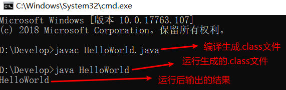

# HelloWorld

## 创建java文件

创建一个扩展名为.java的文件。注意：注意看下是否隐藏了扩展名。

## 编写java代码

在刚刚创建的HelloWorld.java文件中编写如下代码：

~~~~java
public class HelloWorld {
	public static void main(String[] args){
		System.out.println("HelloWorld");
	}
}
~~~~

## 编译运行代码

java文件所在目录打开命令行窗口，编译java文件生成class文件（**javac 文件名包含扩展名**），运行class文件（**java 类名**）。

范例如下：

> javac HelloWorld.java
>
> java HelloWorld

效果图：

## 常见问题

1、非法字符问题。Java中的符号都是英文格式的。

2、大小写问题。Java语言对大小写敏感（区分大小写）。

3、在系统中显示文件的扩展名，避免出现HelloWorld.java.txt文件。

4、main写错成mian

## 作业

练习完HelloWorld后尝试修改代码。尝试在控制台输出和网恋女友的告白文案。

**具体答案可以加入到学习探讨QQ群中获取。**