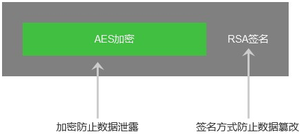

### 哈希 

为了保护用户的明文密码不被泄露，一般会对密码进行**单向不可逆**加密——哈希。

### 对称加密（Symmetric-key algorithm）

> 加密和解密时使用相同的密钥

对称加密（Symmetric-key algorithm）又称为对称加密、**私钥加密**、共享密钥加密

这类算法在加密和解密时使用**相同的密钥**，或是使用两个可以简单地相互推算的密钥。实务上，这组密钥成为在两个或多个成员间的共同秘密，以便维持专属的通讯联系。与公开密钥加密相比，要求双方取得相同的密钥是对称密钥加密的主要缺点之一。

- **概念**：加密算法是公开的，靠的是秘钥来加密数据，使用**一个秘钥加密**，必须使用相同的秘钥才解密。
- 优点： 算法公开、计算量小、加密速度快、加密效率高
- 缺点：在数据传送前，发送方和接收方必须商定好秘钥，然后使双方都能保存好秘钥
- 常见的对称加密算法有：DES、3DES（TripleDES）、IDEA、**AES、ChaCha20、** RC2、RC4、RC5、Blowfish和国密 SM1 和 SM4等。

### 非对称加密

- 概念：加密和解密使用不同的秘钥，一把公开的公钥，一把私有的私钥。公钥加密的信息只有私钥才能解密，私钥加密的信息只有公钥才能解密。
- 优点：安全，即使密文被拦截、公钥被获取，但是无法获取到私钥，也就无法破译密文。作为接收方，务必要保管好自己的密钥。
- 缺点：加密算法及其复杂，安全性依赖算法与密钥，而且加密和解密效率很低。
- 常见算法：RSA、DSA、ECC

非对称加密步骤：

- 后端A生成一对非对称秘钥，将公钥向所有人公开，
- 前端B拿到后端A的公钥后使用A的公钥对信息加密后发送给后端A，经过加密的信息只有后端A手中的私钥能解密。
- 前端B可以通过这种方式将自己的公钥加密后发送给后端A，两方建立起通信，
- 可以通过对方的公钥加密要发送的信息，接收方用私钥解密信息。

### RSA+AES混合加密方案：

#### 加密**思路**

- **利用 RSA 来加密传输 AES的密钥，用 AES的密钥 来加密数据。**
- 这样做：既利用了 RSA 的灵活性，可以随时改动 AES 的密钥；又利用了 AES 的高效性，可以高效传输数据。

1. 流程：
前提：【服务方】生成一对 RSA 秘钥，自己保留私钥，将公钥由互联网交给【合作方】

从【合作方】向【服务方】方向看 →

【合作方】使用 AES 秘钥对要传送的报文数据（明文） Data 进行加密，生成密文 EncryData；
【合作方】使用 RSA 公钥对AES秘钥加密，生成 EncryKey ；
【合作方】将加密后的 AES 秘钥 EncryKey 和加密后的报文 EncryData 通过网络传输给服务器端；
【服务方】通过网络拿到上述（3）步骤中的 EncryKey 和 EncryData ；
【服务方】用 RSA 私钥对 EncryKey （加密的 AES 秘钥）进行解密操作，得到 AesKey；
【服务方】用 AesKey 解密传入过来的加密报文 EncryData，得到报文数据（明文） Data ，流程结束

## AES 密钥与 RSA 密钥的关系

- AES 密钥是对接口请求和响应内容进行加密，密文无法被第三方识别，从而防止接口传输数据泄露。
- RSA 密钥是对接口请求和响应内容进行签名，开发者和支付宝开放平台分别加签验签，以确认接口传输的内容没有被篡改。不论接口内容是明文还是密文，RSA 均可正常签名。

开发者可对请求参数先做 AES 加密，然后对密文进行 RSA 签名。