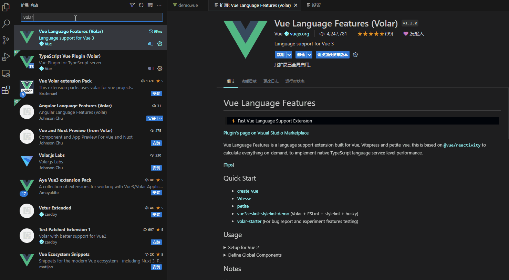

# Vue3技巧与编码规范-优雅永不过时

个人认为良好的代码规范,起码要符合一下2点:

- 可读性
- 可维护性

代码可读性的提高,能减少代码理解的难度,能有效提高维护的效率,想写一个可读性高的代码,写规范的代码是必要;


### 1. 使用`composition api`来编码

##### 按功能块写代码,不要想着data、methods了

- vue3就用`composition api`的思想来组织代码接口,按功能块写,抛弃vue2拆分`data`、`methods`、`computed` 、生命函数分开写的思想

- 避免将`响应式变量ref`声明全部写在一个地方,要按功能分开写

- `composition api`是灵活多变的,功能A可以将`ref/函数/watch/computed/生命周期函数`写在一块,这样更容易维护

  

  

  

  ###### 按功能块写法对比:

  - 不规范写法

    > 把`list`和`list2`所有的变量声明都放在一块了
  
    ```vue
    <script lang="ts" setup  name="test">
    import * as api from '@/api/table'
    let list = ref([
      { a: 1, b: 2, c: 3 },
      { a: 1, b: 2, c: 3 }
    ])
    let list2 = ref([
      { a: 1, b: 2, c: 3 },
      { a: 1, b: 2, c: 3 }
    ])
    const getList = async () => {
      try {
        let res = await api.saveTableApi({})
        list.value = res
      } catch (error) {}
    }
    
    const getList2 = async () => {
      try {
        let res = await api.saveTableApi({})
        list2.value = res
      } catch (error) {}
    }
    
    onMounted(() => {
      getList()
      getList2()
    })
    </script>
    ```

  - 按功能块写
  
    ```vue
    <script lang="ts" setup >
    import * as api from '@/api/table'
    //功能1    
    let list = ref([
      { a: 1, b: 2, c: 3 },
      { a: 1, b: 2, c: 3 }
    ])
    
    const getList = async () => {
      try {
        let res = await api.saveTableApi({})
        list.value = res
      } catch (error) {}
    }
    onMounted(() => {
      getList()
    })
    //功能2
    let list2 = ref([
      { a: 1, b: 2, c: 3 },
      { a: 1, b: 2, c: 3 }
    ])
    const getList2 = async () => {
      try {
        let res = await api.saveTableApi({})
        list2.value = res
      } catch (error) {}
    }
    onMounted(() => {
      getList2()
    })
    </script>
    ```

### 2. 使用`setup`语法糖 `<script setup>`编写组件

###### `setup`语法糖必须掌握的`api`:

- `defineProps()` 和 `defineEmits()`
- `defineModel()`
- `defineExpose()`
- `defineOptions()`


### 3.使用`ref`避免使用`reactive` 声明响应式数据

- `ref`是官方推荐的声明响应式数据的`API`,可以声明基本数据类型和引用数据类型

- 携带`.value` 尾巴,能直观展示是响应式数据

- `vscode` 的`Vue-official`插件可开启对ref声明的响应式数据自动添加`.value`

  > 图中的Volar插件已经升级改名成了``Vue-official`插件`
  
  

### 4. Vue3一些Api技巧


##### `v-for`和`v-if`同时使用时,巧妙使用`template`

> `v-for`和`v-if`是不能同时使用的,但是有些情况需要在遍历的时候判断能否展示

```html
<ul>
  <template v-for="user in users" :key="user.id">
    <li v-if="user.isActive">
      {{ user.name }}
    </li>
  </template>
</ul>
```


##### 组件间通讯

###### 组件通讯的多种形式:

| 通讯方式         | api                   |
| ---------------- | --------------------- |
| 父传子           | `props/defineProps`   |
| 父传子           | `provide/inject`      |
| 父子互相通讯     | `v-model/defineModel` |
| 父组件访问子组件 | `ref/defineExpose`    |
| 子传父           | `@/defineEmits`       |

以上方式可以查漏补缺,哪个不懂的可以翻官方文档看看,都是很有用的通讯方式

###### ` v-model/defineModel`:

其中` v-model/defineModel`是vue3.4版本后新出的api,解决了`props/defineProps`通讯是单向传值的问题,` v-model/defineModel`在子组件修改父组件的值也能做到双向绑定

- 父组件

  ```html
  <UserName
    v-model:first-name="first"
    v-model:last-name="last"
  />
  ```

- 子组件

  ```html
  <template>
    <input type="text" v-model="firstName" />
    <input type="text" v-model="lastName" />
  </template>
  
  <script setup>
  
  const firstName = defineModel('firstName')
  const lastName = defineModel('lastName')    
  </script>
  
  ```

  

###### ``provide/inject``:

`provide/inject`依赖注入,可以在父组件中`provide`注入`函数`或者`属性`,在子组件还子孙组件中通过`inject`即可拿到父组件/祖先组件传递过来的`函数`或者`属性`,解决了`props/defineProps`逐层传递的弊端

```html
//父组件 Root.vue---------------------------------------------------
<template>
  <div>
    <Footer/>
  </div>
</template>
<script setup>
import { ref } from 'vue'
import Footer from './Footer.vue' //导入子组件Footer
//父组件中注册给共享后代组件的信息
provide(/* 注入名 */ 'mgs', /* 值 */ '父组件信息!')  

</script>

//子组件 Footer.vue--------------------------------------------------
<template>
    <DeepChild/>
</template>
<script setup>
import DeepChild from './DeepChild.vue' //导入子组件Footer
//在子组件Footer中可以不需要接收父组件Root共享的数据,在后代组件中,直接接收,实现跨级传递
</script>

//子孙组件DeepChild.vue---------------------------------------------------
<template>
    <div>
        {{ msg }}
    </div>
</template>
<script setup>
import { inject } from 'vue'
const msg = inject('msg') //跨级接收祖先组件的共享的信息
console.log(msg) //父组件信息
</script>
```


##### 样式穿透修改UI组件库样式

> 在开发过程中UI组件库固然好用,但是有时候需要修改UI组件库时,就需要使用样式穿透了

需要样式穿透的原因:使用 `scoped` 后，父组件的样式将不会渗透到子组件中,这就为什么有时候修改UI组件库的样式不生效的原因

`vue3`的样式穿透: `:deep(.想要穿透样式的classid)`

```html
<style lang="scss" scoped>
// 在scoped下这种修改UI组件库的方式不一定生效
.el-form {
    .el-form-item { ... }
}

// 需要使用样式穿透
:deep(.el-form) {
    .el-form-item { ... }
}
</style>
```

##### 没了`this`,我只想`this`怎么办(不推荐用)

> 对于写Vue3还想着`this`的同学,我的评价是再多看一下Vue3官方文档,Vue3提供的`composition api`在绝大多情况下已经适用了

Vue3提供了`getCurrentInstance`替代this:

```html
<script setup>
import { getCurrentInstance } from 'vue'

// proxy 就是当前组件实例，可以理解为组件级别的 this，没有全局的、路由、状态管理之类的
const { proxy, appContext } = getCurrentInstance()

// 这个 global 就是全局实例
const global = appContext.config.globalProperties
</script>
```

##### 接口请求多使用`async/await`,配合try-catch使用

`async/await`的使用,能让异步请求变成更符合人类思维的同步操作,更方便组织代码,在`try-catch` 对异步的错误进行捕获,

```javascript
<script setup>
const loading = ref(false)
const products = ref(null)

const init = async () => {
    loading.value = true
    try {
        products.value = await getProducts() //产品请求接口函数
    } catch (e) {
    }
    loading.value = false
}

onMounted(() => {
    init()
})
</script>
```


### 5.组件名称规范:

##### 使用大驼峰/`PascalCase`命名组件,兼容性强

```html
<template>
     <!-- 实例化组件方式1 -->
    <MyComponent/>
     <!-- 实例化组件方式2 -->
    <my-component/>
</template>
<script setup>
    import MyComponent from './MyComponent'
</script>
```

在`elment-plus`UI组件库里面也是同样的,组件有2中实例化方式,使用大驼峰命名和使用横线命名

> `elment-plus`源码中就是使用大驼峰导出组件名称的 `exports["default"] = ElButton;`

```html
<template>
     <!-- 实例化组件方式1 -->
     <ElButton type="primary" >按钮1</ElButton>
     <!-- 实例化组件方式2 -->
     <el-button type="primary" >按钮1</el-button>
</template>
```

##### 紧密耦合的组件名称:

与其父组件紧密耦合的子组件应包含父组件名称作为前缀。

命名规则:  父组件名称+子组件名称

**好处:**

- 关系更紧密,通过看组件名即可知道2个组件的联系

- 编辑器友好,例如`VsCode`,通常按字母顺序组织文件，因此这也使这些相关文件彼此相邻;

  

**对比:**

- 不推荐

  ```
  components/
  |- SearchSidebar.vue
  |- NavigationForSearchSidebar.vue
  ```

- 推荐

  ```
  components/
  |- SearchSidebar.vue
  |- SearchSidebarNavigation.vue
  ```

  组件命名关联关系更紧密,如果同目录还有其他组件,会优先把这2个组件排序在一块

  

##### 组件名称使用完整单词命名

> 组件名称应优先使用**完整单词**而不是缩写。

编辑器中的自动完成功能使编写较长名称的成本非常低，但是完整单词带给我们清晰度是无价的

**对比**:

- 不推荐

  ```
  components/
  |- SdSettings.vue
  |- UProfOpts.vue
  ```

- 推荐

  ```
  components/
  |- StudentDashboardSettings.vue
  |- UserProfileOptions.vue
  ```

  


### 6.路由设置的path和组件的路径保持一致

好处: 通过`url`上的路径就能直接找到组件在项目中的位置


图中,个人中心的这个菜单的路径是`/personal/personnal-center` ,如果页面有报错,根据URL上的路径就直接能定位出现问题的组件的是在项目中`/Personal/PersonalCenter`下


### 7`hooks`、`utils`、`constants`、`types`、API 等文件，就近存放，必要时才做目录提升

> 不能公共使用的都放在当前组件目录下,如果和业务关联性很大的不能复用的代码,写在公共目录下,就是对公共代码的污染

```
  |- 组件目录
    |- Index.vue 组件
    |- common  该组件下的工具方法
    	|- hooks.ts   
    	|- utils.ts
    	|- types.ts
    	|- constants.ts
    	|- API.ts
```

当然这里说的`API.ts`是已经使用`axios`统一封装好的业务接口,如下

```javascript
//全局的接口请求封装
import request from '@/axios'

// 获取列表接口
export const getXXList = () => {
  return request.get({ url: '/mock/xx/list' })
}
```

**为什么`API.ts`业务接口请求不是放在公共api目录下,而是推荐放在业务代码目录下?**

我们看大部分的vue3开源管理系统项目的api接口请求都是放在公共的API目录下,

但是在企业项目中业务量是庞大的，那么`API`目录可能会变得非常庞大，难以维护,出现以下情况:

1. `API`目录下的`业务api请求js`文件过于庞大,如果文件夹语意不明确,根本无法知道是属于哪个业务的

2. `API`目录下的`业务api请求js`,正常情况都是与业务紧密关联的,统一放在`API`目录下降低了代码的可读性

单独放在业务目录下的好处:

1. 方便跳转,在该业务目录下即可直达`业务api请求js`文件,方便维护

   > 我在A业务目录下就能找到A业务的接口文件,随时修改,虽然`vscode`提供方便的跳转,但是如果开发到一半,整个业务不做了,或者该业务废弃,那剔除业务代码是很方便的,删掉该目录即可

2. api接口与业务联系更紧密,提高了代码可读性,


### 8. 写TS不要写成any TS,减少any的使用

由于前端的小伙伴,写惯了`js`这种弱类型的语言,不知道强类型语言配合`vscode`这类代码编辑器的好处,比如**类型检查**和**代码提示** 

- 代码提示

  

  


### 9.避免过渡封装

> 好用的封装爱不释手,不好用的封装狗都嫌弃,为什么`Element-Plus`组件库好用,因为人家确实解决了痛点和很好的文档支持

团队开发过程中,好用的封装是必不可少的,但是过度的封装,我个人是不推荐的,如果真要封装,我要做以下2点

- 写好封装组件的使用说明文档

- 文档第一条就写清楚,封装的好处

  

  
### 10 使用开源项目的进行二次开发的,多看看文档吧

> 我一直认为站在巨人的肩膀上,是能看得更远的

推荐几个我认为还不错的开源项目吧

- [vue-element-plus-admin](https://github.com/kailong321200875/vue-element-plus-admin/tree/master)

  > 这个项目用来学习和二次开发都是十分不错的,文档也写得很认真

- [uni-best](https://github.com/codercup/unibest)

  > uniapp的基础上封装了一些基本的功能

