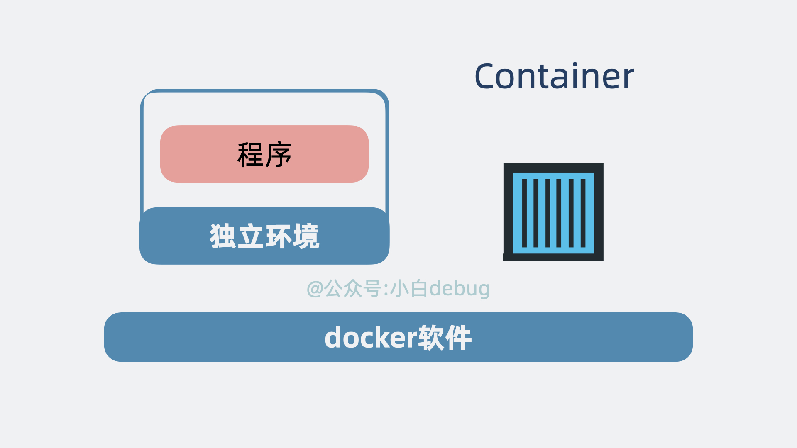
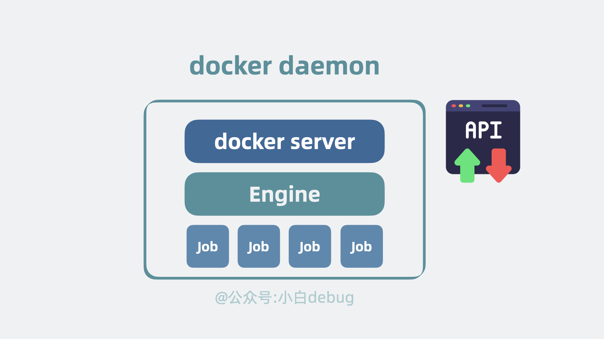
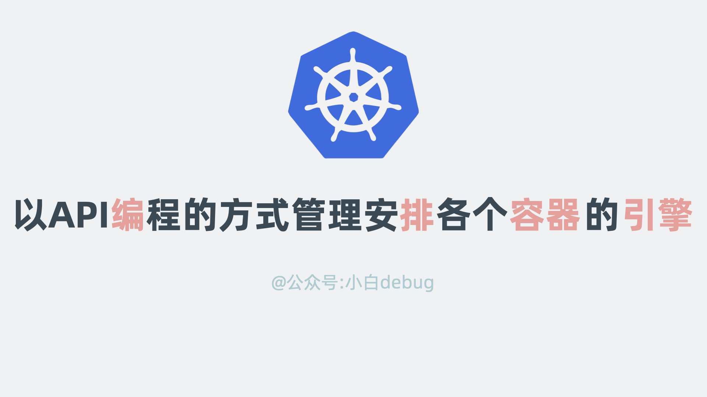

# 转载:[Docker 是什么？ 和 Kubernetes(k8s) 之间是什么关系？ | golang全栈指南 (golangguide.top)](https://golangguide.top/架构/云原生/核心知识点/docker是什么docker和kubernetes(k8s)之间是什么关系有什么区别.html)


作为一个程序员，如果你想安装一个 `vim` 编辑下文本，在不同环境里你得执行不同的命令。 在 ubuntu，你需要执行 `apt-get install vim`，在 centos 里，你需要执行 `yum install vim`.

装个小软件尚且如此，要是你想将自己写的代码部署到各个不同操作系统的服务器上，那依赖的软件和配置就更多了，需要针对每个环境单独写一套部署脚本。
难受，太难受了。

那么问题就来了，有没有更好的解决方案？
当然有，**没有什么是加一层中间层不能解决的，如果有，那就再加一层**，这次我们要加的中间层是 **Docker**。

Docker是代码和操作系统之间的中间层

哦不，准确来说是 **Docker 容器**。

容器技术

## [Docker 是什么？](https://golangguide.top/架构/云原生/核心知识点/docker是什么docker和kubernetes(k8s)之间是什么关系有什么区别.html#docker-是什么)

我们经常能听到程序员说"这个程序在我环境里明明是好的啊，怎么到你这就不行了呢"？
注意这里的关键词，**程序**和**环境**。
程序是跑在操作系统上的，而操作系统上又装了各种不同版本的依赖库和配置，这些被程序所依赖的信息，我们统称为"**环境**"。

程序和环境

程序依赖环境，环境不同，程序就可能跑不起来。
如果我们能将环境和程序一起打包，给到对方运行，那问题不就解决了吗。
Docker 就是这样一款可以将**程序和环境打包并运行**的工具软件。
我们来看下它是怎么做的？

## [基础镜像是什么](https://golangguide.top/架构/云原生/核心知识点/docker是什么docker和kubernetes(k8s)之间是什么关系有什么区别.html#基础镜像是什么)

既然上面提到环境不同，会导致程序运行结果不同，那么我们首先要做的最重要的事情，就是**统一环境**。
而环境中，最最重要的就是**操作系统**。比如 centos 还是 ubuntu，我们得选一个，让所有程序都跑在**同一个**操作系统上。并且我们知道操作系统分为用户空间和内核空间，应用程序运行在用户空间。因此，我们可以阉割操作系统，只需要利用操作系统的用户空间部分，就能构建出应用所需的环境。
其次就是统一**程序语言**依赖，比如要跑 python 应用，你得装个 python 解释器，要跑个 java 应用，得装个 JVM，要跑 go 应用，那就。。什么都不需要装。
选中一个基础操作系统和语言后，我们将它们**对应的文件系统，依赖库，配置等放一起打包成一个类似压缩包的文件**，这就是所谓的**基础镜像**(Base Image)。

基础镜像是什么

## [Dockerfile 是什么](https://golangguide.top/架构/云原生/核心知识点/docker是什么docker和kubernetes(k8s)之间是什么关系有什么区别.html#dockerfile-是什么)

有了基础镜像之后还不够，我们经常还需要安装一些依赖，比如`yum install gcc`，甚至还要创建一些文件夹。最后才是运行我们的目标**应用程序**。
我们知道 linux 中，所有工作都可以通过**命令行**完成，所以我们可以将要做的事情以命令行的形式一行行列出来。
就像一份 **todo list**。
意思是要求在基础镜像的基础上按着 todo list 挨个执行命令。
这份 todo list 长下面这样。

```Dockerfile
# 指定基础镜像
FROM python:3.9

# 设置工作目录
WORKDIR /app

# 复制依赖文件到容器中
COPY requirements.txt .

RUN yum install gcc
# 安装依赖
RUN pip install --no-cache-dir -r requirements.txt

# 将当前目录下的所有文件复制到容器的 /app 目录下
COPY . /app

# 设置容器启动时执行的命令
CMD ["python", "app.py"]
```

具体含义是，基于一个装了 python3.9 解释器的操作系统（基础镜像），再执行 pip install 等命令安装其他依赖，从而构建出一个适合程序运行的环境，最后用 `python app.py` 运行我们的目标应用程序。
像这样一份列清楚了，从操作系统到应用服务启动，需要做哪些事情的清单文件（todo list），就是所谓的 **Dockerfile**。

## [容器镜像 是什么](https://golangguide.top/架构/云原生/核心知识点/docker是什么docker和kubernetes(k8s)之间是什么关系有什么区别.html#容器镜像-是什么)

注意 Dockerfile 只是描述了要做哪些事情，并没有真正开始做。
当我们用命令行执行 **docker build** 的时候，Docker 软件就会按着 Dockerfile 的说明，一行行构建环境+应用程序。最终将这个环境+程序，打包成一个类似"压缩包"的东西，我们叫它**容器镜像**(container image)。

容器镜像

只要将容器镜像传到任意一台服务器上，对这个"压缩包"执行"解压缩"，我们就能同时运行环境和程序。太完美了！
但是现在还有个问题，怎么将容器镜像传到那么多服务器上呢？

## [Registry 是什么](https://golangguide.top/架构/云原生/核心知识点/docker是什么docker和kubernetes(k8s)之间是什么关系有什么区别.html#registry-是什么)

服务器那么多，挨个将容器镜像传过去也不是不行，就是将压力全给到发送方的**网络带宽**了。有没有更好的解决方案？
有。可以参考 `github` 代码仓库 的做法，我们通常会使用 `git push` 将代码传到 github，有需要的人自己通过 `git pull` 的方式将代码从 github 拉到自己的机器上。

github仓库

那 Docker 也一样，弄一个**镜像仓库**，通过 **docker push** 将镜像推到仓库，有需要的时候再通过 **docker pull** 将镜像拉到机器上。这个负责管理镜像仓库推拉能力的服务，就叫 **Docker Registry**。基于 Docker Registry 的能力，我们可以搭建各种**官方或私人镜像仓库**，比如官方的叫 DockerHub，非官方的有清华大学的 Tuna 等等，一般公司内部也会有自己的镜像仓库。

Registry是什么

## [容器是什么](https://golangguide.top/架构/云原生/核心知识点/docker是什么docker和kubernetes(k8s)之间是什么关系有什么区别.html#容器是什么)

现在，我们解决了服务器间**传输容器镜像**的问题。
我们可以跑到目的服务器上，执行 docker pull 拿到容器镜像。
然后执行 docker run 命令，将这个类似"压缩包"的容器镜像给"解压缩"，获得一个**独立的环境和应用程序**并运行起来。这样一个独立的环境和应用程序，就是所谓的**容器**(container)。我们可以在一个操作系统上同时跑多个容器。且这些容器之间都是互相独立，互相隔离的。

容器是什么

## [Docker 和虚拟机的关系？](https://golangguide.top/架构/云原生/核心知识点/docker是什么docker和kubernetes(k8s)之间是什么关系有什么区别.html#docker-和虚拟机的关系)

眼熟不，这个**容器**是不是很像我们用 vmware 或 kvm 整出来的**传统虚拟机**？
但不同的是，传统虚拟机自带一个完整操作系统，而容器本身不带完整操作系统，容器的基础镜像实际上只包含了操作系统的核心依赖库和配置文件等必要组件。
它利用一个叫 **Namespace** 的能力让它看起来就像是一个独立操作系统一样。再利用一个叫 **Cgroup** 的能力限制它能使用的计算资源。

Docker和虚拟机的区别

所以说，容器本质上只是个自带独立运行环境的**特殊进程**，底层用的其实是**宿主机的操作系统内核**。

容器本质是一个特殊进程

## [Docker 的架构原理](https://golangguide.top/架构/云原生/核心知识点/docker是什么docker和kubernetes(k8s)之间是什么关系有什么区别.html#docker-的架构原理)

现在，我们回到日常使用场景中，聊聊 Docker 的架构原理。它是经典的 Client/Server 架构。Client 对应 Docker-cli， Server 对应 Docker daemon。
我们在命令行里敲 Docker 命令，使用的就是 Docker-cli.

Docker是C/S软件架构

Docker-cli 会解析我们输入的 cmd 命令，然后调用 Docker daemon 守护进程提供的 RESTful API，守护进程收到命令后，会根据指令创建和管理各个容器。
再具体点，Docker Daemon 内部分为 Docker Server、Engine 两层。Docker Server 本质上就是个 HTTP 服务，负责对外提供操作容器和镜像的 api 接口，接收到 API 请求后，会分发任务给 Engine 层，Engine 层负责创建 Job，由 Job 实际执行各种工作。

Docker daemon内部架构

不同的 Docker 命令会执行不同类型的 Job 任务。

### [docker build](https://golangguide.top/架构/云原生/核心知识点/docker是什么docker和kubernetes(k8s)之间是什么关系有什么区别.html#docker-build)

如果你执行的是 docker build 命令，Job 则会根据 Dockerfile 指令，像包洋葱皮似的一层层构建容器镜像文件。

docker build执行逻辑

### [docker pull/push](https://golangguide.top/架构/云原生/核心知识点/docker是什么docker和kubernetes(k8s)之间是什么关系有什么区别.html#docker-pull-push)

如果你执行的是 docker pull 或 push 之类的镜像推拉操作，Job 则会跟外部的 `Docker Registry` 交互，将镜像上传或下载。

docker pull/push执行逻辑

### [docker run](https://golangguide.top/架构/云原生/核心知识点/docker是什么docker和kubernetes(k8s)之间是什么关系有什么区别.html#docker-run)

如果你执行的是 docker run 命令，Job 就会基于镜像文件调用 containerd 组件，驱使 runC 组件创建和运行容器。

docker run执行逻辑

## [Docker 到底是什么？](https://golangguide.top/架构/云原生/核心知识点/docker是什么docker和kubernetes(k8s)之间是什么关系有什么区别.html#docker-到底是什么)

现在我们再回过头来看这句话，Docker 本质上就是一个将**程序和环境打包并运行**的工具软件。具体点来说就是，它通过 Dockerfile 描述环境和应用程序的依赖关系， docker build 构建镜像， docker pull/push 跟 Docker Registry 交互实现存储和分发镜像，docker run 命令基于镜像启动容器，基于容器技术运行程序和它对应的环境，从而解决环境依赖导致的各种问题。

Docker到底是什么

好了，到这里，我们就了解了 Docker 的架构和基本运行原理了。
接下来，我们再来聊聊跟 Docker 相关的几个周边。

## [Docker Compose 是什么？](https://golangguide.top/架构/云原生/核心知识点/docker是什么docker和kubernetes(k8s)之间是什么关系有什么区别.html#docker-compose-是什么)

我们现在知道了 Docker 容器 本身只是**一个**特殊进程，但如果我想要部署**多个**容器，且对这些容器的顺序有一定要求呢？比如一个博客系统，当然是先启动数据库，再启动身份验证服务，最后才能启动博客 web 服务。
按理说挨个执行 docker run 命令当然是没问题的，但有没有更优雅的解决方案？
有。我们可以通过一个 **YAML** 文件写清楚要部署的**容器有哪些**，**部署顺序**是怎么样的，以及这些容器占用的 **cpu 和内存**等信息。

```yaml
version: "3.8"

services:
  A:
    image: "some-image-for-a"
    deploy:
      resources:
        limits:
          cpus: "0.50" # 限制 CPU 使用率为 50%
          memory: 256M # 限制内存使用量为 256MB

  B:
    image: "some-image-for-b"
    depends_on:
      - A

  C:
    image: "some-image-for-c"
    depends_on:
      - B
```

然后，通过一行`Docker-compose up`命令，开始解析 YAML 文件，将容器们一键按顺序部署，就完成**一整套服务**的部署。
这其实就是 **Docker Compose** 干的事情。

Docker compose原理

## [Docker Swarm 是什么？](https://golangguide.top/架构/云原生/核心知识点/docker是什么docker和kubernetes(k8s)之间是什么关系有什么区别.html#docker-swarm-是什么)

Docker 解决的是**一个容器**的部署。
Docker Compose 解决的是**多个容器组成的一整套服务**的部署。
那 Docker Swarm 就更高维度了，它解决的其实是这一整套服务**在多台服务器上的集群部署**问题。
比如在 A 服务器坏了，就将服务在 B 服务器上重新部署一套，实现迁移，还能根据需要对服务做扩缩容。

Docker swarm是什么

## [Docker 和 k8s 的关系是什么？](https://golangguide.top/架构/云原生/核心知识点/docker是什么docker和kubernetes(k8s)之间是什么关系有什么区别.html#docker-和-k8s-的关系是什么)

还记得之前的[文章](https://golangguide.top/架构/微服务/核心知识点/k8s到底是什么)里提到的 k8s 吗？它会在多台 Node 服务器上调度 Pod，进行部署和扩缩容。

k8s的node内部

每个 Pod 内部可以含有多个 container，每个 container 本质上就是一个服务进程。

pod内部

是不是感觉**k8s**跟 **Docker Swarm** 做的事情很像？
没错，其实 Docker Swarm 是 k8s 的**竞品**，既然是竞品，那它们做的事情其实区别就不大了。
现在回过头来看 Docker 容器和 k8s 之间的关系，思路就清晰了。
Docker 部署的**容器**，其实就是 k8s 调度的 Pod 里的 **container**，它们都叫**容器**，其实是一回事。只不过 k8s 除了支持 Docker 的容器外，还支持别人家的容器。
Docker Compose 基于多个 container 创建的**一整套服务**，其实就是 k8s 里的 **pod**。而 Docker Swarm 做的事情和 k8s 一样，本质上就是在调度 pod。
回过头来看下 k8s 的官方定义，叫容器编排引擎，将它理解为，以 API **编**程的方式管理安**排**各个容器的引擎，是不是就特别精辟。

容器编排引擎的含义

现在，我们再回过头来看下 Docker 的图标，是一个个**集装箱**，放在一艘船上，这一个个集装箱指的就是互相隔离的**容器**，而 k8s 的图标，则是一个轮船上的**方向盘**，意思是 k8s 控制着轮船的航向，其实指的就是**调度**容器。这波联想就非常形象了。

Docker和k8s

现在大家通了吗？

## [总结](https://golangguide.top/架构/云原生/核心知识点/docker是什么docker和kubernetes(k8s)之间是什么关系有什么区别.html#总结)

- Docker 本质上就是一个将**程序和环境打包并运行**的工具软件，而 Docker 容器本质上只是个自带独立运行环境的**特殊进程**，底层用的其实是**宿主机的操作系统内核**。
- Docker 软件 通过 Dockerfile 描述环境和应用程序的依赖关系， docker build 构建镜像， docker pull/push 跟 Docker Registry 交互实现存储和分发镜像，docker run 命令基于镜像启动容器，基于容器技术运行程序和它对应的环境，从而解决环境依赖导致的各种问题。
- Docker 解决的是**一个容器**的部署问题，Docker Compose 解决的是**多个容器组成的一套服务**的部署问题，Docker Swarm 解决的是多个容器组成的**一套服务在多台服务器上的部署问题**，k8s 则是 Docker Swarm 的竞品，在更高维度上**兼容**了 Docker 容器，实现了容器编排调度。

## 