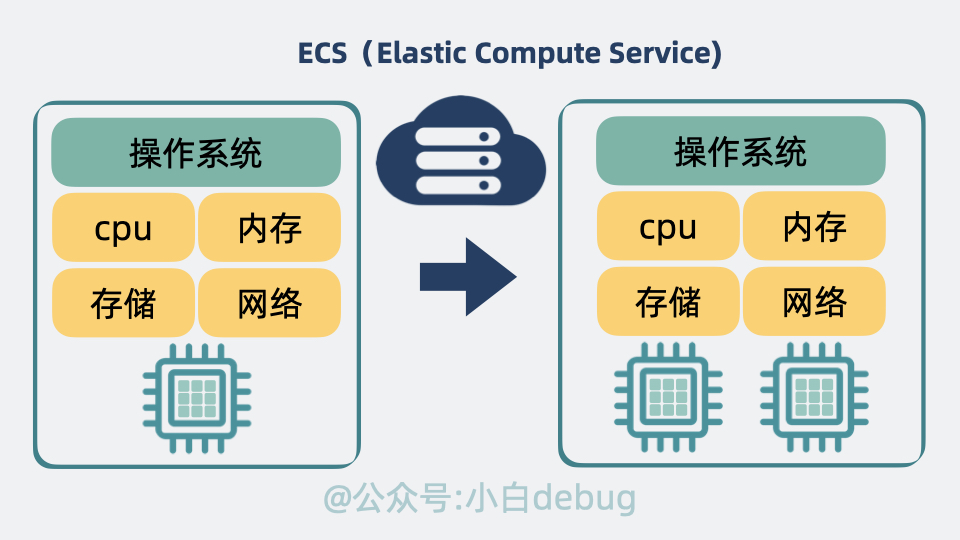

# 转载 [docker 和传统虚拟机有什么区别？ | golang全栈指南 (golangguide.top)](https://golangguide.top/架构/云原生/核心知识点/docker和传统虚拟机有什么区别.html)

我有一个程序员朋友，他每年情人节都要送女朋友一台服务器。

他说：“谁不想在过节当天收到一台 4 核 8g 的服务器呢？”

“万一对方不要，我还能留着自己用。”
给他一次过节的机会，他能把**浪漫**玩的明明白白。
所以今年情人节，他自己一个人过。
太痛了，是那种**布洛芬都不知道他哪里痛**的痛。

虽然人跑了，但起码还有服务器陪着他，但屏幕前依然单身的你呢？
**你连服务器都没有**。
那么问题就来了，你买过服务器吗？看着云厂商各种产品是不是有点懵。
你知道 ecs，vps，docker 容器 是什么吗？它们有啥区别呢？

我们今天来聊聊这个话题。

## [物理服务器是什么？](https://golangguide.top/架构/云原生/核心知识点/docker和传统虚拟机有什么区别.html#物理服务器是什么)

我的柜子里有一台大学时候用的废弃电脑，自带 cpu、 内存等硬件和操作系统，根据一些教程视频，是可以做成服务器的。
像这样一台看得见摸得着的机器，其实就是云厂商页面里提到的**物理服务器**或**物理机**。不同厂商叫法不同，有的厂商叫它**独立服务器**。
跟家里电脑不一样的是，云厂商的机器性能更好，核数更高，还有专业的机房和空调伺候着。
那既然这样，是不是就不需要买云厂商的服务器呢？
糊涂啊，一台家用电脑跑起来 50 瓦，一年下来电费都好几百，还得花精力伺候着不让它关机，还真不如买别人家的划算。

但问题又来了，云厂商的物理服务器一般都是核数较高，很多时候我们根本不需要这么高配的机器。怎么办呢？
这一点云厂商当然也考虑到了。

## [vps 和 ecs 是什么](https://golangguide.top/架构/云原生/核心知识点/docker和传统虚拟机有什么区别.html#vps-和-ecs-是什么)

云厂商一般会**将一台物理服务器分割成多个虚拟机**。它跟我们在 windows 用 `VMware`, `VirtualBox` 建的虚拟机其实是一回事。
每个虚拟机都拥有独立的操作系统、资源（比如 CPU、内存、存储空间）和公网 IP 地址。然后对外出售，这样的虚拟机就是所谓的 **VPS**（Virtual Private Server，虚拟专用服务器）。

但传统 VPS 有个缺点，不支持用户**自主升降级**，它的资源是预先分配的，不易动态调整。
举个例子，假设你买了 `1c1g` 的服务器，想在页面上点点两下升级成 `2c2g`，这在传统 VPS 里是不支持的。
如果给 VPS 加入自主升降级的功能，那它就成了 **ECS**（Elastic Compute Service，弹性计算服务）

用户可以根据需要随时调整 CPU、内存、磁盘和带宽，主打一个"**弹性**"。
我们可以利用 ecs 学习 linux 命令，部署个人博客，做私人云盘存储，甚至可以将自己做的游戏部署到 ecs 上邀请朋友来玩。

ecs的用途

## [docker 容器 是什么](https://golangguide.top/架构/云原生/核心知识点/docker和传统虚拟机有什么区别.html#docker-容器-是什么)

买了 ecs 后，我们一般会开始部署自己的软件应用。机器少的时候手动部署问题不大，机器多了后各种问题就来了，其中最明显的就是，ecs 之间，如果**底层操作系统**不同，比如有些是 `ubuntu`，有些是 `centos`，部署应用的时候就会有各种环境问题。如果能让软件带着操作系统环境一起去部署就好了，最简单的方案是将软件和操作系统一起打包成虚拟机部署在 `ecs` 中。
但这样就成了在 ECS（也就是虚拟机）中再运行一个完整的虚拟机，**太重了**。有解法吗？

虚拟机上再运行一个虚拟机

有。既然多加一个操作系统太重，那我就只打包**软件和系统依赖库加配置**就好了。然后将这部分系统文件挂到 ecs 的操作系统下，利用一个叫 **Namespace** 的能力让它看起来就像是一个独立操作系统一样。再利用一个叫 **Cgroup** 的能力限制它能使用的计算资源。这就省掉了一层笨重的操作系统，同时还让软件轻松跑在各类操作系统上。这就是我们常说的 **Docker 容器技术**。

总的来说就是，**物理服务器上跑 ecs，ecs 跑 Docker 容器。多个 Docker 容器共享一个 ecs 实例 操作系统内核**。

ecs和docker容器的关系

## [服务器怎么选](https://golangguide.top/架构/云原生/核心知识点/docker和传统虚拟机有什么区别.html#服务器怎么选)

现在我们了解完他们的区别了，但服务器款式那么多，我们怎么选？
如果你是小公司老板或个体创业者，想要好一点的物理机又不想自建机房，那可以考虑买独立服务器。

如果你是像我一样的个人开发者，或者是学生，那无脑冲云服务器 ecs。
有了它，我们可以很方便的在上面部署 docker 容器，平时做做实验，部署博客，完全够用了。

容器里跑应用

这时候问题很多的小明就要问了，为什么不选择大厂商的云服务器？是用不起吗？
喂喂喂，怎么说话呢？
**不是大厂云服务器用不起，而是小厂商的更有性价比**。
就以同样是香港 1 核 1g 的 ecs 为例，比如我用的莱卡云，一个月只要 1 碗红烧牛肉面。大厂商则要 3 碗。

同样是 24 核物理服务器，小厂商千把块搞定，大厂商就是它的好几倍。

这省下来的钱，能买多少份 **19 块 9** `5条`的南极人内裤？

这时候问题很多的小明就又要问了，为什么要选**香港服务器**？大陆的不是更便宜吗？
那是因为香港服务器没有备案的烦恼，而且大陆也能轻松访问，有时候一些热点技术一出来，比如时下火热的 ai 技术，网站越快上线就能越早拿到搜索引擎排名，备案得等个把月，这一等就白白错失了很多成为下一个马总的机会。

## [最后](https://golangguide.top/架构/云原生/核心知识点/docker和传统虚拟机有什么区别.html#最后)