# 转载 [k8s 到底是什么，架构是怎么样的？ | golang全栈指南 (golangguide.top)](https://golangguide.top/架构/云原生/核心知识点/k8s到底是什么.html)

你是一个程序员，你用代码写了一个博客应用服务，并将它部署在了云平台上。
但应用服务太过受欢迎，访问量太大，经常会挂。

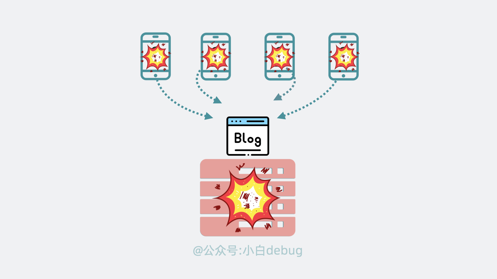

所以你用了一些工具自动重启挂掉的应用服务，并且将应用服务部署在了好几个服务器上，总算扛住了。

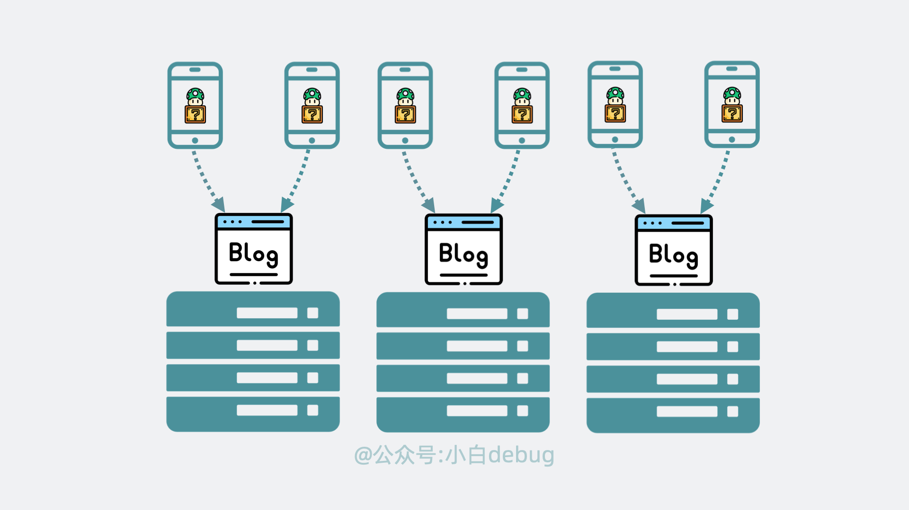
后来你又上线了商城应用服务和语音应用服务，随着**应用服务变多**，需求也千奇百怪。有的应用服务不希望被外网访问到，有的部署的时候要求内存得大于 xxGB 才能正常跑。
你每次都需要登录到各个服务器上，执行**手动**操作更新。不仅容易出错，还贼**浪费时间**。

**原本就没时间找女朋友的你，现在哭得更大声了。**

那么问题就来了，有没有一个办法，可以解决上面的问题？
当然有，**没有什么是加一个中间层不能解决的，如果有，那就再加一层**。
这次我们要加的中间层，叫 **Kubernetes**。

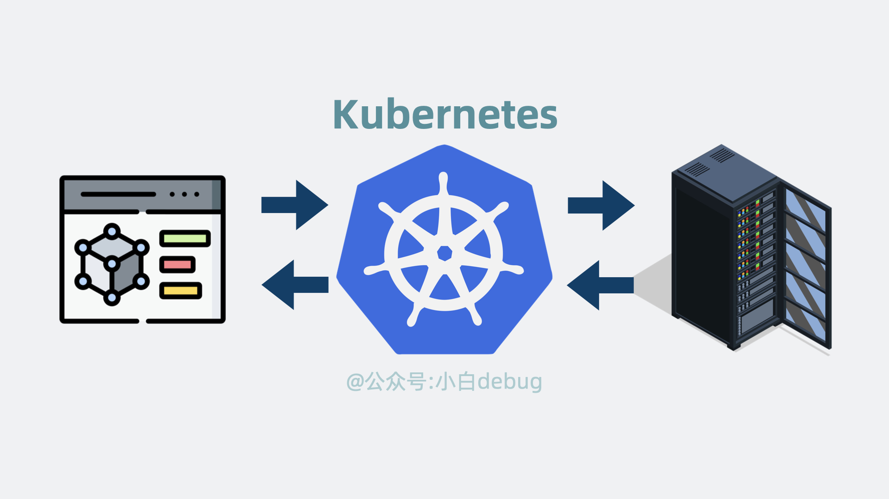Kubernetes的位置

## [Kubernetes 是什么？](https://golangguide.top/架构/云原生/核心知识点/k8s到底是什么.html#kubernetes-是什么)

Kubernetes，它是 **G 家**开源的神器，因为单词太长，所以我们习惯省略中间 8 个字母，简称它为 **k8s**。

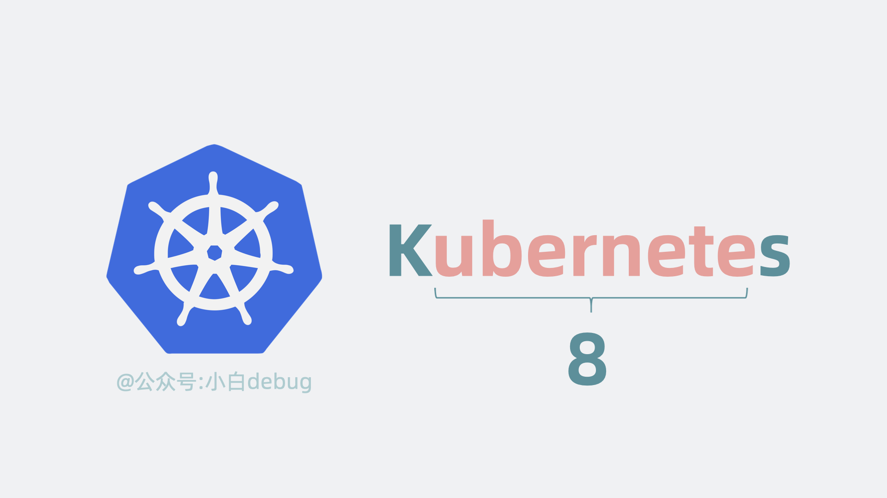
它介于**应用服务**和**服务器**之间，能够通过策略，协调和管理多个应用服务，只需要一个 **yaml** 文件配置，定义应用的部署顺序等信息，就能自动部署应用到各个服务器上，还能让它们挂了自动重启，自动扩缩容。

听起来有些厉害，它是怎么实现这些功能的呢？

## [Kubernetes 架构原理](https://golangguide.top/架构/云原生/核心知识点/k8s到底是什么.html#kubernetes-架构原理)

为了实现上面的功能，Kubernetes 会将我们的服务器划为两部分，一部分叫**控制平面**（control plane，以前叫 master），另一部分叫**工作节点**，也就是 **Node**。
简单来说它们的关系就是老板和打工人， 用现在流行的说法就是训练师和帕鲁。
控制平面负责控制和管理各个 Node，而 Node 则负责实际运行各个应用服务。

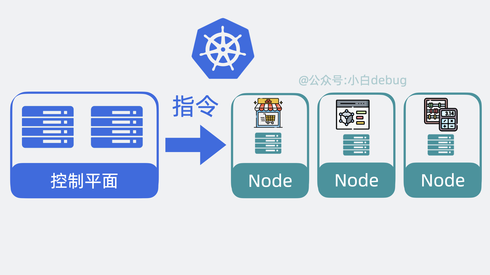
我们依次看下这两者的内部架构。

### [控制平面内部组件](https://golangguide.top/架构/云原生/核心知识点/k8s到底是什么.html#控制平面内部组件)

- 以前我们需要登录到每台服务器上，手动执行各种命令，现在我们只需要调用 k8s 的提供的 api 接口，就能操作这些服务资源，这些接口都由 **API Server** 组件提供。
- 以前我们需要到处看下哪台服务器 cpu 和内存资源充足，然后才能部署应用，现在这部分决策逻辑由 **Scheduler**（调度器）来完成。
- 找到服务器后，以前我们会手动创建，关闭服务，现在这部分功能由 **Controller Manager**（控制器管理器）来负责。
- 上面的功能都会产生一些数据，这些数据需要被保存起来，方便后续做逻辑，因此 k8s 还会需要一个**存储层**，用来存放各种数据信息，目前是用的 **etcd**，这部分源码实现的很解耦，后续可能会扩展支持其他中间件。

以上就是控制平面内部的组件。

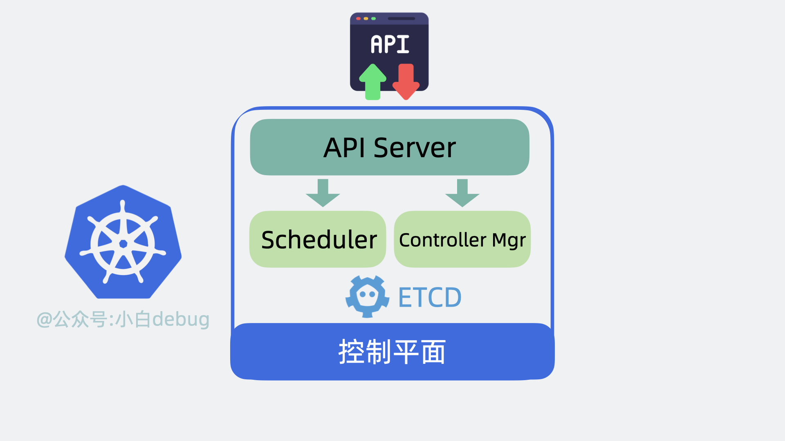
我们接下来再看看 Node 里有哪些组件。

### [Node 内部组件](https://golangguide.top/架构/云原生/核心知识点/k8s到底是什么.html#node-内部组件)

Node 是实际的工作节点，它既可以是**裸机服务器**，也可以是**虚拟机**。它会负责实际运行各个应用服务。多个应用服务**共享**一台 Node 上的内存和 CPU 等计算资源。

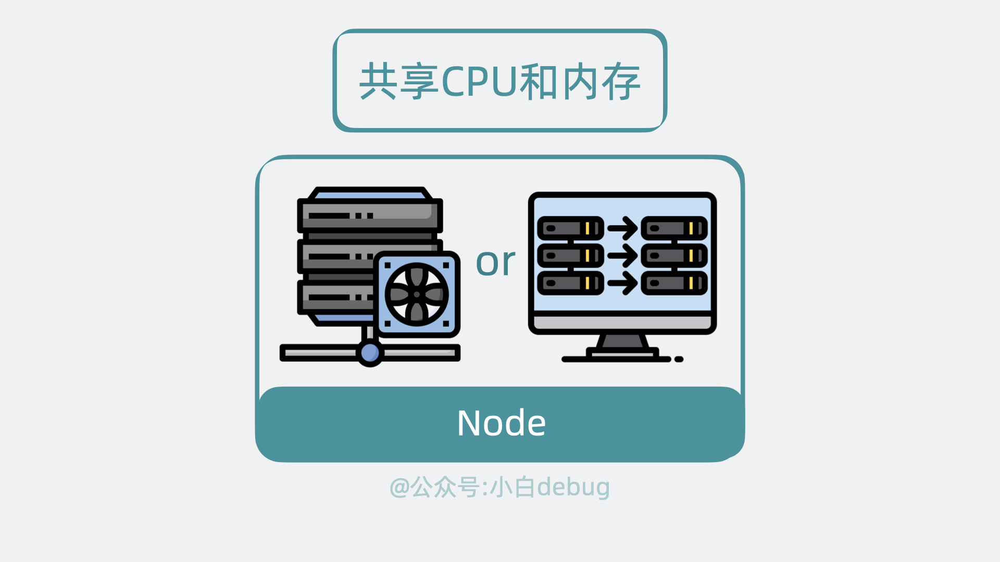
在文章开头，我们聊到了部署多个应用服务的场景。以前我们需要上传代码到服务器，而用了 k8s 之后，我们只需要将服务代码打包成**Container Image**(容器镜像)，就能一行命令将它部署。

如果你不了解容器镜像的含义，你可以简单理解为它其实就是将**应用代码**和依赖的**系统环境**打了个压缩包，在任意一台机器上解压这个压缩包，就能正常运行服务。为了下载和部署镜像，Node 中会有一个 **Container runtime** 组件。

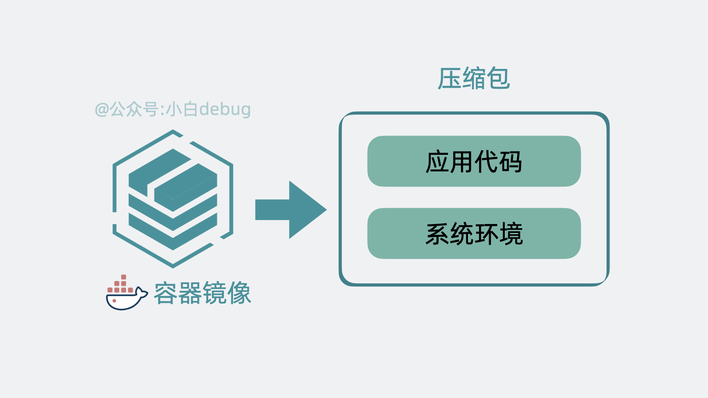
每个应用服务都可以认为是一个 **Container**（容器）, 并且大多数时候，我们还会为应用服务搭配一个日志收集器 Container 或监控收集器 Container，多个 Container 共同组成一个一个 **Pod**，它运行在 Node 上。

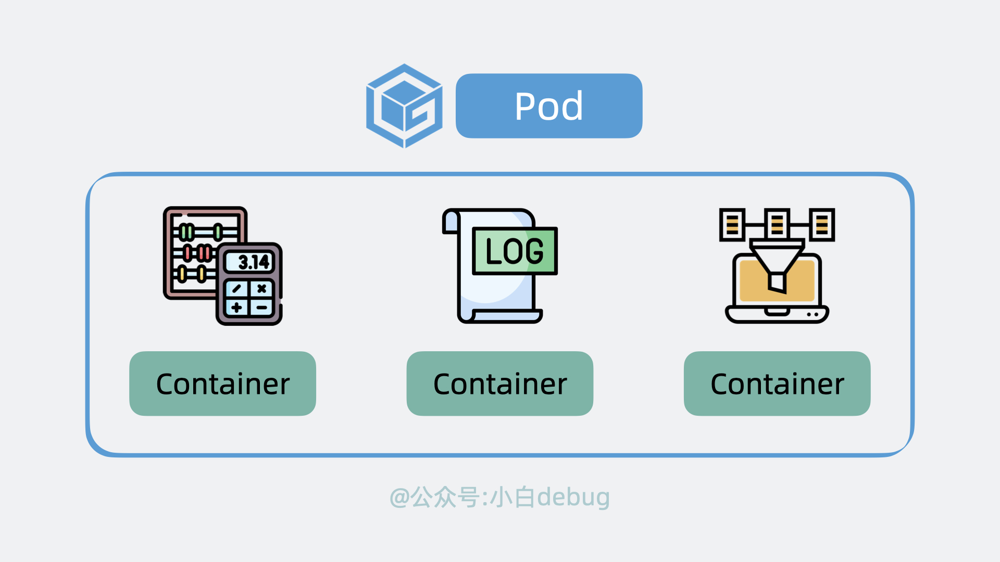一个pod内有多个容器

k8s 可以将 pod 从某个 Node 调度到另一个 Node，还能以 pod 为单位去做重启和动态扩缩容的操作。
所以说 **Pod 是 k8s 中最小的调度单位**。

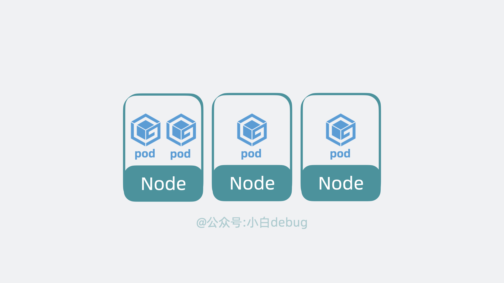
另外，前面提到控制平面会用 **Controller Manager** （通过 API Server）控制 Node 创建和关闭服务，那 Node 也得有个组件能接收到这个命令才能去做这些动作，这个组件叫 **kubelet**，它主要负责管理和监控 Pod。
最后，Node 中还有个 **Kube Proxy** ，它负责 Node 的网络通信功能，有了它，外部请求就能被转发到 Pod 内。

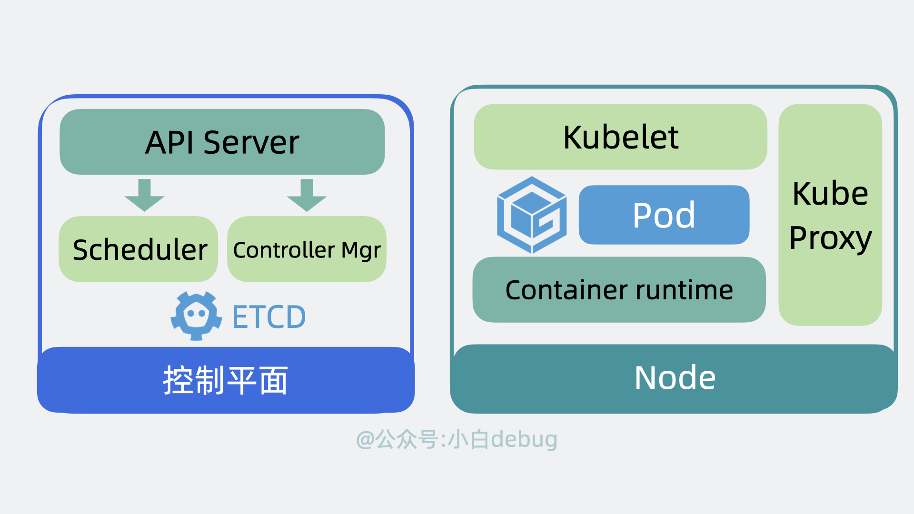控制平面和Node的组件

### [Cluster](https://golangguide.top/架构/云原生/核心知识点/k8s到底是什么.html#cluster)

**控制平面和 Node** 共同构成了一个 **Cluster**，也就是**集群**。在公司里，我们一般会构建多个集群, 比如测试环境用一个集群，生产环境用另外一个集群。同时，为了将集群内部的服务暴露给外部用户使用，我们一般还会部署一个入口控制器，比如 **Ingress 控制器（比如 Nginx）**，它可以提供一个入口让外部用户访问集群内部服务。

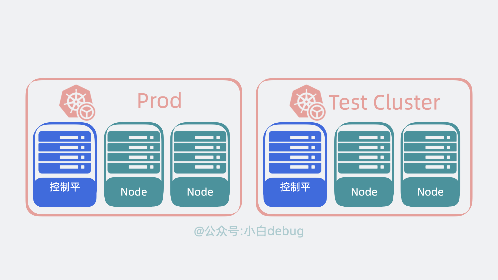生产和测试环境

### [kubectl 是什么](https://golangguide.top/架构/云原生/核心知识点/k8s到底是什么.html#kubectl-是什么)

上面提到说我们可以使用 k8s 提供的 API 去创建服务，但问题就来了，这是需要我们自己写代码去调用这些 API 吗？
答案是不需要，k8s 为我们准备了一个命令行工具 **kubectl**，我们只需要执行命令，它内部就会调用 k8s 的 API。

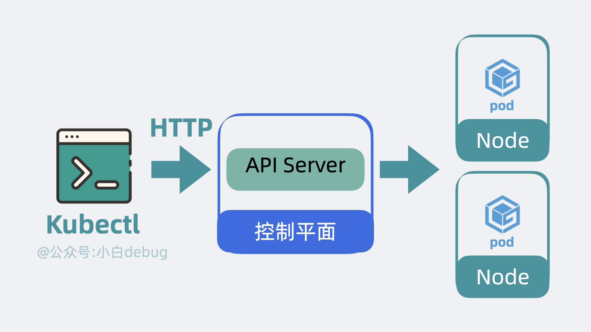kubectl调用k8s的API

接下来我们以部署服务为例子，看下 k8s 是怎么工作的。

### [怎么部署服务？](https://golangguide.top/架构/云原生/核心知识点/k8s到底是什么.html#怎么部署服务)

首先我们需要编写 **YAML 文件**，在里面定义 Pod 里用到了哪些镜像，占用多少内存和 CPU 等信息。
然后使用 kubectl 命令行工具执行 `kubectl apply -f xx.yaml` ，此时 kubectl 会读取和解析 YAML 文件，将解析后的对象通过 API 请求发送给 Kubernetes 控制平面内 的 **API Server**。 API Server 会根据要求，驱使 **Scheduler** 通过 **etcd** 提供的数据寻找合适的 **Node**， **Controller Manager** 会通过 API Server 控制 Node 创建服务，Node 内部的 **kubelet** 在收到命令后会开始基于 **Container runtime** 组件去拉取镜像创建容器，最终完成 **Pod** 的创建。

至此服务完成创建。

整个过程下来，我们只需要写一遍 yaml 文件，和执行一次 kubectl 命令，比以前省心太多了！
部署完服务后，我们来看下服务是怎么被调用的。

### [怎么调用服务？](https://golangguide.top/架构/云原生/核心知识点/k8s到底是什么.html#怎么调用服务)

以前外部用户小明，直接在浏览器上发送 http 请求，就能打到我们服务器上的 Nginx，然后转发到部署的服务内。
用了 k8s 之后，外部请求会先到达 k8s 集群的 Ingress 控制器，然后请求会被转发到 k8s 内部的某个 Node 的 **Kube Proxy** 上，再找到对应的 pod，然后才是转发到内部**容器服务**中，处理结果原路返回，到这就完成了一次服务调用。

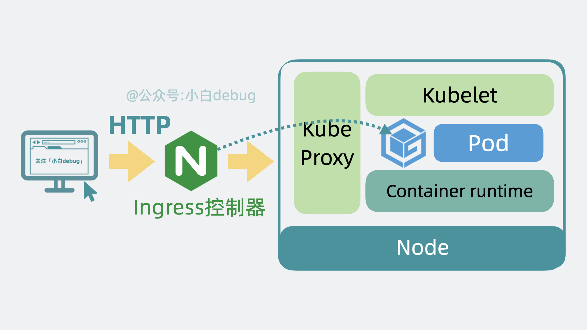用户调用k8s内应用服务的流程

到这里我们就大概了解了 k8s 的工作原理啦，它本质上就是应用服务和服务器之间的**中间层**，通过暴露一系列 API 能力让我们简化服务的部署运维流程。

并且，不少中大厂基于这些 API 能力搭了自己的服务管理平台，程序员不再需要敲 kubectl 命令，直接在界面上点点几下，就能完成服务的部署和扩容等操作，是真的嘎嘎好用。

## [总结](https://golangguide.top/架构/云原生/核心知识点/k8s到底是什么.html#总结)

- k8s 是 G 家开源的神器，用于管理海量容器服务。
- k8s 集群内分为控制平面和 Node，控制平面是大脑，负责发指令，Node 是手脚，负责执行任务。
- 控制平面内有 API Server，Scheduler，Controller Manager 以及 etcd 等组件。Node 中含有 Pod，Kubelet,Container runtime, Kube Proxy 等组件。控制平面和 Node 共同构成一个 Cluster。
- 文章通过怎么部署服务和怎么调用服务两个例子将这些组件串联了起来，方便大家加深理解。