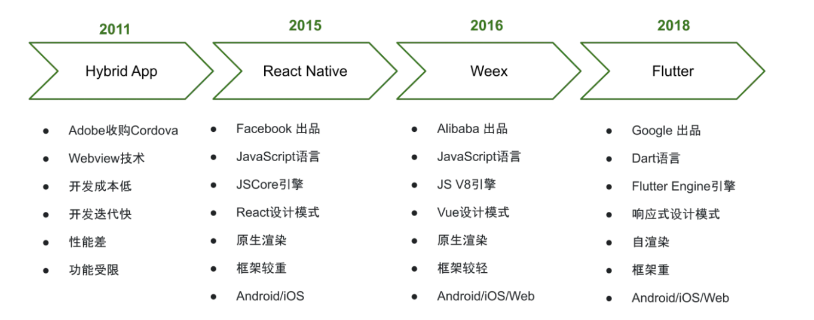

#  前端跨平台

> 转载
>
> [javascript - 5000字解析：前端五种跨平台技术 - 前端巅峰 - SegmentFault 思否](https://segmentfault.com/a/1190000022106809)
>
> [前端H5与客户端Native交互原理 - JSBridge - 哈啰技术 - SegmentFault 思否](https://segmentfault.com/a/1190000044803959)

## 名词解锁

- Native   原生的
- Native APP  原始app

## 前端跨平台常用的技术

### 1.响应式设计（Responsive Design）

- CSS媒体查询
- 弹性布局

过使用CSS媒体查询和弹性布局等技术，可以根据设备的屏幕大小和分辨率来自适应地调整页面布局和样式，从而在不同的终端上提供良好的用户体验。

### 2. Progressive Web Apps（PWA）

PWA是一种使用现代Web技术开发的应用程序，它能够像原生应用一样提供离线访问、推送通知和设备硬件访问等功能。PWA可以运行在各种平台上，包括桌面浏览器、移动浏览器和操作系统。

### 3 Hybrid App   [ˈhaɪbrɪd]

###### 特点:H5+原生混合开发

原生APP开发通过原生的网页加载控件 Webview( Android)或 WK Webview(iOS)来加载H5

也就是在**APP上嵌入H5**

###### 原生APP嵌入H5方案:

- 安卓:WebView
- 苹果: WK Webview

目前混合开发框架的典型代表有 Cordova、 lonic和微信小程序，微信小程序目前是在 Webview中渲染的。并非原生渲染，但将来有可能会采用原生渲染。

###### 原生APP嵌入H5的局限性

Webview实质上就是一个浏览器器内核、其脚本依然运行在一个**权限受限的沙箱**中，所以对大多数系统能力都没有访向权限、如**无法访向文件系统、不能使用蓝牙等**，所以，对于H5不能实现的功能，都需要原生来实现。

###### JSBridge是Web 应用和原生应用之间的通信桥梁

WebView是js在app上的载体，JS和App之间的沟通需要通过`JSBridge`， **JSBridge 充当了 Web 应用和原生应用之间的通信桥梁**，通过 JSBridge，我们可以在 web 和原生代码之间进行双向通信，使这两者能够互相调用和传递数据；

###### `JSBridge`的作用拆解：

1. 混合框架一般都会在APP原生代码中预先实现一些访问系统能力的API
2. 通过JSBridge这个通讯桥梁，将原始能力通过API暴露给 Webview以供 Javascript调用
3. 通过JSBridge，Web端可以调用Native端的Java接口，同样Native端也可以通过JSBridge调用Web端的JavaScript接口，实现彼此的双向调用。

### 4 跨平台框架（Cross-platform Framework）

跨平台框架允许开发人员使用统一的代码库来构建可以运行在多个平台上的应用程序。一些知名的跨平台框架包括React Native、Flutter、Ionic等，它们提供了丰富的组件和API，同时支持多个平台，如iOS、Android和Web。

> 转载:[字节跳动技术整理：一文秒懂Flutter跨平台演进及架构-阿里云开发者社区 (aliyun.com)](https://developer.aliyun.com/article/914437)

## 跨平台技术路线

Web技术：主要依赖于WebView的技术，功能支持受限，性能体验很差，比如PhoneGap、Cordova、小程序。

原生渲染：使用JavaScript作为编程语言，通过中间层转化为原生控件来渲染UI界面，比如React Native、Weex。

自渲染技术：自行实现一套渲染框架，可通过调用skia等方式完成自渲染，而不依赖于原生控件，比如Flutter、Unity

## 跨平台技术演进

第一阶段，采用WebView技术绘制界面的Hybrid混合开发技术，通过JS Bridge 将系统部分能力暴露给 JS 调用，其缺点是性能较差，功能受限，扩展性差，不适合交互复杂的场景，比如Cordova。 

第二阶段，针对WebView界面性能等问题，于是绘制交还原生渲染，仅仅通过JS调用原生控件，相比WebView技术性能体验更好，这是目前绝大部分跨平台框架的设计思路，比如React Native、Weex。另外，最近小程序也比较火，第一和第二阶段的融合，依然采用WebView作为渲染容器，通过限制Web技术栈的子集，规范化组件使用，并逐步引入原生控件代表WebView渲染，以提升性能。 

第三阶段，虽然通过桥接技术使用原生控件解决了功能受限问题，提升性能体验，但相比原生体验差距还是比较大，以及处理平台差异性非常耗费人力。于是Flutter提出自带渲染引擎的解决方案，尽可能减少不同平台间的差异性, 同时媲美原生的高性能体验，因此业界对 Flutter有着极高的关注度。

[WebView性能、体验分析与优化 - 美团技术团队 (meituan.com)](https://tech.meituan.com/2017/06/09/webviewperf.html)

## Native.js和uniapp 

### 介绍Native.js

- Native.js技术，简称NJS，是一种将手机操作系统的原生对象转义，映射为JS对象，在JS里编写原生代码的技术。

- 如果说Node.js把js扩展到服务器世界，那么Native.js则把js扩展到手机App的原生世界。

- NJS突破了浏览器的功能限制，也不再需要像Hybrid那样由原生语言开发插件才能补足浏览器欠缺的功能。
- 关于支持NJS的运行环境：NJS编写的代码，最终需要在HBuilder里打包发行为App安装包，或者在支持Native.js技术的浏览器里运行。目前Native.js技术不能在普通手机浏览器里直接运行。

### Native.js和uniapp 

Uni-app不支Native.js执行UI相关操作的API调用及webview相关API调用。将失效无法正常使用。Uni-app不推荐使用Native.js

Native.js不是一个js库，不需要下载引入到页面的script中，也不像nodejs那样有单独的运行环境，Native.js的运行环境是集成在5+runtime里的，使用HBuilder打包的app或流应用都可以直接使用Native.js。

Native.js可以实现用js语法来调用Android或者ios的功能，以实现一处开发，多处运行的目的。使用HBuilder这个开发工具完成功能开发后，需要把打包数据放入Android项目或者ios项目里，然后就可以编译得到Android或者ios安装包。

todo 