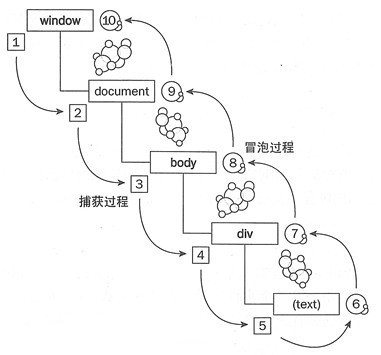

## JS事件委托/事件代理（冒泡相关）



### 事件传播（事件流模型）分成三个阶段：

- 捕获阶段：从window对象传导到目标节点（上层传到底层）称为“捕获阶段”（capture phase），捕获阶段不会响应任何事件；
- 目标阶段：在目标节点上触发，称为“目标阶段”
- 冒泡阶段：从目标节点传导回window对象（从底层传回上层），称为“冒泡阶段”（bubbling phase）。**事件代理**即是利用事件冒泡的机制把里层所需要响应的事件绑定到外层
  

### 事件委托（事件代理）

事件委托就是利用冒泡的原理，将事件加到 (外层) 父元素 或 祖先元素上，触发执行效果

```html
  <ul id="list" >
        <li>item 1
            <div>111</div>
            <div>222</div>
            <div>333</div>
            <div>444</div>
        </li>
        <li>item 2</li>
        <li>item 3</li>
         ...
        <li>item n</li>
      </ul>
```

```js
  document.getElementById('list').onclick=function(e){
    console.log(e.target.innerText);   
  }
```

点击 item1 这个li  将显示 item1 下面的所有div的innerText

```
item1
111
222
333
444
```

#### 事件委托的优点

##### 1、 可以大量节省内存占用，减少事件注册，比如在ul上代理所有li的click事件就非常棒

  如上面代码所示，如果给每个li列表项都绑定一个函数，那对内存的消耗是非常大的，因此较好的解决办法就是将li元素的点击事件绑定到它的父元素ul身上，执行事件的时候再去匹配判断目标元素。

##### 2、可以实现当新增子对象时无需再次对其绑定（动态绑定事件）

   假设上述的例子中列表项li就几个，我们给每个列表项都绑定了事件；

在很多时候，我们需要通过 AJAX 或者用户操作动态的增加或者删除列表项li元素，那么在每一次改变的时候都需要重新给新增的元素绑定事件，给即将删去的元素解绑事件；

如果用了事件委托就没有这种麻烦了，因为事件是绑定在父层的，和目标元素的增减是没有关系的，执行到目标元素是在真正响应执行事件函数的过程中去匹配的；所以使用事件在动态绑定事件的情况下是可以减少很多重复工作的。


技巧： 可以使用 switch  匹配元素绑定的事件

```js
        <li id="list" >
            <div id="A">111</div>
            <div id="B">222</div>
            <div id="C">333</div>
            <div id="D">444</div>
        </li>
    document.getElementById('list').onclick=function(event) {
     // var target = event.target;
         var e = event || window.event;
         var target = e.target || e.srcElement;
      switch (target.id) {
        case "A":
               alert("A");
          break;
        case "B":
               alert("B");
          break;
        case "C":
              alert("C");
          break;
      }
    }
```

```

```


#### 事件委托需要注意的地方

因为 事件冒泡 的过程也要耗时，越接近顶层，事件的「事件传播链」就越长，也就越耗时。

